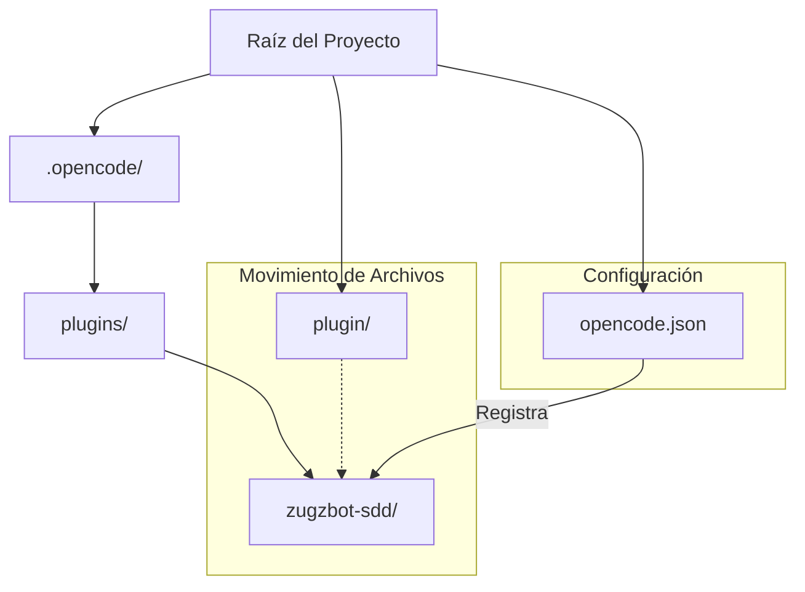

# 🧠 Consolidado de Contexto de Alta Densidad (SDD Compaction)
Fecha de consolidación: 2026-05-23
Cambio Activo: `activate-monitoring-plugin`

---

## 📜 Propuesta y Objetivos
# Propuesta Técnica: Activación del Plugin de Monitoreo Zugzbot-SDD

---

## 📐 Especificaciones y Escenarios
Escenarios validados:
- Scenario: Activación del sidebar con la tecla 'b'
- Scenario: Visualización de información de monitoreo

---

## 🏛️ Estructura Arquitectónica
Esquema Arquitectónico:

---

## 📋 Estado del Checklist
Checklist de Tareas: 0/11 completadas.
- [ ] Crear el directorio `.opencode/plugins/zugzbot-sdd` si no existe.
- [ ] Mover el contenido de `plugin/` a `.opencode/plugins/zugzbot-sdd/`.
- [ ] Verificar que `plugin.json` esté presente en el nuevo destino.
- [ ] Eliminar el directorio `plugin/` original (si está vacío después de mover).
- [ ] Modificar `opencode.json` para añadir `"plugin": ["zugzbot-sdd"]` en el nivel raíz del objeto JSON.
- [ ] Configurar la variable de entorno `OPENCODE_EXPERIMENTAL=true`.
- [ ] Iniciar OpenCode (o simular el inicio en el entorno de pruebas).
- [ ] Probar la activación del sidebar mediante la tecla "b".
- [ ] Verificar que el sidebar muestre la información de monitoreo (Fase activa, tareas, logs).
- [ ] Ejecutar `sdd_bdd_tester` para validar los escenarios definidos en `spec.md`.
... (y más)

---

> [!TIP]
> **Acción Recomendada para Limpiar Memoria de Contexto:**
> Si eres un subagente y ves este archivo, tu memoria ha sido compactada con éxito.
> Lee **únicamente** este archivo de consolidación para entender el estado actual y los contratos técnicos previos. Descarta la lectura repetitiva de chats históricos o archivos de logs antiguos.
