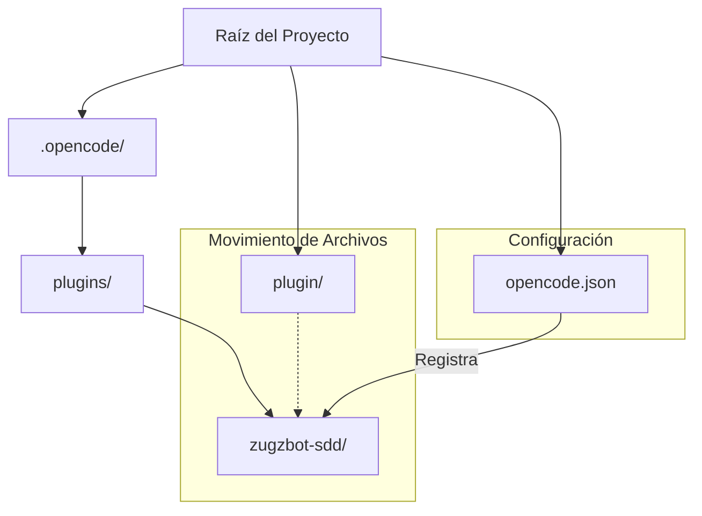

# Arquitectura de Activación del Plugin

## Diagrama de Estructura de Directorios

## Componentes y Responsabilidades

1.  **opencode.json**: Actúa como el manifiesto de configuración. Debe declarar el plugin para que el cargador de OpenCode lo reconozca.
2.  **.opencode/plugins/zugzbot-sdd/**: Directorio de despliegue local. Contiene el código fuente y el manifiesto (`plugin.json`) del plugin.
3.  **TUI (Terminal User Interface)**: El plugin se registra como un componente TUI que intercepta eventos de teclado (tecla 'b') para mostrar el sidebar.

## Flujo de Activación

1.  **Inicio**: OpenCode se inicia con `OPENCODE_EXPERIMENTAL=true`.
2.  **Carga**: El motor de plugins lee `opencode.json` y busca los plugins listados en `.opencode/plugins/`.
3.  **Registro**: El plugin `zugzbot-sdd` se registra y vincula el atajo de teclado 'b'.
4.  **Renderizado**: Al presionar 'b', se instancia el componente definido en `sdd-sidebar.tsx`.
