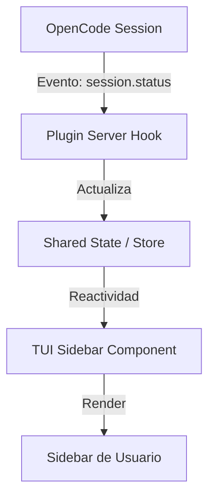

# Propuesta Técnica: Plugin de Monitoreo de Agentes en Sidebar

## 🔍 1. Diagnóstico de la Situación Actual

Tras un análisis exhaustivo del directorio `./plugin` y su comparación con la documentación oficial y el ejemplo `opencode-quota`, se han identificado los siguientes motivos por los cuales el plugin no es visible ni funcional:

### A. Falta de Registro en la Configuración Global
El archivo `opencode.json` en la raíz del proyecto no contiene la entrada `plugin`. OpenCode requiere que los plugins externos o locales sean declarados explícitamente si no se encuentran en los directorios por defecto (`.opencode/plugins/`).
- **Estado**: Ausente.
- **Impacto**: El plugin nunca es cargado por el runtime de OpenCode.

### B. Punto de Entrada de Servidor Inoperante
El archivo `plugin/index.js`, que actúa como el punto de entrada principal (definido en `package.json` como `main`), contiene únicamente `export default {};`. 
- **Estado**: Vacío.
- **Impacto**: Aunque el plugin se cargara, no suscribe ningún hook ni evento del sistema (como `session.status`), imposibilitando el monitoreo en tiempo real.

### C. Registro Incompleto de Componentes
En `package.json`, el campo `oc-plugin` solo registra `"tui"`. 
- **Comparación**: `opencode-quota` registra tanto `"server"` como `"tui"`.
- **Impacto**: Falta la lógica de backend del plugin que procesa los datos de los agentes antes de enviarlos a la interfaz.

### D. Estructura de Archivos No Estándar
El plugin se encuentra en `./plugin/`, fuera de los directorios de carga automática recomendados:
1. `.opencode/plugins/` (Nivel de proyecto)
2. `~/.config/opencode/plugins/` (Nivel global)

## 💡 2. Propuesta Técnica

Para lograr la visualización de los agentes en tiempo real en el sidebar, se propone la siguiente reestructuración y plan de acción:

### 2.0 Fase de Estabilización (Simplificación)
Debido a discrepancias en el renderizado ("Saludo inicial" no identificado), se procederá con una **Simplificación Extrema**:
- Reducir el `SidebarPanel` a un componente "Hello World" dinámico.
- Ajustar el `order` del slot para forzar la visibilidad por encima de otros componentes.
- Validar la reactividad básica antes de re-introducir la lógica de monitoreo completa.

### 2.1 Registro y Carga
- Añadir `"plugin": ["./plugin"]` al archivo `opencode.json` o mover el contenido a `.opencode/plugins/agent-monitor`.
- Asegurar que `package.json` incluya `"server"` en la lista de `oc-plugin`.

### 2.2 Implementación de Hooks (Server Side)
Implementar en `index.ts` (compilado a `index.js`) los hooks necesarios para capturar el ciclo de vida de los agentes:
- `session.status`: Para detectar cuándo un agente inicia, está pensando o termina.
- `session.updated`: Para obtener información sobre el agente activo y su progreso.
- `todo.updated`: Para monitorear las tareas pendientes asignadas a subagentes.

### 2.3 Refuerzo de la Interfaz (TUI)
- Validar la comunicación entre el estado del servidor y el componente `SidebarPanel`.
- Utilizar el `api` de OpenCode para acceder al estado compartido de las sesiones.
- Asegurar que el componente `SidebarPanel` en `sdd-plugin/tui.ts` esté correctamente vinculado a los slots de la interfaz.

### 2.4 Alineación con Estándares Premium (SDD-UX)
- Implementar transiciones fluidas en el sidebar cuando los agentes cambian de estado.
- Usar indicadores visuales de "High Performance" siguiendo las directrices de `sdd-ux-premium`.

## 📐 3. Arquitectura del Flujo de Datos

## ✅ 4. Próximos Pasos (Fase 1 y 2)
1. Crear las especificaciones funcionales en `specs/spec.md` con escenarios BDD.
2. Definir el plano arquitectónico detallado en `orchestrator_architecture.md`.
3. Generar el checklist de tareas atómicas en `orchestrator_tasks.md`.
