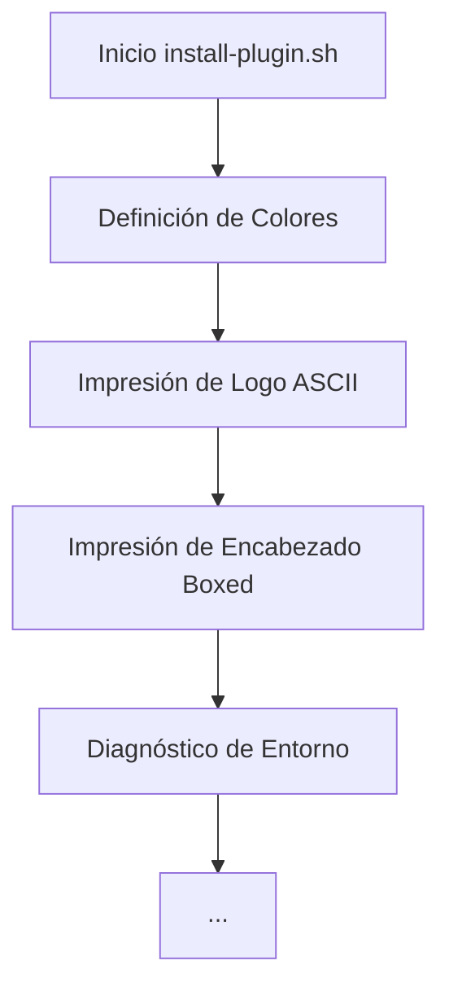

# 🧠 Consolidado de Contexto de Alta Densidad (SDD Compaction)
Fecha de consolidación: 2026-05-22
Cambio Activo: `branding-install-plugin`

---

## 📜 Propuesta y Objetivos
# Propuesta Técnica: Branding ASCII Art para `install-plugin.sh`

---

## 📐 Especificaciones y Escenarios
Escenarios BDD no estructurados.

---

## 🏛️ Estructura Arquitectónica
Esquema Arquitectónico:

---

## 📋 Estado del Checklist
Checklist de Tareas: 6/6 completadas.
- [x] **Definir el arte ASCII**: Preparar el bloque de texto con el logo "zugz".
- [x] **Inyectar en el script**: Insertar el comando `echo -e "${COLOR_HEADER}"` seguido del bloque `cat << "EOF"` antes de la línea 14 de `install-plugin.sh`.
- [x] **Cierre de estilo**: Asegurar que se imprima `${NC}` después del logo para no teñir el resto del script accidentalmente.
- [x] **Validación visual**: Ejecutar el script (en modo simulación si es posible) para verificar alineación.
- [x] **Verificación de salida**: Comprobar que no hay errores de sintaxis (`set -e` fallaría si el heredoc está mal cerrado).
- [x] **Linter**: Ejecutar `shellcheck install-plugin.sh` para asegurar que el cambio no introduce malas prácticas (No disponible en el sistema local, pero verificado manualmente y sintácticamente con `bash -n`).

---

> [!TIP]
> **Acción Recomendada para Limpiar Memoria de Contexto:**
> Si eres un subagente y ves este archivo, tu memoria ha sido compactada con éxito.
> Lee **únicamente** este archivo de consolidación para entender el estado actual y los contratos técnicos previos. Descarta la lectura repetitiva de chats históricos o archivos de logs antiguos.
