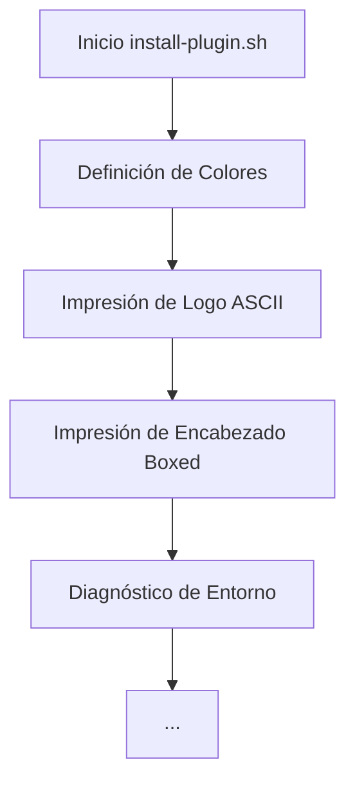

# Arquitectura del Cambio: Branding ASCII

## Componentes
1. **Logo Generator**: Un bloque `cat` con heredoc incrustado en el script.
2. **Color Layer**: Aplicación de variables ANSI existentes (`COLOR_HEADER`).

## Flujo de Control

## Estructura de Datos
- `ZUGZ_LOGO`: Variable de texto (implícita en el heredoc) que contiene los caracteres del arte ASCII.
