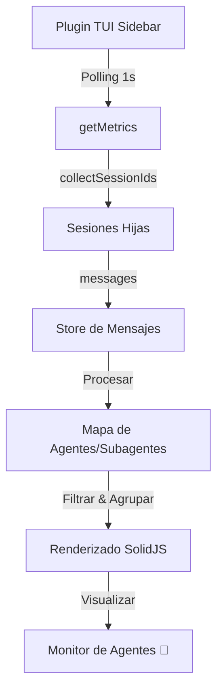

# 🧠 Consolidado de Contexto de Alta Densidad (SDD Compaction)
Fecha de consolidación: 2026-05-23
Cambio Activo: `add-subagents-to-tui-monitor`

---

## 📜 Propuesta y Objetivos
# Propuesta Técnica: Monitoreo de Subagentes y Costos en TUI

---

## 📐 Especificaciones y Escenarios
Escenarios validados:
- Scenario: Visualización de un subagente activo
- Scenario: Acumulación de costos de múltiples subagentes

---

## 🏛️ Estructura Arquitectónica
Esquema Arquitectónico:

---

## 📋 Estado del Checklist
Checklist de Tareas: 12/12 completadas.
- [x] **Refactor de Recolección de Datos**
    - [x] Hacer `collectSessionIds` recursivo para capturar sub-sub-sesiones.
    - [x] Modificar `getMetrics` para identificar si un mensaje proviene de un subagente (comparando con el `sessionId` principal).
- [x] **Actualización de Tipos e Interfaces**
    - [x] Actualizar `AgentMetrics` para incluir `isSubagent: boolean`.
- [x] **Mejora de la Interfaz (UI)**
    - [x] Implementar identación visual para subagentes en el loop de renderizado.
    - [x] Añadir prefijo ASCII `└─ ` para subagentes.
    - [x] Asegurar que el `Total:` siga sumando todos los costos correctamente.
- [x] Verificar que la mascota ASCII sigue funcionando y no se rompió el layout.
... (y más)

---

> [!TIP]
> **Acción Recomendada para Limpiar Memoria de Contexto:**
> Si eres un subagente y ves este archivo, tu memoria ha sido compactada con éxito.
> Lee **únicamente** este archivo de consolidación para entender el estado actual y los contratos técnicos previos. Descarta la lectura repetitiva de chats históricos o archivos de logs antiguos.
