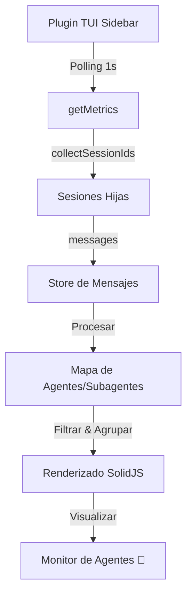

# Arquitectura: Monitoreo de Subagentes

## Flujo de Datos

## Componentes Clave

1.  **`collectSessionIds` (Recursivo)**: Función para aplanar el árbol de sesiones en una lista de IDs única.
2.  **`AgentMetrics`**: Estructura enriquecida con metadatos de jerarquía.
3.  **`RenderAgentLine`**: Sub-componente (dentro del loop) para aplicar identación y colores según si es subagente o no.

## Consideraciones de Rendimiento
- El polling de 1 segundo es adecuado para el TUI siempre que el número de mensajes no sea masivo (>1000).
- Se recomienda usar `memo` o `createMemo` para el mapa de agentes si se detecta lag en sesiones largas.
