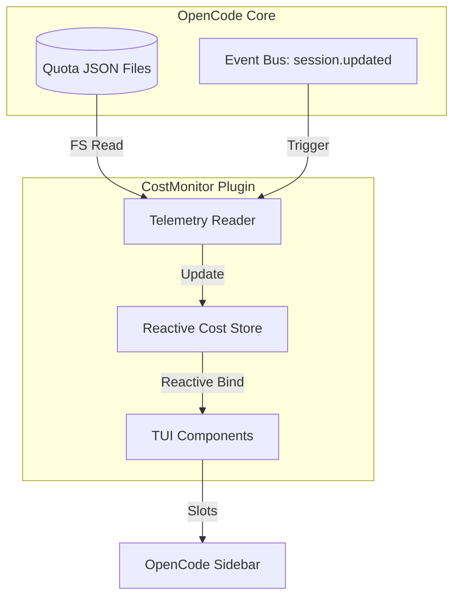

# 🧠 Consolidado de Contexto de Alta Densidad (SDD Compaction)
Fecha de consolidación: 2026-05-23
Cambio Activo: `cost-tui-plugin`

---

## 📜 Propuesta y Objetivos
# Propuesta Técnica: Monitor de Costos TUI (CostMonitor)

---

## 📐 Especificaciones y Escenarios
Escenarios BDD no estructurados.

---

## 🏛️ Estructura Arquitectónica
Esquema Arquitectónico:

---

## 📋 Estado del Checklist
Checklist de Tareas: 16/16 completadas.
- [x] Crear el directorio del plugin: `plugin/cost-monitor/`
- [x] Crear subdirectorios: `lib/`, `components/`
- [x] Configurar el archivo `plugin.json` básico para el nuevo plugin (o integrar en el existente).
- [x] Implementar `plugin/cost-monitor/lib/paths.ts` para resolver rutas de `~/.local/share/opencode/`.
- [x] Implementar `plugin/cost-monitor/lib/reader.ts` para leer y parsear los archivos JSON de cuotas.
- [x] Implementar lógica de agregación en `lib/aggregator.ts` para agrupar costos por nombre de agente extraído del título de sesión.
- [x] Crear `plugin/cost-monitor/lib/state.ts` usando SolidJS.
- [x] Implementar el hook `useCostResource` que realice la lectura inicial y se suscriba a eventos `session.updated`.
- [x] Crear `plugin/cost-monitor/components/AgentCostItem.ts` para mostrar la fila de cada agente.
- [x] Crear `plugin/cost-monitor/components/CostSidebarPanel.ts` como contenedor principal del sidebar.
... (y más)

---

> [!TIP]
> **Acción Recomendada para Limpiar Memoria de Contexto:**
> Si eres un subagente y ves este archivo, tu memoria ha sido compactada con éxito.
> Lee **únicamente** este archivo de consolidación para entender el estado actual y los contratos técnicos previos. Descarta la lectura repetitiva de chats históricos o archivos de logs antiguos.
