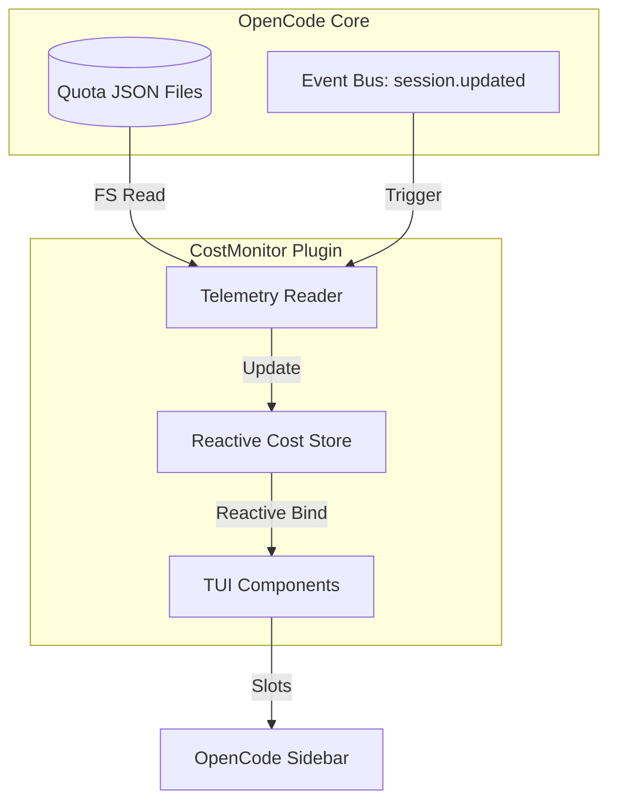

# Arquitectura Técnica: CostMonitor Plugin

## 🏗️ Diagrama de Componentes

## 🧩 Capas de Software

### 1. Capa de Datos (`lib/telemetry.ts`)
- **Path Resolver**: Calcula la ruta del archivo JSON según la fecha actual.
- **Parser**: Lee y deserializa el contenido de `quota-sidebar-sessions`.
- **Aggregator**: Procesa el mapa de sesiones para agrupar por agente.

### 2. Capa de Estado (`lib/state.ts`)
- **Signals**: Usa `createSignal` de SolidJS para `costState`.
- **Subscription**: Escucha eventos del sistema para disparar re-lecturas del sistema de archivos.

### 3. Capa de Interfaz (`components/`)
- **CostPanel**: Contenedor principal.
- **AgentItem**: Fila individual para cada agente con sus métricas.
- **SummaryWidget**: Resumen compacto para slots pequeños.

## 📡 Flujo de Comunicación
1. El plugin se registra en el slot `sidebar_content`.
2. Se inicia un intervalo de respaldo (polling) y un listener de eventos.
3. Cuando cambia el uso de tokens, el Core de OpenCode escribe en el disco.
4. El plugin detecta el cambio o recibe el evento.
5. El `Store` se actualiza y la UI se repinta instantáneamente.
