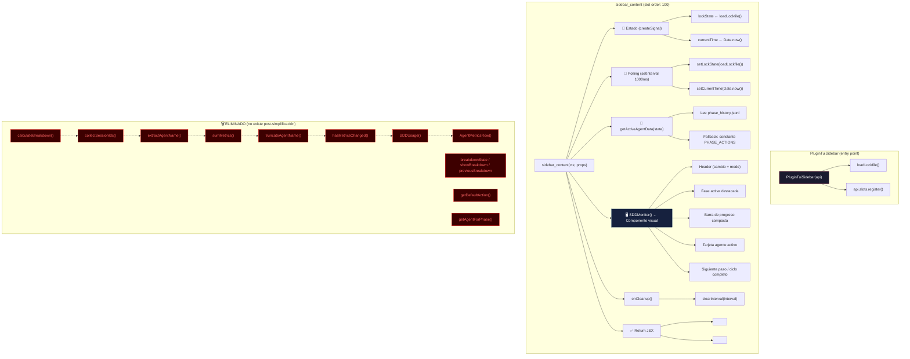

# 🧠 Consolidado de Contexto de Alta Densidad (SDD Compaction)
Fecha de consolidación: 2026-05-23
Cambio Activo: `simplify-tui-monitor`

---

## 📜 Propuesta y Objetivos
# Propuesta Técnica: Simplificación del Monitor TUI SDD

---

## 📐 Especificaciones y Escenarios
Escenarios BDD no estructurados.

---

## 🏛️ Estructura Arquitectónica
Esquema Arquitectónico:

---

## 📋 Estado del Checklist
Checklist de Tareas: 0/0 completadas.

---

> [!TIP]
> **Acción Recomendada para Limpiar Memoria de Contexto:**
> Si eres un subagente y ves este archivo, tu memoria ha sido compactada con éxito.
> Lee **únicamente** este archivo de consolidación para entender el estado actual y los contratos técnicos previos. Descarta la lectura repetitiva de chats históricos o archivos de logs antiguos.
