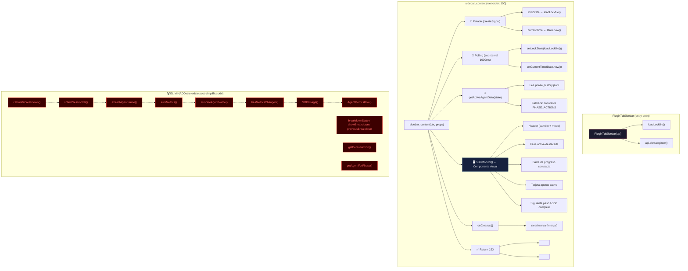

# Plano Arquitectónico — Monitor TUI SDD Simplificado

## Visión General

Arquitectura post-simplificación del plugin `plugin_tui.tsx`. Se elimina el subsistema de breakdown de costos/tokens (~120 líneas) y se comprime el visual del pipeline SDD. El resultado es un monitor enfocado exclusivamente en el estado del ciclo SDD.

### Métricas objetivo
| Concepto | Líneas |
|----------|--------|
| Infraestructura (imports, loadLockfile, slot, export) | ~70 |
| Constantes y tipos | ~10 |
| SDDMonitor comprimido | ~80 |
| getActiveAgentData simplificado | ~12 |
| Polling + cleanup | ~8 |
| **Total** | **~180** |

---

## Diagrama de Árbol de Componentes



---

## Diagrama de Flujo de Datos

```mermaid
flowchart LR
    A[("💾 sdd-lock.json<br/>.openspec/")] -->|fs.readFileSync| B[loadLockfile()]
    B -->|"JSON.parse"| C["🔵 lockState signal"]

    D[("💾 phase_history.jsonl<br/>.openspec/changes/*/")] -->|fs.readFileSync| E[getActiveAgentData]
    C -->|state.active_phase| E
    E -->|"{timestamp, action}"| F["🖥️ SDDMonitor"]

    G["⏱️ Date.now()"] -->|cada 1000ms| H["🔵 currentTime signal"]
    H -->|elapsed time| F

    C -->|state completo| F
    F --> I["🧾 Renderizado TUI"]

    J["⏲️ setInterval(1000ms)"] -->|polling loop| B
    J -->|polling loop| G

    K["onCleanup"] -->|clearInterval| J

    style A fill:#2d4a22,stroke:#4caf50,color:#fff
    style D fill:#2d4a22,stroke:#4caf50,color:#fff
    style I fill:#1a1a2e,stroke:#e94560,color:#fff
    style K fill:#4a2222,stroke:#e94560,color:#fff
```

---

## Gestión de Estado

### Señales (SolidJS createSignal)

| Señal | Tipo | Propósito | Actualizada por |
|-------|------|-----------|-----------------|
| `lockState` | `object \| null` | Estado completo del lockfile SDD | Polling cada 1000ms |
| `currentTime` | `number` | Timestamp UNIX para cálculo de elapsed time | Polling cada 1000ms |

### 🗑️ Estado eliminado

| Estado eliminado | Tipo | Razón |
|------------------|------|-------|
| `breakdownState` | `MetricsBreakdown` | Subsistema de breakdown eliminado |
| `showBreakdown` | `boolean` | Interactividad colapsable eliminada |
| `previousBreakdown` | `MetricsBreakdown \| null` | Optimización de diff eliminada |

### Props del slot

| Prop | Tipo | Propósito |
|------|------|-----------|
| `props.session_id` | `string` | ID de sesión activa (ya no se usa para breakdown) |
| `props.children` | `any` | Contenido hijo del slot (chat original) |

---

## Contratos de Interfaces Post-Simplificación

### Constantes inline (reemplazan funciones)
```typescript
// Eliminado: getDefaultAction() → reemplazado por constante PHASE_ACTIONS
// Eliminado: getAgentForPhase() → reemplazado por constante PHASE_AGENTS
// Eliminado: MAX_AGENT_NAME_LENGTH, COST_DECIMALS → ya no son necesarias
```

### Funciones que se mantienen
| Función | Líneas | Cambio |
|---------|--------|--------|
| `loadLockfile()` | ~10 | Sin cambios |
| `getActiveAgentData()` | ~12 | Simplificado (sin dependencia de getDefaultAction) |
| `SDDMonitor()` | ~80 | Comprimido (pipeline compacto, tarjeta simplificada) |

### Funciones eliminadas
| Función | Líneas originales |
|---------|-------------------|
| `getDefaultAction()` | 12 |
| `getAgentForPhase()` | 14 |
| `collectSessionIds()` | 8 |
| `extractAgentName()` | 10 |
| `sumMetrics()` | 11 |
| `truncateAgentName()` | 5 |
| `calculateBreakdown()` | 37 |
| `hasMetricsChanged()` | 6 |
| `AgentMetricsRow()` | 12 |
| `SDDUsage()` | 28 |

---

## Especificación de SDDMonitor Comprimido

```
┌─────────────────────────────────────┐
│ 🤖 ZUGZBOT SDD                      │  ← Encabezado
│ Cambio: simplify-tui-monitor        │
│ Modo: Manual 🛑                     │
│─────────────────────────────────────│
│ ► Fase Activa: 📐 Planificación     │  ← Fase activa destacada
│─────────────────────────────────────│
│ ✔🔍 ✔📝 ●📐 ○🛠️ ○🎨 ○🚀 ○🧪 ○📄 ○📦 │  ← Barra de progreso 1 línea
│─────────────────────────────────────│
│ ┌─────────────────────────────────┐ │
│ │ 🧠 AGENTE ACTIVO                │ │  ← Tarjeta con borde doble
│ │ Agente: sdd-architect 📐        │ │
│ │ Acción: "Generando checklist..."│ │
│ │ Tiempo: 2m 15s activo           │ │
│ │ Iteración: #0 | Estado: Activo 🟢│ │
│ └─────────────────────────────────┘ │
│─────────────────────────────────────│
│ 🔮 Siguiente: Codificación (💻)     │  ← 1 línea, solo si phase < 8
└─────────────────────────────────────┘
```

---

## Dependencias Técnicas (sin cambios)

| Dependencia | Uso |
|-------------|-----|
| SolidJS (`createSignal`, `onCleanup`) | Estado reactivo y cleanup |
| OpenCode API (`TuiPlugin`, `api.state`, `api.theme`, `api.slots`) | Integración con el host |
| Node.js (`fs`, `path`) | Lectura de archivos del sistema |
