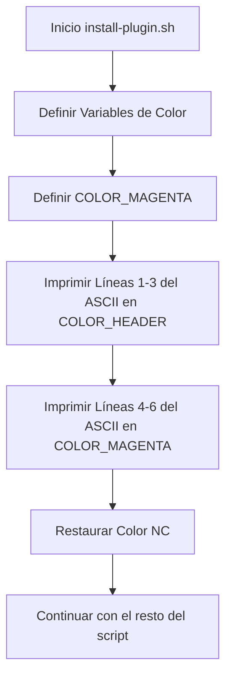

# 🧠 Consolidado de Contexto de Alta Densidad (SDD Compaction)
Fecha de consolidación: 2026-05-23
Cambio Activo: `update-ascii-color`

---

## 📜 Propuesta y Objetivos
# Propuesta Técnica: Actualización Estética de Arte ASCII

**ID del Cambio:** `update-ascii-color`
**Autor:** `sdd-architect` 📐

---

## 📐 Especificaciones y Escenarios
Escenarios validados:
- Scenario: El arte ASCII se muestra con un degradado bitonal

---

## 🏛️ Estructura Arquitectónica
Esquema Arquitectónico:

---

## 📋 Estado del Checklist
Checklist de Tareas: 7/7 completadas.
- [x] Definir la nueva variable de color `COLOR_MAGENTA="\033[1;35m"` en la sección de colores de `install-plugin.sh`.
- [x] Dividir la impresión del arte ASCII (líneas 16-21) para aplicar diferentes colores.
    - [x] Líneas 16-18: Usar `${COLOR_HEADER}` (Cian).
    - [x] Líneas 19-21: Usar `${COLOR_MAGENTA}` (Magenta).
- [x] Asegurar que el color se restablezca con `${NC}` después de la impresión.
- [x] Ejecutar el script (opcionalmente con un mock para no reinstalar todo) o verificar visualmente el código.
- [x] Validar que los códigos de escape ANSI sean correctos.

---

> [!TIP]
> **Acción Recomendada para Limpiar Memoria de Contexto:**
> Si eres un subagente y ves este archivo, tu memoria ha sido compactada con éxito.
> Lee **únicamente** este archivo de consolidación para entender el estado actual y los contratos técnicos previos. Descarta la lectura repetitiva de chats históricos o archivos de logs antiguos.
