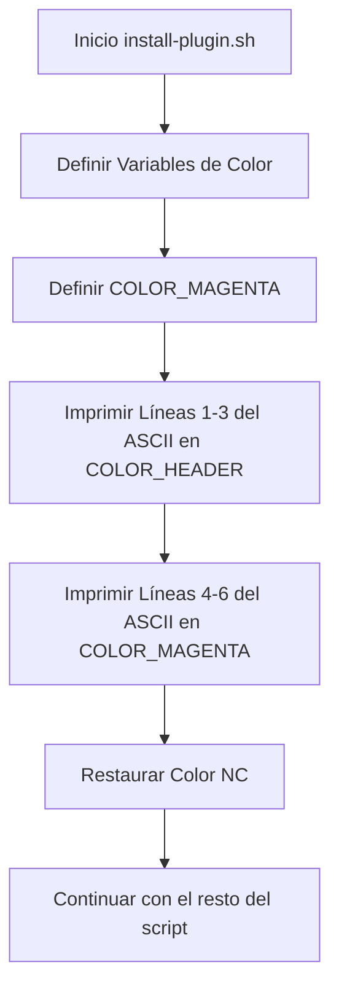

# Arquitectura de la Solución: update-ascii-color

## Diagrama de Flujo de Impresión

## Cambios Técnicos
1. **Definiciones:** Añadir `COLOR_MAGENTA="\033[1;35m"`.
2. **Lógica de Impresión:** Reemplazar el bloque `cat << "EOF"` por dos bloques separados o comandos `echo` individuales para controlar el color por línea.
