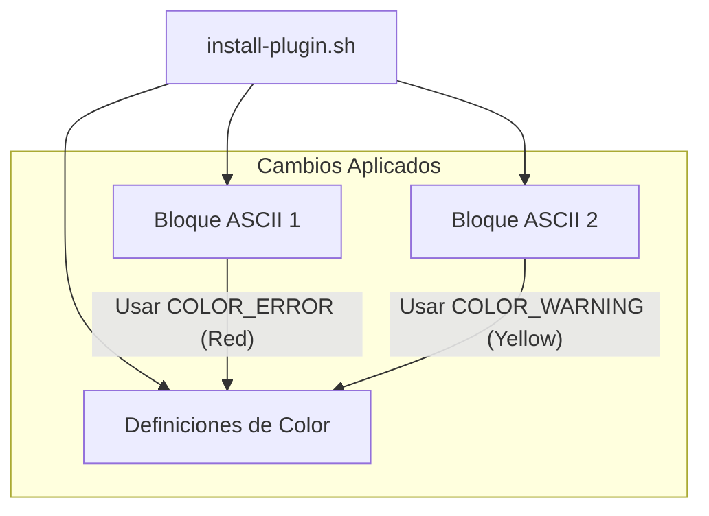

# Arquitectura del Cambio: Colores ASCII

## Diagrama de Componentes
El cambio afecta únicamente a la capa de presentación del script de shell.

## Flujo de Ejecución
1. El script define las variables de entorno ANSI.
2. Se evalúa el comando `echo -e` con la variable roja.
3. Se imprime el `cat` del primer bloque de texto.
4. Se evalúa el comando `echo -e` con la variable amarilla.
5. Se imprime el `cat` del segundo bloque de texto.
6. Se restaura el color con `NC` (No Color).
