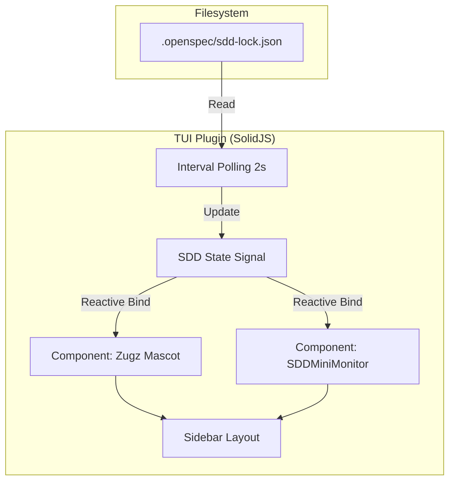

# Arquitectura Técnica: Visual SDD Status

Este diagrama describe el flujo de datos desde el sistema de archivos hasta la renderización en el TUI.



## Flujo de Datos
1.  **Captura**: El plugin `plugin_tui.tsx` inicia un loop de polling.
2.  **Procesamiento**: Se parsea el JSON y se actualiza una señal reactiva de SolidJS.
3.  **Renderizado**:
    *   **Fase**: Se mapea `active_phase` (0-8) a un nombre legible y un color.
    *   **Progreso**: Se calcula `(active_phase / 8) * 10` para llenar la barra ASCII.
    *   **Mascota**: Si `status === 'in_progress'`, se cambia la máscara ASCII a modo "trabajando".

## Restricciones de Diseño
- **Ancho Máximo**: 37 caracteres.
- **Refresh Rate**: 2000ms para evitar sobrecarga de IO.
- **Colores**: Uso estricto del tema actual (`api.theme.current`).
```text
Sidebar (37 chars)
+-------------------------------------+
|  (\__/)  <-- Zugzbot [*_*]          |
|   [o_o]      Working on: architect  |
|  (") (")                            |
|                                     |
| [Fase 2: Arquitectura y Plan]        |
| [■■□□□□□□□□] 25%                    |
| ─────────────────────────────────── |
| [Monitor de Agentes] 🤖             |
+-------------------------------------+
```
