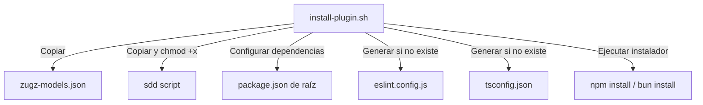

# Plano Técnico de Especificación: fix-installer-linters

## 1. Diagnóstico y Archivos Afectados
- `install-plugin.sh` (Líneas 132-475): Necesitamos añadir la instalación de `zugz-models.json`, la copia y asignación de permisos de ejecución para el script `./sdd`, y generalizar la instalación de linters y TypeScript a cualquier carpeta de destino (no solo en el modo desarrollo `$TARGET_DIR = $REPO_DIR`).
- `zugz-models.json` (Todo el archivo): Archivo de preset de modelos requerido que no se estaba copiando al proyecto destino.

## 2. Consenso de Encuesta con el Usuario
- **Pregunta 1**: ¿Se debe instalar automáticamente un archivo de linter básico en el destino?
  - **Decisión**: Sí, se autogenerará un archivo Flat Config `eslint.config.js` básico en el destino si no se encuentra ninguno configurado.
- **Pregunta 2**: ¿Se deben instalar las dependencias de linter y typescript en el destino?
  - **Decisión**: Sí, el instalador actualizará el `package.json` de destino e instalará las dependencias necesarias de desarrollo de forma automatizada.
- **Pregunta 3**: ¿Se debe copiar el script de control local `./sdd`?
  - **Decisión**: Sí, se copiará o vinculará en la raíz del proyecto destino y se le dará permisos de ejecución para que el comando `./sdd lint` funcione out-of-the-box.

## 3. Propuesta de Solución y Arquitectura
- Actualizar `install-plugin.sh` para copiar `zugz-models.json`, copiar/vincular el script `sdd` con permisos `+x` y generalizar la inicialización del `package.json` raíz con dependencias linter y TypeScript para cualquier directorio destino `$TARGET_DIR` (y no solo en el modo desarrollo). Además, se autogenerará un archivo `eslint.config.js` básico para garantizar compatibilidad con OpenCode de inmediato.

- **Diagrama de Componentes**:

## 4. Especificaciones BDD (Comportamiento)
Feature: Instalador robusto para el arnés SDD
  Scenario: Instalación en una carpeta destino limpia
    Given una carpeta destino limpia
    When ejecuto ./install-plugin.sh /ruta/destino
    Then el archivo zugz-models.json se copia a la raíz del destino
    And el script sdd se copia con permisos de ejecución en la raíz del destino
    And el package.json de destino se actualiza con eslint y typescript
    And se genera un eslint.config.js funcional
    And se instalan las dependencias de desarrollo locales

## 5. Criterios de Aceptación y Calidad (QA)
- [ ] El script `install-plugin.sh` se ejecuta sin errores.
- [ ] `zugz-models.json` está presente en la raíz del proyecto destino tras la instalación.
- [ ] El script `sdd` está presente en la raíz del proyecto destino y es ejecutable (`./sdd`).
- [ ] El archivo `package.json` de la raíz del proyecto destino tiene registradas e instaladas las dependencias de linter.
- [ ] El archivo `eslint.config.js` está creado y es estructuralmente válido.
