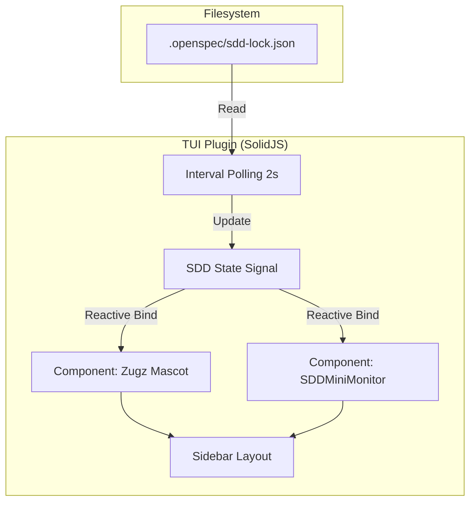

# 🧠 Consolidado de Contexto de Alta Densidad (SDD Compaction)
Fecha de consolidación: 2026-05-23
Cambio Activo: `visual-sdd-status`

---

## 📜 Propuesta y Objetivos
# Propuesta Técnica: Visual SDD Status en TUI

---

## 📐 Especificaciones y Escenarios
Escenarios BDD no estructurados.

---

## 🏛️ Estructura Arquitectónica
Esquema Arquitectónico:

---

## 📋 Estado del Checklist
Checklist de Tareas: 7/9 completadas.
- [x] **B.1: Tipado de Datos SDD**
- [x] **B.2: Señal y Polling Reactivo**
- [x] **C.1: Refactor de Mascota "Zugz"**
- [x] **C.2: Monitor de Fase SDD**
- [x] **C.3: Ajuste de Layout y Limites (37 chars)**
- [x] **D.1: Test de Reactividad**
- [x] **D.2: Auditoría Visual (sdd-ux-premium)**
- [ ] **E.1: Acortar Nombres de Fases**
- [ ] **E.2: Validación Final de Ancho**

---

> [!TIP]
> **Acción Recomendada para Limpiar Memoria de Contexto:**
> Si eres un subagente y ves este archivo, tu memoria ha sido compactada con éxito.
> Lee **únicamente** este archivo de consolidación para entender el estado actual y los contratos técnicos previos. Descarta la lectura repetitiva de chats históricos o archivos de logs antiguos.
