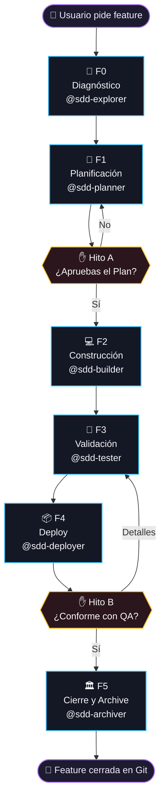

# 🤖 Zugzbot — Arnés SDD Multi-Agente para OpenCode

> [!IMPORTANT]
> **Zugzbot** es un arnés de orquestación industrial basado en **Spec-Driven Development (SDD) Simplificado** para [OpenCode](https://opencode.ai). Estructura el ciclo de vida del desarrollo de software en **6 fases secuenciales (F0 a F5)**, garantizando que ningún modelo de IA escriba código de producción sin planificación previa, revisión humana interactiva, validación estática de calidad y cierre documentado en Git.

---

## 🧠 Filosofía: SDD Simplificado de 6 Fases

**Ningún agente toca código sin un plan aprobado.** El ciclo SDD de Zugzbot se compone de 6 hitos estructurados donde 6 agentes especializados se pasan el control entre sí de forma atómica:



> [!NOTE]
> La **Fase 0** se ejecuta **solo una vez por proyecto** (si `.openspec/diagnostics.md` no existe) para mapear el stack del repositorio. En ciclos posteriores de desarrollo, `@zugzbot` salta directamente a la Fase 1.

---

## 🤖 Elenco de Agentes y Roles Técnicos

### Agentes del Ciclo Core SDD

| Agente | Rol | Fase | Entregable principal |
|:---|:---|:---:|:---|
| **`zugzbot`** | **Orquestador Maestro** — coordina la metodología, delega a subagentes, fiscaliza sus límites y gestiona las pausas de visto bueno humano (HIL). | Permanente | Roadmap de 6 fases y delegaciones rápidas. |
| **`sdd-explorer`** | **Diagnosticador e Indexador** — escanea la base de código, ejecuta análisis automáticos de habilidades y genera el mapa técnico del stack. | **F0** | `.openspec/diagnostics.md` + `skills_manifest.md` |
| **`sdd-planner`** | **Planificador e Interrogador** — realiza una encuesta consolidada de 3-5 preguntas concretas y redacta la especificación técnica en formato BDD. | **F1** | `.openspec/changes/<change-name>/specs/spec.md` |
| **`sdd-builder`** | **Constructor Lógico y Estético** — implementa el código en base a las especificaciones y asegura interfaces estéticamente modernas y balanceadas. | **F2** | Código funcional modificado de manera quirúrgica. |
| **`sdd-tester`** | **Control de Calidad y Pruebas** — ejecuta las suites de tests automatizados de forma nativa y valida el balanceo de etiquetas de marcado (HTML/JSX). | **F3** | `.openspec/changes/<change-name>/validation_report.md` |
| **`sdd-archiver`** | **Especialista de Cierre** — realiza el bump de versión del proyecto, consolida el CHANGELOG, prepara el commit semántico y archiva la carpeta del cambio. | **F4** | `commit_message.txt` y carpeta de cambio archivada. |

### Agentes Auxiliares fuera del Ciclo Core

| Agente | Rol | Limitación |
|:---|:---|:---|
| **`aux-oracle`** | Consultas conceptuales, arquitectura de sistemas y dudas sobre el código sin alterar archivos. | Edición y bash denegados. |
| **`aux-handyman`** | Parches atómicos rápidos o correcciones menores que involucren un máximo de 3 archivos sin necesidad de abrir un ciclo SDD completo. | Limitado a ediciones pequeñas. |

---

## 📂 Anatomía de Archivos (Compartidos vs Locales)

```
tu-proyecto/
├── .gitignore             # Archivos locales ignorados
├── AGENTS.md              # 🟢 Compartido: Reglamento y convenciones globales
├── ZUGZ.md                # 🟢 Compartido: Manual de inducción rápida
├── opencode.json          # 🟢 Compartido: Declaración de agentes y permisos
├── tui.json               # 🔴 Local: Cargador visual del plugin TUI
├── .opencode/             # 🔴 Local: Motor del arnés, herramientas, skills
│   ├── tools/            # Herramientas CLI del arnés
│   ├── plugins/          # Plugins del arnés
│   └── agents/           # Prompts de agentes
└── .openspec/
    ├── brain.md           # 🟢 Compartido: Base de conocimiento técnico
    ├── prompt_base.md     # 🟢 Compartido: Directrices de comportamiento
    ├── sdd-lock.json      # 🔴 Local: Estado y fase activa del ciclo
    └── changes/           # 🟢 Compartido: Historial de especificaciones
        └── <change-name>/
            ├── specs/spec.md
            └── verification_report.md
```

---

## 🛠️ Utilidad CLI Local (`sdd`)

```bash
# Ver el estado del ciclo activo
./sdd status

# Auditar estructuralmente las especificaciones BDD
./sdd validate

# Ejecutar suites de tests del proyecto
./sdd test

# Auditar sintaxis del linter y auditoria HTML
./sdd lint

# Limpiar logs y reiniciar el ciclo a Fase 0
./sdd clean

# Descartar modificaciones locales y regresar al checkpoint
./sdd rollback

# Cambiar perfil de modelos (free / balanced / turbo)
./sdd models preset turbo
```

---

## 🔌 Monitor SDD en Tiempo Real (TUI Plugin)

El plugin `plugin_tui.tsx` inyecta un panel reactivo en el sidebar lateral de OpenCode (activable con la tecla **`b`**), permitiendo visualizar:
* Un logo interactivo de ZUGZ con efectos estéticos degradados en naranja.
* La barra de porcentaje y el estado de progreso de las **6 fases (F0-F5)** del ciclo activo.
* El registro en tiempo real de las últimas transiciones y las tareas pendientes con su respectivo check.

---

## 📦 Instalación en tu Proyecto (One-Step Setup)

```bash
rm -rf /tmp/zugzbot \
  && git clone --depth=1 --branch main https://github.com/Danielisla96/zugzbot.git /tmp/zugzbot \
  && /tmp/zugzbot/zugz-plugin/install-plugin.sh "$(pwd)" \
  && rm -rf /tmp/zugzbot
```

### ¿Qué hace el instalador?
1. Valida entorno (Node.js, Git, Bun/NPM).
2. Copia el motor de agentes en `.opencode/`.
3. Crea archivos compartidos (`AGENTS.md`, `ZUGZ.md`, `opencode.json`).
4. Inyecta reglas en `.gitignore` para archivos locales.
5. Instala dependencias aisladas.

---

## 🤝 Contribuir al Arnés (Modo Desarrollo)

1. Haz fork de este repositorio.
2. Clona tu fork y ejecuta:
   ```bash
   ./zugz-plugin/install-plugin.sh
   ```
   *Esto crea symlinks en lugar de copiar, permitiendo desarrollo en tiempo real.*
3. Corre `bun install` o `npm install` en la raíz.
4. Envía un Pull Request con la especificación del cambio.

---

## ⚙️ Modelo Oficial

El modelo oficial del arnés es **`minimax-coding-plan/MiniMax-M2.7`**.

Para cambiar modelos, edita el campo `model` en cada archivo de agente en `.opencode/agents/` o usa los presets en `zugz-models.json`.

| Preset | Descripción |
|:---|:---|
| **default** | MiniMax-M2.7 para todos los agentes |
| **free** | DeepSeek V4 Flash gratuito |
| **balanced** | Gemini 3.5 Flash |
| **turbo** | Claude 3.5 Sonnet para builder, Gemini para el resto |

---

## 📋 Convenciones de Desarrollo

1. **Fase 0 solo una vez**: El diagnóstico se realiza cuando `.openspec/diagnostics.md` no existe.
2. **Carga perezosa**: Los agentes leen archivos solo bajo demanda (on a need-to-know basis).
3. **QA Manual primero**: El usuario valida en caliente antes del cierre automático.
4. **Tests de regresión**: Solo se ejecutan si existen en el proyecto (no se crean mocks).

---

## 📄 Licencia

MIT © Danielisla96
