# 🤖 Zugzbot SDD Harness: Orquestación Inteligente Multi-Agente de Alto Rendimiento

> [!IMPORTANT]
> **Zugzbot** es un arnés de orquestación industrial para **Desarrollo Guiado por Especificaciones (Spec-Driven Development - SDD)** multi-agente. Está diseñado a la medida para [OpenCode](https://opencode.ai) y [Cursor](https://cursor.sh), permitiendo estructurar un ciclo de vida de desarrollo de software completamente aislado, auditable y de grado de producción dentro de tu repositorio, sin ensuciar la configuración global del sistema ni requerir intervención manual constante.

---

## 🚀 Filosofía y Arquitectura del Ciclo SDD

Bajo esta constitución de desarrollo, **ningún modelo de Inteligencia Artificial escribe código de producción "al vuelo" o sin planificación previa**. Todo cambio de código o refactorización progresa de manera secuencial a través de **3 Hitos de Decisión (Fricción Cero)** y **9 Fases de Desarrollo**.

Este enfoque garantiza que el código sea correcto por diseño, validando firmas mediante el **Servidor de Lenguaje (LSP)** nativo antes de tocar una sola línea de código, y auto-curando fallas en bucle cerrado antes de molestar al desarrollador.

### 📐 Mapa del Ciclo de Vida y Flujo de Auto-Curación

El siguiente diagrama ilustra el viaje completo de una funcionalidad desde su concepción hasta su despliegue y cierre de versión. Nota cómo la suite de QA en la **Fase 5** actúa como un escudo, devolviendo el flujo automáticamente al equipo de construcción ante cualquier fallo de pruebas o linter.

```mermaid
flowchart TD
    %% Styling de Nodos y Colores Modernos
    classDef default fill:#0f1016,stroke:#3b3f5c,color:#f8f9fa,stroke-width:1px;
    classDef hito fill:#141724,stroke:#4e54c8,stroke-width:2px,color:#fff;
    classDef agent fill:#0a0c10,stroke:#00f2fe,stroke-width:1.5px,color:#e4e6eb;
    classDef error fill:#2b161d,stroke:#ff0055,stroke-width:1.5px,color:#ffccd5;
    classDef success fill:#162b1d,stroke:#00ff66,stroke-width:1.5px,color:#ccffd5;
    classDef user fill:#1d1b30,stroke:#b175ff,stroke-width:1.5px,color:#f3ebff;

    %% Subgraphs para los Hitos
    subgraph Hito_A ["🛡️ Hito A: Planificación y Diseño (Fases 0 - 2)"]
        direction TB
        F0["🔍 Fase 0: Diagnóstico e Indexación\n(@sdd-architect)\n- npx autoskills --detect\n- Indexado de código vía LSP"]
        F1["📝 Fase 1: Especificación y BDD\n(@sdd-architect)\n- Redacción de escenarios Gherkin\n- .openspec/changes/..."]
        F2["📐 Fase 2: Arquitectura y Plan\n(@sdd-architect)\n- Checklist detallado de tareas\n- Definición de archivos a modificar"]
        
        F0 --> F1 --> F2
    end
    class Hito_A hito;

    subgraph Hito_B ["💻 Hito B: Construcción y Simulación (Fases 3 - 5)"]
        direction TB
        F3["💻 Fase 3: Codificación de Lógica\n(@sdd-implementer)\n- Validación de firmas con LSP\n- Escritura de pruebas unitarias"]
        F4{"¿Requiere UI?"}
        F4_UI["🎨 Fase 4: Refinamiento UX/UI\n(@sdd-implementer)\n- Diseño estético, animaciones\n- Sin placeholders"]
        F5["🚀 Fase 5: Simulación y Despliegue\n(@sdd-launcher)\n- Levantar servidor local\n- clasp push / build efímero"]

        F3 --> F4
        F4 -- Sí --> F4_UI --> F5
        F4 -- No --> F5
    end
    class Hito_B hito;

    subgraph Hito_C ["🧪 Hito C: Calidad, Documentación y Cierre (Fases 6 - 8)"]
        direction TB
        F6["🧪 Fase 6: QA Final y Linter\n(@sdd-release-manager)\n- sdd lint & sdd test\n- Limpieza de lockfiles"]
        F7["📚 Fase 7: Changelog y Memoria\n(@sdd-release-manager)\n- Actualización de brain.md\n- Registro de lecciones en la base"]
        F8["🏁 Fase 8: Cierre y Git Commit\n(@sdd-release-manager)\n- Conventional Commits\n- sdd-lock.json -> idle"]

        F6 --> F7 --> F8
    end
    class Hito_C hito;

    %% Flujos del Usuario (Puertas de Enlace)
    U_Start["👤 Usuario solicita feature"] --> F0
    F2 --> U_ApproveA{"📋 Aprobación Hito A\n(¿Plan OK?)"}
    U_ApproveA -- "Aprobar (1)" --> F3
    U_ApproveA -- "Modificar" --> F0
    
    F5 --> U_ApproveB{"🌐 Aprobación Hito B\n(¿Visual/Funcional OK?)"}
    U_ApproveB -- "Aprobar (1)" --> F6
    U_ApproveB -- "Detalles" --> F3

    %% Bucle Cerrado de Auto-Curación (Súper-Poder Automatizado)
    F5 -- "❌ Fallo de QA Estático / Test Rotas" --> F5_Err["✏️ Escribe diagnostics.md con stacktrace"]
    F5_Err --> F3_Auto["💻 @sdd-implementer corrige código de forma autónoma"]
    F3_Auto --> F5

    %% Cierre del Ciclo
    F8 --> U_End["🎉 Feature terminada en Git y Lista!"]

    %% Clases
    class U_Start,U_ApproveA,U_ApproveB,U_End user;
    class F0,F1,F2,F3,F4_UI,F5,F6,F7,F8 agent;
    class F5_Err error;
    class F3_Auto success;
```



---

## 🤖 El Elenco de Agentes y Sus Superpoderes

El arnés se compone de **4 agentes especializados core** (diseñados para mantener un contexto ultra-enfocado, reduciendo drásticamente el consumo de tokens y eliminando alucinaciones) y **2 agentes auxiliares**:

### Agentes del Ciclo Core SDD (Flujo Principal)

| Agente | Perfil Operativo | Herramientas y Técnicas Clave | Fases |
| :--- | :--- | :--- | :--- |
| **`zugzbot`** | **Orquestador Primario** | Coordinación, ruteo del token en `sdd-lock.json`, gestión de aprobaciones con el usuario y control de transiciones síncronas. | Permanente |
| **`sdd-architect`** | **Ingeniero de Requerimientos y Diseño** | **Descubrimiento inicial**, ejecución de `npx autoskills --detect` para autoconfigurar herramientas locales, y uso intensivo de **LSP** para mapear la arquitectura. | Fases 0, 1 y 2 |
| **`sdd-implementer`** | **Desarrollador Full-Stack y UI/UX** | **Validación de firmas vía LSP** (`goToDefinition`, `hover`) antes de modificar, codificación modular, TDD, y diseño UI moderno sin placeholders. | Fases 3 y 4 |
| **`sdd-launcher`** | **Ingeniero de Plataforma** | Ejecución de entornos locales de simulación, compilación efímera (`clasp push`, `npm run dev`) y control de compuertas Human-in-the-Loop. | Fase 5 |
| **`sdd-release-manager`** | **Ingeniero de Calidad y DevOps** | Ejecución de pipelines de test y linter (`sdd lint`), mantenimiento de `brain.md`, generación de `CHANGELOG.md` y commits semánticos en Git. | Fases 6, 7 y 8 |

### Agentes Auxiliares (Modo Consulta y Parches Rápidos)

*   **`aux-oracle`**: Analista experto para resolver dudas conceptuales, analizar arquitecturas complejas o comparar patrones de diseño **sin realizar modificaciones de código**.
*   **`aux-handyman`**: Programador para cambios atómicos de emergencia (máximo 3 archivos modificados) que no justifican abrir un ciclo completo de SDD (ej. corrección de typos, renombrar una variable menor).

---

## ⚡ Activación Mandatoria de LSP (Súper-Poderes de Lectura)

Para que los agentes puedan realizar descubrimiento inteligente de archivos, verificar firmas de funciones y navegar el código de manera quirúrgica sin lecturas ciegas, se requiere levantar la sesión de OpenCode con el soporte experimental nativo activo:

```bash
OPENCODE_EXPERIMENTAL=true opencode
```

> [!TIP]
> Al habilitar esta bandera, el arnés configura automáticamente el permiso `"lsp": "allow"` para todos los agentes, permitiéndoles usar llamadas de `goToDefinition` y `hover` nativas de los servidores de lenguaje instalados en Cursor/VSCode.

---

## 💬 Simulación del "Pinponeo" Multi-Agente (End-to-End)

Para entender la magia detrás de Zugzbot, veamos una **simulación compacta y ultra-explicativa** de cómo cooperan el Desarrollador (Usuario), `@zugzbot` y los subagentes consolidados al implementar una nueva funcionalidad: *calcular un descuento automático de volumen del 10% para compras mayores a 5 artículos*.

---

### 1️⃣ Activación e Hito A (Planificación y Diseño)

**Usuario ➔ `@zugzbot`**
> Oye `@zugzbot`, me pidieron implementar un descuento del 10% automático cuando compren más de 5 artículos. Hay que integrarlo en el motor de facturación. ¿Iniciamos un ciclo SDD?

**`@zugzbot` ➔ `@sdd-architect`**
> ¡Al tiro! `@sdd-architect`, te paso el token del ciclo. Ejecuta la Fase 0 (Diagnóstico), Fase 1 (BDD Spec) y Fase 2 (Checklist). Indexa el código de facturación con LSP y verifica si faltan habilidades locales.

**🛠️ El Arquitecto trabaja en la planificación del cambio:**
*   **Descubrimiento & LSP**: Navega el proyecto usando herramientas LSP nativas (`goToDefinition` y `hover`) en `src/billing/calculator.js`. Identifica que la función `calculateTotal` recibe un carrito con formato `{ items: Array<{ qty: number, price: number }> }`.
*   **Auto-habilidades**: Ejecuta `npx autoskills --detect` para autoconfigurar soporte para Vitest.
*   **Especificaciones**: Diseña un escenario BDD en Gherkin (`discount.spec`) detallando el caso: *6 artículos de $100 c/u -> Descuento: $60, Neto: $540*.
*   **Checklist**: Escribe el plan de tareas quirúrgico en `volume-discount/tasks.md` detallando los archivos a crear y modificar.

**`@sdd-architect` ➔ `@zugzbot`**
> *[Hito A Completado]*: Mapeé la lógica con LSP en `calculator.js`. Plan arquitectónico y especificación BDD redactados. Quedamos listos para la aprobación del desarrollador.

**`@zugzbot` ➔ Usuario**
> ¡Impecable! `@sdd-architect` inspeccionó el repositorio usando LSP. Aquí tienes el plan para el **Hito A**:
> *   **Propuesta**: Inyectar lógica de descuento en `src/billing/calculator.js` y crear pruebas unitarias en `tests/billing/discount.test.js`.
> *   **BDD**: Escenario de descuento del 10% para compras mayores a 5 items.
> 
> 📋 **¿Aprobamos el diseño para iniciar la construcción?** (Responde `1` para sí, o indica ajustes).

---

### 2️⃣ Hito B (Construcción y Bucle Autónomo de Auto-Curación)

**Usuario ➔ `@zugzbot`**
> 1, ¡démosle no más!

**`@zugzbot` ➔ `@sdd-implementer`**
> `@sdd-implementer`: Plan aprobado. Iniciamos Fases 3 y 4. Lee las tareas en `tasks.md` y programa la lógica. Apóyate en LSP para evitar romper firmas del sistema.

**🛠️ El Implementador trabaja en la codificación:**
*   **Desarrollo**: Modifica `src/billing/calculator.js` agregando la regla de descuento del 10%. Crea el archivo de pruebas `tests/billing/discount.test.js` usando Vitest para corroborar el caso BDD.
*   **Registro**: Marca las casillas en `tasks.md` y genera el reporte técnico de la implementación.

**`@sdd-implementer` ➔ `@zugzbot`**
> *[Construcción Completa]*: Lógica programada y pruebas de Vitest listas. Handoff al Lanzador.

**`@zugzbot` ➔ `@sdd-launcher`**
> `@sdd-launcher`: Toma el token. Fase 5 activa. Corre tests preventivos y levanta el entorno de simulación.

**💥 El Lanzador ejecuta pruebas locales (Ocurre un error de sintaxis en los tests):**
*   **Fallo de QA**: `@sdd-launcher` ejecuta `npm run test` preventivo, pero falla debido a un error tipográfico en la importación de `calculator` (olvidó la extensión `.js` requerida por el bundler estricto).
*   **Acción**: El Lanzador escribe automáticamente el error en `diagnostics.md` y notifica a `@zugzbot` con estado `QUALITY_CHECKS_FAILED`. **No se interrumpe al usuario.**
*   **Bucle de Auto-Curación**: `@zugzbot` re-asigna el token al Implementador con el diagnóstico.

**🛠️ El Implementador trabaja en la auto-curación autónoma:**
*   **Resolución**: `@sdd-implementer` lee `diagnostics.md`, corrige la extensión a `calculator.js` y entrega la corrección de forma silenciosa en segundos.

**🔄 Re-Intento Exitoso:**
*   `@sdd-launcher` ejecuta las pruebas nuevamente (¡pasan al 100%!) y levanta el servidor local en el puerto `3000`.

**`@zugzbot` ➔ Usuario**
> ¡Éxito total! La lógica se programó e integró.
> 
> > [!NOTE]
> > Durante la simulación preventiva se detectó un fallo de importación en los tests. El arnés activó el **Bucle de Auto-Curación** y `@sdd-implementer` lo reparó de forma autónoma, logrando un QA del 100% limpio.
> 
> 🌐 **Servidor Activo**: Puedes probar los cambios en vivo en [http://localhost:3000](http://localhost:3000).
> 📋 **¿Funciona impecable? ¿Procedemos al cierre?** (Responde `1` para sí, o indica detalles).

---

### 3️⃣ Hito C (Aseguramiento de Calidad y Cierre Automatizado)

**Usuario ➔ `@zugzbot`**
> 1, funciona filete. Dale con el cierre.

**`@zugzbot` ➔ `@sdd-release-manager`**
> `@sdd-release-manager`: Hito B aprobado. Procede de forma autónoma al Hito C (Fases 6, 7 y 8). Ejecuta la auditoría estática, documenta y cierra la versión en Git.

**🛠️ El Gestor de Lanzamientos trabaja en el cierre técnico:**
*   **QA Final**: Corre la validación definitiva con `./.openspec/sdd validate` y `./.openspec/sdd lint`.
*   **Memoria del Proyecto**: Registra la lección aprendida sobre extensiones ESM en `.openspec/brain.md`.
*   **Changelog**: Registra la nueva versión `1.2.0` en `CHANGELOG.md`.
*   **Git**: Ejecuta `git commit` semántico autónomo: `feat(billing): add 10% volume discount...`.
*   **Liberación**: Purga locks y resetea el estado a inactivo (`idle`).

**`@zugzbot` ➔ Usuario**
> 🎉 **¡Ciclo Cerrado de forma 100% Exitosa!**
> 
> Todo el flujo ha sido completado:
> *   **QA Estática**: 100% aprobada.
> *   **Changelog & Memoria**: Documentados con éxito en `.openspec/brain.md` y `CHANGELOG.md`.
> *   **Git Commit**: Firmado y cerrado: `feat(billing): add 10% volume discount...`.
> 
> El arnés de Zugzbot ha retornado al estado inactivo (`idle`). ¡Listo para el siguiente desafío! 🚀

---

## 🛠️ Utilidad de CLI Local (`sdd`)

El arnés incorpora una utilidad portable ubicada en `./.openspec/sdd` (un script altamente optimizado) para controlar y monitorear el estado del desarrollo directamente desde tu terminal preferida:

```bash
# Imprime el diagrama de flujo y estado actual del ciclo multi-agente
./.openspec/sdd status

# Realiza una auditoría completa de consistencia de tus especificaciones BDD y esquemas
./.openspec/sdd validate

# Ejecuta la suite de linters estáticos configurada en el proyecto
./.openspec/sdd lint

# Ejecuta las pruebas unitarias y de integración
./.openspec/sdd test

# Purga logs de depuración, libera el lock de ejecución colgada y devuelve el estado a 'idle'
./.openspec/sdd clean

# Descarta cambios del ciclo actual de forma segura volviendo al último commit de Git
./.openspec/sdd rollback
```

---

## 🔌 Integración y Monitor TUI en Tiempo Real (OpenCode Plugin)

El arnés incorpora un **plugin nativo para OpenCode TUI** que añade un **Monitor SDD en Tiempo Real** directamente en el panel lateral de tu editor (desplegable presionando la tecla **`b`**).

Este monitor muestra el progreso de las fases de forma reactiva, una barra de carga ASCII premium y el subagente encargado actual sin tener que abrir navegadores externos.

### ❓ ¿Por qué la carpeta `plugin/` contiene un `node_modules`?
Durante el desarrollo, la carpeta `plugin/` genera su propio `node_modules` local. Esto **solo es necesario en tiempo de desarrollo** por dos motivos:
1. **IntelliSense y Autocompletado:** Para que tu editor (VS Code, Cursor, OpenCode, etc.) reconozca los tipos de `solid-js` y `@opencode-ai/plugin` y no marque errores de sintaxis en rojo.
2. **Typechecking (`npm run typecheck`):** Para poder compilar y validar la seguridad de tipos de TypeScript durante el desarrollo.

> [!IMPORTANT]
> **No es necesario para el funcionamiento en producción/tiempo de ejecución.** OpenCode ya incluye y resuelve estas dependencias internamente de forma automática al cargar el plugin. Por lo mismo, este directorio está convenientemente ignorado en `.gitignore` y nunca se sube a tu repositorio Git.

### 🚀 Cómo instalar y activar el Plugin en OpenCode

Puedes instalar este plugin de dos formas según tu preferencia:

#### Opción A: Instalación Global (Disponible en TODOS tus proyectos en tu Mac - Recomendado)
Si quieres que el Monitor SDD esté activo de forma global en cualquier carpeta donde ejecutes `opencode`:

1. Abre tu terminal de macOS.
2. Crea el directorio de plugins globales de OpenCode si no existe:
   ```bash
   mkdir -p ~/.config/opencode/plugins
   ```
3. Crea un enlace simbólico desde el archivo del plugin hacia tu configuración global:
   ```bash
   ln -s /Users/wavesbyte/Documents/zugzbot/plugin/sdd-sidebar.tsx ~/.config/opencode/plugins/sdd-sidebar.tsx
   ```
4. **¡Listo!** Cierra e inicia tu instancia de `opencode` y presiona **`b`** para abrir el panel lateral con el monitor activo en tiempo real.

#### Opción B: Instalación Local (Solo en el proyecto actual)
Si prefieres activar el plugin únicamente dentro de un proyecto específico:

1. Crea la carpeta de plugins locales si no existe en la raíz de tu proyecto destino:
   ```bash
   mkdir -p .opencode/plugins
   ```
2. Crea un enlace simbólico o copia el archivo:
   ```bash
   ln -s /Users/wavesbyte/Documents/zugzbot/plugin/sdd-sidebar.tsx .opencode/plugins/sdd-sidebar.tsx
   ```

---

## 📂 Estructura de Archivos del Proyecto Post-Bootstrap

Tras ejecutar la instalación, tu repositorio quedará configurado localmente con los siguientes archivos y carpetas estructuradas:

```
tu-proyecto/
 ├── .opencode/
 │   ├── agents/              # Prompts de sistema e instrucciones de los agentes consolidados
 │   │   ├── zugzbot.md           # Orquestador Maestro, Vocero Oficial y Guardián Didáctico
 │   │   ├── sdd-architect.md     # Arquitecto de Software y Diseñador Técnico (Fases 0 a 2)
 │   │   ├── sdd-implementer.md   # Programador y Desarrollador especialista (Fases 3 y 4)
 │   │   ├── sdd-launcher.md      # Ingeniero de Entornos y Despliegue Local (Fase 5)
 │   │   ├── sdd-release-manager.md # QA Lead y Technical Writer (Fases 6 a 8)
 │   │   ├── aux-oracle.md        # Asistente de Conocimiento General y Consultas Teóricas
 │   │   └── aux-handyman.md      # Asistente de Tareas Rápidas y No Estructurales
 │   ├── commands/            # Configuración de comandos slash integrados
 │   ├── mcp-config.json      # Configuración local de servidores MCP
 │   └── skills/              # Habilidades e integraciones en caliente de OpenCode
├── .openspec/
│   ├── changes/             # Historial y directorio de cambios activos (Specs BDD y tareas)
│   ├── schemas/             # Esquemas JSON de validación estructural
│   ├── sdd                  # Utilidad portable de CLI local para control de estado
│   ├── sdd-lock.json        # Lockfile que persiste el estado de la máquina de estados SDD
│   ├── prompt_base.md       # Reglamento global de personalidad, tono chileno e instrucciones
│   └── brain.md             # Memoria a largo plazo y base relacional de lecciones aprendidas
├── AGENTS.md                # Reglamento ético y de conducta para el equipo de modelos de IA
└── README.md                # Esta guía interactiva de uso técnico y operacional
```

---

## 📦 Instalación y Bootstrap Aislado

La instalación es **100% local, no intrusiva y contenida** dentro del directorio del proyecto. No requiere instalar binarios globales en tu sistema operativo.

### Requisitos Previos
*   Git 2.28+ configurado localmente.
*   OpenCode instalado y en ejecución en tu entorno.

### Comando de Instalación (V2 Consolidada)

Navega a la raíz del repositorio de tu proyecto destino y ejecuta el siguiente comando en la terminal:

```bash
rm -rf /tmp/zugzbot-harness \
  && git clone --depth 1 -b fix/v2 https://github.com/Danielisla96/zugzbot.git /tmp/zugzbot-harness \
  && /tmp/zugzbot-harness/sdd-harness/bootstrap-sdd.sh \
  && rm -rf /tmp/zugzbot-harness
```

Al terminar, la consola te mostrará una tarjeta interactiva con el mensaje de éxito de instalación y te recomendará ejecutar la sesión con soporte LSP:

```
┌──────────────────────────────────────────────────────────────┐
│  🎉 ¡INSTALACIÓN COMPLETADA CON ÉXITO!                       │
├──────────────────────────────────────────────────────────────┤
│  Siguientes pasos recomendados:                              │
│  1. Abre tu editor de código preferido en este proyecto.    │
│  2. Levanta tu entorno de OpenCode ejecutando:              │
│     OPENCODE_EXPERIMENTAL=true opencode                      │
│  3. Llama a Zugzbot y pídele el cambio que necesitas.       │
│  4. Zugzbot orquestará el ciclo SDD de forma impecable.      │
└──────────────────────────────────────────────────────────────┘
```

---

## 📜 Reglamento de Conducta del Equipo (AGENTS.md)

Todos los subagentes operan bajo la estricta directiva de `AGENTS.md`, la cual asegura:
1.  **Código Limpio e Higiene Estructural**: Respetar patrones SOLID, modularización y evitar duplicaciones absurdas.
2.  **Cero Alucinaciones de APIs**: Es mandatorio validar la compatibilidad de firmas llamando a las herramientas LSP en lugar de realizar conjeturas.
3.  **Higiene en Control de Versiones**: Commits de Git con mensajes limpios, breves y libres de marcas que delaten autoría de un modelo de IA.
