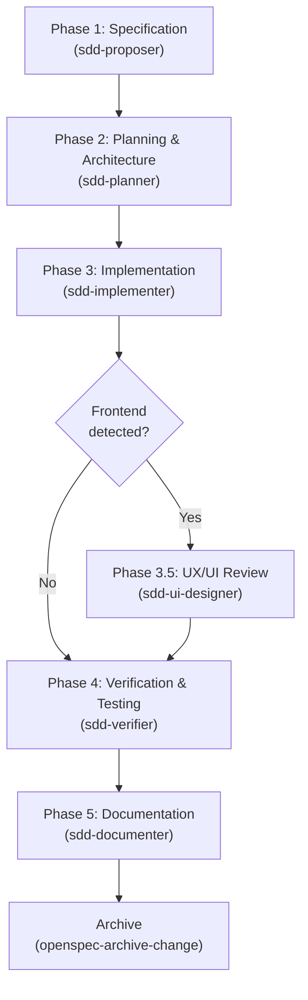

# Zugzbot SDD Harness

> [!IMPORTANT]
> **Zugzbot** is a reusable, multi-agent Spec-Driven Development (SDD) orchestration harness for [OpenCode](https://opencode.ai). It installs a complete, production-grade AI development lifecycle into any project with a single command — fully project-scoped, nothing written to your global config.

---

## 🚀 Key Concepts & Architecture

This harness implements a strict **Spec-Driven Development (SDD)** lifecycle orchestrated by **Zugzbot**, a primary agent that delegates every phase to a specialized subagent. No agent writes code without an approved spec, plan, and task list.



---

## 🤖 Agent Roster

### SDD Cycle Agents

| Agent | Role | Phase |
|---|---|---|
| `zugzbot` | Primary orchestrator — routes, delegates, and gates every phase | Always active |
| `sdd-proposer` | Conducts technical interview, generates `proposal.md` and `spec.md` | Phase 1 |
| `sdd-planner` | Designs architecture, breaks work into atomic tasks | Phase 2 |
| `sdd-implementer` | Writes production code following the task checklist | Phase 3 |
| `sdd-ui-designer` | Starts dev server, screenshots UI, applies UX/UI improvements | Phase 3.5 *(conditional — frontend only)* |
| `sdd-verifier` | Runs linting, test suite, curl verification report | Phase 4 |
| `sdd-documenter` | Generates `README.md`, `docs/TECHNICAL.md`, `docs/USER_GUIDE.md` | Phase 5 |

### Auxiliary Agents

| Agent | Role | Permissions |
|---|---|---|
| `aux-oracle` | Answers general knowledge questions **unrelated to the project** | Read-only — never touches project files |
| `aux-handyman` | Executes small, scoped project tasks that don't warrant a full SDD cycle | Read + Edit, with mandatory SDD escalation rules |

---

## 📋 The Full SDD Lifecycle

Every significant change goes through these sequential phases:

1. **Phase 1 — Specification (`sdd-proposer`)**
   - Conducts a structured technical interview with the user.
   - Generates `openspec/changes/<name>/proposal.md` (what & why).
   - Generates `openspec/changes/<name>/specs/spec.md` with Gherkin scenarios (`Given / When / Then`).

2. **Phase 2 — Planning & Architecture (`sdd-planner`)**
   - Designs the system architecture following SOLID and Clean Architecture principles.
   - Produces `orchestrator_architecture.md` and an atomic task checklist in `orchestrator_tasks.md`.

3. **Phase 3 — Implementation (`sdd-implementer`)**
   - Implements source code sequentially following the task checklist.
   - No bash access — purely a file editor. LSP quality gate before handoff.

4. **Phase 3.5 — UX/UI Review (`sdd-ui-designer`) — *Conditional***
   - Automatically activated when frontend is detected (React, Vue, HTML/CSS, etc.).
   - Starts the dev server, captures screenshots via browser tools, analyzes the UI against UX best practices, and applies improvements.
   - Produces `ui_review_report.md` with before/after evidence.

5. **Phase 4 — Verification & Testing (`sdd-verifier`)**
   - Runs static analysis, linting, and the full test suite.
   - Starts the server and performs real curl calls, documenting results in `verification_report.md`.
   - Auto-healing loop: on test failure, re-activates `sdd-implementer` with the error trace.

6. **Phase 5 — Documentation (`sdd-documenter`)**
   - Reads all SDD artifacts (proposal, spec, architecture, verification report, source code).
   - Writes or updates three canonical documents:
     - `README.md` — project overview and quick start
     - `docs/TECHNICAL.md` — architecture, Mermaid diagrams, API catalogue
     - `docs/USER_GUIDE.md` — installation, usage examples, troubleshooting

7. **Archive**
   - After user approval of the docs, `sdd-verifier` runs `openspec-archive-change`.
   - The change directory moves to `openspec/changes/archive/YYYY-MM-DD-<name>/`.

---

## 📦 Installation

> [!NOTE]
> The bootstrap script is fully **project-scoped** — it writes nothing to your global OpenCode or system configuration. Every file lands inside your target project.

### Prerequisites

- [OpenCode](https://opencode.ai) installed and available in your PATH.
- Git 2.28+ (required for `git init -b main` support).

### Option A — One-Line Zero-Footprint Install (Recommended)

Navigate to the root of your target project and run:

```bash
git clone --depth 1 https://github.com/Danielisla96/zugzbot.git /tmp/zugzbot-harness \
  && /tmp/zugzbot-harness/sdd-harness/bootstrap-sdd.sh \
  && rm -rf /tmp/zugzbot-harness
```

This clones the harness to a temporary directory, runs the bootstrap, and cleans up — leaving no trace except the files injected into your project.

### Option B — Local Clone Install

If you already have the repository cloned:

```bash
cd /path/to/your/project
/path/to/zugzbot/sdd-harness/bootstrap-sdd.sh
```

### What the bootstrap does

```
[0/6] Git check     — initializes git with main branch if no .git exists; creates .gitignore
[1/6] Directories   — creates .agent/, .opencode/, openspec/
[2/6] Agent prompts — copies all agent .md files into .opencode/agents/
[3/6] opencode.jsonc — generates project-local agent registry (all 9 agents)
[4/6] Skills & schemas — injects skills, workflows, commands, and OpenSpec schemas
[5/6] Git checkpoint — commits the harness install as a traceable git commit
[6/6] AGENTS.md     — installs the master rule set for all agents
```

---

## 📂 Project Structure After Bootstrap

```
your-project/
├── .agent/
│   ├── skills/              # openspec-* and sdd-* skill definitions
│   └── workflows/           # opsx-* declarative workflow files
├── .opencode/
│   ├── agents/              # All agent prompts (zugzbot, sdd-*, aux-*)
│   ├── commands/            # Slash command mappings
│   └── skills/              # Skill definitions (opencode-scoped)
├── openspec/
│   ├── changes/             # Active and archived SDD changes
│   └── schemas/
│       └── ssd-orchestrated/ # Schema templates (proposal, spec, architecture, tasks)
├── docs/                    # Generated by sdd-documenter after first cycle
│   ├── TECHNICAL.md
│   └── USER_GUIDE.md
├── opencode.jsonc           # Project-local agent registry
├── AGENTS.md                # Master rules governing all agents
└── README.md                # Updated by sdd-documenter after first cycle
```

---

## ⚡ Slash Command Reference

| Command | Description |
|---|---|
| `/opsx-propose <description>` | Start Phase 1 — interview and spec generation |
| `/opsx-explore <query>` | Enter exploration mode to think through complex problems |
| `/opsx-apply` | Start Phase 3 — implementation from the approved task checklist |
| `/opsx-archive` | Archive a completed change after all phases are signed off |

---

## 📜 Master Rules (AGENTS.md)

All agents are governed by `AGENTS.md`, which enforces:
- No production code without an approved spec and task checklist.
- SOLID principles, Clean Architecture, and conventional commits.
- Strict phase gating — Zugzbot cannot advance without explicit user approval at each phase boundary.
- No global configuration changes — everything is project-scoped.
