# 🤖 Zugzbot SDD Harness: Orquestación Inteligente Multi-Agente de Alto Rendimiento

> [!IMPORTANT]
> **Zugzbot** es un arnés de orquestación industrial para **Desarrollo Guiado por Especificaciones (Spec-Driven Development - SDD)** multi-agente. Está diseñado a la medida para [OpenCode](https://opencode.ai) y [Cursor](https://cursor.sh), permitiendo estructurar un ciclo de vida de desarrollo de software completamente aislado, auditable y de grado de producción dentro de tu repositorio, sin ensuciar la configuración global del sistema ni requerir intervención manual constante.

---

## 🚀 Filosofía y Arquitectura del Ciclo SDD

Bajo esta constitución de desarrollo, **ningún modelo de Inteligencia Artificial escribe código de producción "al vuelo" o sin planificación previa**. Todo cambio de código o refactorización progresa de manera secuencial a través de **3 Hitos de Decisión (Fricción Cero)** y **9 Fases de Desarrollo**.

Este enfoque garantiza que el código sea correcto por diseño, validando firmas mediante el **Servidor de Lenguaje (LSP)** nativo antes de tocar una sola línea de código, y auto-curando fallas en bucle cerrado antes de molestar al desarrollador.

### 📐 Mapa del Ciclo de Vida y Flujo de Auto-Curación

El siguiente diagrama ilustra el viaje completo de una funcionalidad desde su concepción hasta su despliegue y cierre de versión. Nota cómo la suite de QA en la **Fase 5** actúa como un escudo, devolviendo el flujo automáticamente al equipo de construcción ante cualquier fallo de pruebas o linter.

```mermaid
flowchart TD
    %% Styling de Nodos y Colores Modernos
    classDef default fill:#0f1016,stroke:#3b3f5c,color:#f8f9fa,stroke-width:1px;
    classDef hito fill:#141724,stroke:#4e54c8,stroke-width:2px,color:#fff;
    classDef agent fill:#0a0c10,stroke:#00f2fe,stroke-width:1.5px,color:#e4e6eb;
    classDef error fill:#2b161d,stroke:#ff0055,stroke-width:1.5px,color:#ffccd5;
    classDef success fill:#162b1d,stroke:#00ff66,stroke-width:1.5px,color:#ccffd5;
    classDef user fill:#1d1b30,stroke:#b175ff,stroke-width:1.5px,color:#f3ebff;

    %% Subgraphs para los Hitos
    subgraph Hito_A ["🛡️ Hito A: Planificación y Diseño (Fases 0 - 2)"]
        direction TB
        F0["🔍 Fase 0: Diagnóstico e Indexación\n(@sdd-architect)\n- npx autoskills --detect\n- Indexado de código vía LSP"]
        F1["📝 Fase 1: Especificación y BDD\n(@sdd-architect)\n- Redacción de escenarios Gherkin\n- .openspec/changes/..."]
        F2["📐 Fase 2: Arquitectura y Plan\n(@sdd-architect)\n- Checklist detallado de tareas\n- Definición de archivos a modificar"]
        
        F0 --> F1 --> F2
    end
    class Hito_A hito;

    subgraph Hito_B ["💻 Hito B: Construcción y Simulación (Fases 3 - 5)"]
        direction TB
        F3["💻 Fase 3: Codificación de Lógica\n(@sdd-implementer)\n- Validación de firmas con LSP\n- Escritura de pruebas unitarias"]
        F4{"¿Requiere UI?"}
        F4_UI["🎨 Fase 4: Refinamiento UX/UI\n(@sdd-implementer)\n- Diseño estético, animaciones\n- Sin placeholders"]
        F5["🚀 Fase 5: Simulación y Despliegue\n(@sdd-launcher)\n- Levantar servidor local\n- clasp push / build efímero"]

        F3 --> F4
        F4 -- Sí --> F4_UI --> F5
        F4 -- No --> F5
    end
    class Hito_B hito;

    subgraph Hito_C ["🧪 Hito C: Calidad, Documentación y Cierre (Fases 6 - 8)"]
        direction TB
        F6["🧪 Fase 6: QA Final y Linter\n(@sdd-release-manager)\n- sdd lint & sdd test\n- Limpieza de lockfiles"]
        F7["📚 Fase 7: Changelog y Memoria\n(@sdd-release-manager)\n- Actualización de brain.md\n- Registro de lecciones en la base"]
        F8["🏁 Fase 8: Cierre y Git Commit\n(@sdd-release-manager)\n- Conventional Commits\n- sdd-lock.json -> idle"]

        F6 --> F7 --> F8
    end
    class Hito_C hito;

    %% Flujos del Usuario (Puertas de Enlace)
    U_Start["👤 Usuario solicita feature"] --> F0
    F2 --> U_ApproveA{"📋 Aprobación Hito A\n(¿Plan OK?)"}
    U_ApproveA -- "Aprobar (1)" --> F3
    U_ApproveA -- "Modificar" --> F0
    
    F5 --> U_ApproveB{"🌐 Aprobación Hito B\n(¿Visual/Funcional OK?)"}
    U_ApproveB -- "Aprobar (1)" --> F6
    U_ApproveB -- "Detalles" --> F3

    %% Bucle Cerrado de Auto-Curación (Súper-Poder Automatizado)
    F5 -- "❌ Fallo de QA Estático / Test Rotas" --> F5_Err["✏️ Escribe diagnostics.md con stacktrace"]
    F5_Err --> F3_Auto["💻 @sdd-implementer corrige código de forma autónoma"]
    F3_Auto --> F5

    %% Cierre del Ciclo
    F8 --> U_End["🎉 Feature terminada en Git y Lista!"]

    %% Clases
    class U_Start,U_ApproveA,U_ApproveB,U_End user;
    class F0,F1,F2,F3,F4_UI,F5,F6,F7,F8 agent;
    class F5_Err error;
    class F3_Auto success;
```



---

## 🤖 El Elenco de Agentes y Sus Superpoderes

El arnés se compone de **4 agentes especializados core** (diseñados para mantener un contexto ultra-enfocado, reduciendo drásticamente el consumo de tokens y eliminando alucinaciones) y **2 agentes auxiliares**:

### Agentes del Ciclo Core SDD (Flujo Principal)

| Agente | Perfil Operativo | Herramientas y Técnicas Clave | Fases |
| :--- | :--- | :--- | :--- |
| **`zugzbot`** | **Orquestador Primario** | Coordinación, ruteo del token en `sdd-lock.json`, gestión de aprobaciones con el usuario y control de transiciones síncronas. | Permanente |
| **`sdd-architect`** | **Ingeniero de Requerimientos y Diseño** | **Descubrimiento inicial**, ejecución de `npx autoskills --detect` para autoconfigurar herramientas locales, y uso intensivo de **LSP** para mapear la arquitectura. | Fases 0, 1 y 2 |
| **`sdd-implementer`** | **Desarrollador Full-Stack y UI/UX** | **Validación de firmas vía LSP** (`goToDefinition`, `hover`) antes de modificar, codificación modular, TDD, y diseño UI moderno sin placeholders. | Fases 3 y 4 |
| **`sdd-launcher`** | **Ingeniero de Plataforma** | Ejecución de entornos locales de simulación, compilación efímera (`clasp push`, `npm run dev`) y control de compuertas Human-in-the-Loop. | Fase 5 |
| **`sdd-release-manager`** | **Ingeniero de Calidad y DevOps** | Ejecución de pipelines de test y linter (`sdd lint`), mantenimiento de `brain.md`, generación de `CHANGELOG.md` y commits semánticos en Git. | Fases 6, 7 y 8 |

### Agentes Auxiliares (Modo Consulta y Parches Rápidos)

*   **`aux-oracle`**: Analista experto para resolver dudas conceptuales, analizar arquitecturas complejas o comparar patrones de diseño **sin realizar modificaciones de código**.
*   **`aux-handyman`**: Programador para cambios atómicos de emergencia (máximo 3 archivos modificados) que no justifican abrir un ciclo completo de SDD (ej. corrección de typos, renombrar una variable menor).

---

## ⚡ Activación Mandatoria de LSP (Súper-Poderes de Lectura)

Para que los agentes puedan realizar descubrimiento inteligente de archivos, verificar firmas de funciones y navegar el código de manera quirúrgica sin lecturas ciegas, se requiere levantar la sesión de OpenCode con el soporte experimental nativo activo:

```bash
OPENCODE_EXPERIMENTAL=true opencode
```

> [!TIP]
> Al habilitar esta bandera, el arnés configura automáticamente el permiso `"lsp": "allow"` para todos los agentes, permitiéndoles usar llamadas de `goToDefinition` y `hover` nativas de los servidores de lenguaje instalados en Cursor/VSCode.

---

## 💬 Simulación del "Pinponeo" Multi-Agente (End-to-End)

Para entender cómo funciona el arnés, veamos una **transcripción realista** de cómo interactúan el Desarrollador (Usuario), `@zugzbot` y los subagentes en un proyecto real.

### 🎬 Escenario
El usuario quiere agregar una funcionalidad para calcular el descuento por volumen de compra en un sistema de facturación en Node.js + Vitest.

---

### 1️⃣ Activación e Hito A (Planificación y Diseño)

**Usuario ➔ `@zugzbot`**
> Oye `@zugzbot`, me pidieron implementar un descuento automático del 10% cuando el cliente compre más de 5 artículos en el carrito. Esto hay que integrarlo en el motor de facturación existente. ¿Podemos iniciar un ciclo SDD, porfa?

**`@zugzbot` ➔ Sistema (`sdd-lock.json`)**
*Zugzbot actualiza el estado local y bloquea el ciclo para evitar colisiones.*
```json
{
  "state": "active",
  "active_agent": "sdd-architect",
  "phase": "Phase_0_Discovery",
  "current_change": "volume-discount"
}
```

**`@zugzbot` ➔ `@sdd-architect`**
> `@sdd-architect`: Te paso el token del ciclo. Inicia el Hito A (Fases 0, 1 y 2) para el cambio `volume-discount`. Ejecuta el descubrimiento del proyecto, corre `npx autoskills --detect` para asegurar las habilidades correctas, e indexa las firmas de cálculo de facturación usando LSP.

**`@sdd-architect` ➔ Terminal y LSP (Consola interna de OpenCode)**
1. *El Arquitecto ejecuta diagnóstico inicial:*
   ```bash
   npx autoskills --detect
   ```
   *Autoskills detecta un entorno Node.js con Vitest e instala automáticamente la habilidad `vitest-helper`.*
2. *Usa LSP (`goToDefinition`) para saltar directamente a `src/billing/calculator.js` y ver la estructura actual de la función `calculateTotal`.*
3. *Usa LSP (`hover`) en la firma de `calculateTotal` y descubre que recibe un objeto `Cart` con la estructura `{ items: Array<{ qty: number, price: number }> }`.*
4. *El Arquitecto crea la especificación técnica y las pruebas BDD en `.openspec/changes/volume-discount/specs/discount.spec`:*
   ```gherkin
   Feature: Descuento por Volumen
     Scenario: Compra de más de 5 artículos aplica 10% de descuento
       Given un carrito con 6 artículos de un valor neto de $100 cada uno
       When se calcula el total de la factura
       Then el descuento aplicado debe ser $60
       And el total neto a cobrar debe ser $540
   ```
5. *Escribe el checklist quirúrgico de tareas en `.openspec/changes/volume-discount/tasks.md`.*
6. *Devuelve el control a `@zugzbot` escribiendo su reporte técnico.*

**`@sdd-architect` ➔ `@zugzbot`**
> ```yaml
> ---
> SDD_STATUS: HITO_A_COMPLETED
> REASON: "Fases 0, 1 y 2 terminadas. Se mapeó la lógica de facturación mediante LSP en `src/billing/calculator.js`. Plan y pruebas BDD listos."
> TASKS_CHECKLIST: ".openspec/changes/volume-discount/tasks.md"
> ---
> `@zugzbot`: El plan arquitectónico está impecable. Quedo a la espera de la aprobación del desarrollador.
> ```

**`@zugzbot` ➔ Usuario**
> ¡Hola! `@sdd-architect` completó su análisis de forma espectacular. Corrió `npx autoskills --detect` para integrar los helpers de testing, y usó LSP para verificar la firma de `calculateTotal` en `src/billing/calculator.js`.
>
> Aquí tienes el resumen del **Hito A**:
> *   **Propuesta**: Modificar `src/billing/calculator.js` para inyectar una función interna `applyVolumeDiscount(cart)`.
> *   **Especificación BDD**: Creada una regla Gherkin para aplicar 10% de descuento en carritos con más de 5 artículos.
> *   **Archivos a Modificar/Crear**:
>     *   `[MODIFY] src/billing/calculator.js`
>     *   `[NEW] tests/billing/discount.test.js`
>
> 📋 **¿Aprobamos el diseño para iniciar la codificación?**
> *Responde `1` para dar el vamos, o indícame si quieres hacer algún ajuste.*

---

### 2️⃣ Hito B (Construcción, Simulación y la Magia de la Auto-Curación)

**Usuario ➔ `@zugzbot`**
> 1, démosle no más! Quedó súper claro el plan.

**`@zugzbot` ➔ Sistema (`sdd-lock.json`)**
```json
{
  "state": "active",
  "active_agent": "sdd-implementer",
  "phase": "Phase_3_Coding",
  "current_change": "volume-discount"
}
```

**`@zugzbot` ➔ `@sdd-implementer`**
> `@sdd-implementer`: El plan fue aprobado por el desarrollador. Ejecuta las Fases 3 y 4. Lee `.openspec/changes/volume-discount/tasks.md` y realiza la codificación. Usa LSP para validar las firmas del motor de facturación antes de inyectar cambios.

**`@sdd-implementer` ➔ Archivos del Código**
1. *El Implementador usa LSP (`goToDefinition`) para leer la línea exacta de importación en `src/billing/calculator.js`.*
2. *Realiza la codificación:*
   ```javascript
   // src/billing/calculator.js
   export function calculateTotal(cart) {
     const subtotal = cart.items.reduce((acc, item) => acc + (item.price * item.qty), 0);
     const totalQty = cart.items.reduce((acc, item) => acc + item.qty, 0);
     
     // Aplicar descuento por volumen
     let discount = 0;
     if (totalQty > 5) {
       discount = subtotal * 0.10; // 10% de descuento
     }
     
     return {
       subtotal,
       discount,
       total: subtotal - discount
     };
   }
   ```
3. *Crea el archivo de pruebas `tests/billing/discount.test.js`:*
   ```javascript
   import { expect, test } from 'vitest';
   import { calculateTotal } from '../../src/billing/calculator';

   test('Aplica 10% de descuento si hay mas de 5 items', () => {
     const cart = {
       items: [
         { price: 100, qty: 6 }
       ]
     };
     const result = calculateTotal(cart);
     expect(result.discount).toBe(60);
     expect(result.total).toBe(540);
   });
   ```
4. *Marca los elementos completados en el archivo `tasks.md`.*
5. *Entrega el reporte de construcción.*

**`@sdd-implementer` ➔ `@zugzbot`**
> ```yaml
> ---
> SDD_STATUS: SUCCESS
> REASON: "Fase 3 finalizada. Lógica de descuento integrada y pruebas unitarias escritas."
> ---
> `@zugzbot`: Lógica lista. Pasa el token a `@sdd-launcher` para levantar la simulación y correr las pruebas iniciales.
> ```

**`@zugzbot` ➔ `@sdd-launcher`**
> `@sdd-launcher`: Toma el control. Activa la Fase 5. Corre la suite de pruebas preventivas y levanta el entorno de simulación local.

---

### 💥 Bucle de Auto-Curación (Detrás de escena: Algo falla)

**`@sdd-launcher` ➔ Terminal de Pruebas**
*El Lanzador corre las pruebas usando el comando configurado:*
```bash
npm run test
```
*¡Oh no! Las pruebas fallan por un error tipográfico en la importación de `calculateTotal` en `tests/billing/discount.test.js` (puso `../../src/billing/calculator` en lugar de `../../src/billing/calculator.js` y el bundler estricto se queja).*

**`@sdd-launcher` ➔ Archivos de Control**
1. *El Lanzador no molesta al usuario. Genera automáticamente un archivo de diagnóstico temporal `.openspec/diagnostics.md`:*
   ```markdown
   # DIAGNÓSTICO DE FALLA - FASE 5
   - **Módulo**: Tests unitarios
   - **Error**: `Error: Cannot find module '../../src/billing/calculator'` en `tests/billing/discount.test.js:1`
   ```
2. *Devuelve el flujo con estado de error controlado:*
   ```yaml
   ---
   SDD_STATUS: ERROR_DETECTED
   REASON: "Fallo en la suite de pruebas al intentar importar el módulo en los tests."
   DIAGNOSTIC_PATH: ".openspec/diagnostics.md"
   ---
   ```

**`@zugzbot` ➔ `@sdd-implementer` (Auto-Healing Trigger)**
> `@sdd-implementer`: `@sdd-launcher` detectó un fallo de QA en las pruebas preventivas. Lee `.openspec/diagnostics.md` y corrige la codificación de inmediato de forma autónoma. No levantes banderas con el desarrollador aún.

**`@sdd-implementer` ➔ Archivos del Código**
1. *El Implementador lee `.openspec/diagnostics.md`.*
2. *Usa LSP (`goToDefinition`) para corroborar la ruta relativa exacta de `src/billing/calculator.js` respecto a `tests/billing/discount.test.js`.*
3. *Corrige la línea 1 de `tests/billing/discount.test.js`:*
   ```javascript
   // Corregido: se añade la extensión .js requerida por el entorno estricto de ESM
   import { calculateTotal } from '../../src/billing/calculator.js';
   ```
4. *Guarda el archivo y responde:*
   ```yaml
   ---
   SDD_STATUS: REPAIRED
   REASON: "Error de importación corregido añadiendo la extensión .js."
   ---
   ```

**`@zugzbot` ➔ `@sdd-launcher` (Re-Intento)**
> `@sdd-launcher`: El Implementador ha reparado el código. Re-ejecuta la Fase 5.

**`@sdd-launcher` ➔ Terminal de Pruebas y Servidor**
1. *Vuelve a ejecutar `npm run test`. ¡Todas las pruebas pasan al 100%!*
2. *Levanta el servidor local de desarrollo (`npm run dev`) en el puerto 3000.*
3. *Entrega el reporte final de simulación exitoso:*

```yaml
---
SDD_STATUS: LAUNCHER_READY
LOCAL_URL: "http://localhost:3000"
QA_STATUS: "PASSED (1/1 tests ok, 0 lint warnings)"
---
`@zugzbot`: Entorno de simulación levantado impecable en puerto 3000. QA preventiva limpia.
```

**`@zugzbot` ➔ Usuario**
> ¡Éxito total! La lógica se construyó perfectamente y el entorno local está listo.
>
> > [!NOTE]
> > Durante la simulación preventiva, detectamos un error menor de importación en los tests unitarios. El arnés activó el **Bucle de Auto-Curación** y `@sdd-implementer` lo reparó de forma autónoma en segundos, logrando un QA del 100% libre de advertencias.
>
> 🌐 **Servidor de Simulación Activo**: Puedes verificar los cambios y probar en vivo en [http://localhost:3000](http://localhost:3000).
>
> 📋 **¿Todo funciona impecable por tu lado? ¿Procedemos al cierre de la versión en Git?**
> *Responde `1` para dar la orden de cierre o coméntame cualquier detalle.*

---

### 3️⃣ Hito C (Aseguramiento de Calidad y Cierre Autónomo)

**Usuario ➔ `@zugzbot`**
> 1, ¡funciona de lujo! Dale con el cierre.

**`@zugzbot` ➔ Sistema (`sdd-lock.json`)**
```json
{
  "state": "active",
  "active_agent": "sdd-release-manager",
  "phase": "Phase_6_ReleaseQA",
  "current_change": "volume-discount"
}
```

**`@zugzbot` ➔ `@sdd-release-manager`**
> `@sdd-release-manager`: El Hito B fue aprobado por el desarrollador. Entras en acción para las Fases 6, 7 y 8. Ejecuta los linters y pruebas oficiales, actualiza la memoria del proyecto, genera el CHANGELOG y realiza el commit semántico en Git de manera autónoma.

**`@sdd-release-manager` ➔ Terminal y Repositorio**
1. *El Release Manager corre la suite oficial de auditoría:*
   ```bash
   ./.openspec/sdd validate && ./.openspec/sdd lint
   ```
2. *QA estático y linters completados con 0 errores.*
3. *Actualiza `.openspec/brain.md` agregando la lección aprendida:*
   > * Lección #42: Al trabajar con bundlers estrictos de ESM, las importaciones en las suites de pruebas de Vitest requieren de forma mandatoria especificar la extensión explícita `.js` para evitar fallos de resolución en tiempo de compilación efímera.
4. *Actualiza `.openspec/CHANGELOG.md` documentando la versión:*
   ```markdown
   ## [1.2.0] - 2026-05-22
   ### Added
   - Implementación de descuento automático por volumen (10%) para compras de más de 5 artículos en `src/billing/calculator.js`.
   - Pruebas unitarias de descuento en `tests/billing/discount.test.js`.
   ```
5. *Limpia archivos residuales y purga los locks de ejecución:*
   ```bash
   ./.openspec/sdd clean
   ```
6. *Prepara el mensaje de commit y firma en Git de forma autónoma:*
   ```bash
   git add .
   git commit -m "feat(billing): add 10% volume discount utility for sales above 5 items"
   ```
7. *Devuelve el estado a Inactivo (Idle) y notifica el cierre de ciclo:*
   ```yaml
   ---
   SDD_STATUS: IDLE
   REASON: "Ciclo de vida cerrado de forma exitosa. Cambios integrados a Git de forma semántica y memoria de brain.md sincronizada."
   ---
   ```

**`@zugzbot` ➔ Usuario**
> 🎉 **¡Ciclo Cerrado de forma 100% Exitosa!**
>
> Hemos completado la integración de forma impecable y automatizada. Aquí tienes tu reporte del **Hito C**:
> *   **QA Estática**: 100% aprobada (Vitest corrió todas las pruebas limpias).
> *   **Changelog**: Actualizado en `.openspec/CHANGELOG.md` y memoria de lecciones aprendidas registrada en `.openspec/brain.md`.
> *   **Git Commit Semántico**: Realizado de manera limpia:
>     `feat(billing): add 10% volume discount utility for sales above 5 items`
>
> El arnés de Zugzbot ha retornado al estado inactivo (`idle`). ¡Listo para el siguiente desafío! 🚀

---

## 🛠️ Utilidad de CLI Local (`sdd`)

El arnés incorpora una utilidad portable ubicada en `./.openspec/sdd` (un script altamente optimizado) para controlar y monitorear el estado del desarrollo directamente desde tu terminal preferida:

```bash
# Imprime el diagrama de flujo y estado actual del ciclo multi-agente
./.openspec/sdd status

# Realiza una auditoría completa de consistencia de tus especificaciones BDD y esquemas
./.openspec/sdd validate

# Ejecuta la suite de linters estáticos configurada en el proyecto
./.openspec/sdd lint

# Ejecuta las pruebas unitarias y de integración
./.openspec/sdd test

# Purga logs de depuración, libera el lock de ejecución colgada y devuelve el estado a 'idle'
./.openspec/sdd clean

# Descarta cambios del ciclo actual de forma segura volviendo al último commit de Git
./.openspec/sdd rollback
```

---

## 📂 Estructura de Archivos del Proyecto Post-Bootstrap

Tras ejecutar la instalación, tu repositorio quedará configurado localmente con los siguientes archivos y carpetas estructuradas:

```
tu-proyecto/
├── .opencode/
│   ├── agents/              # Prompts de sistema e instrucciones de los subagentes consolidados
│   │   ├── sdd-architect.md     # Instrucciones del Arquitecto (Fases 0 a 2 + LSP)
│   │   ├── sdd-implementer.md   # Reglas del Programador (Lógica + UI/UX Premium)
│   │   ├── sdd-launcher.md      # Instrucciones del Ingeniero de Plataforma (Fase 5)
│   │   └── sdd-release-manager.md # Instrucciones de Cierre, QA y Git Semántico (Fases 6 a 8)
│   ├── commands/            # Configuración de comandos slash integrados
│   ├── mcp-config.json      # Configuración local de servidores MCP
│   └── skills/              # Habilidades e integraciones en caliente de OpenCode
├── .openspec/
│   ├── changes/             # Historial y directorio de cambios activos (Specs BDD y tareas)
│   ├── schemas/             # Esquemas JSON de validación estructural
│   ├── sdd                  # Utilidad portable de CLI local para control de estado
│   ├── sdd-lock.json        # Lockfile que persiste el estado de la máquina de estados SDD
│   ├── prompt_base.md       # Reglamento global de personalidad, tono chileno e instrucciones
│   └── brain.md             # Memoria a largo plazo y base relacional de lecciones aprendidas
├── AGENTS.md                # Reglamento ético y de conducta para el equipo de modelos de IA
└── README.md                # Esta guía interactiva de uso técnico y operacional
```

---

## 📦 Instalación y Bootstrap Aislado

La instalación es **100% local, no intrusiva y contenida** dentro del directorio del proyecto. No requiere instalar binarios globales en tu sistema operativo.

### Requisitos Previos
*   Git 2.28+ configurado localmente.
*   OpenCode instalado y en ejecución en tu entorno.

### Comando de Instalación (V2 Consolidada)

Navega a la raíz del repositorio de tu proyecto destino y ejecuta el siguiente comando en la terminal:

```bash
git clone --depth 1 -b fix/v2 https://github.com/Danielisla96/zugzbot.git /tmp/zugzbot-harness \
  && /tmp/zugzbot-harness/sdd-harness/bootstrap-sdd.sh \
  && rm -rf /tmp/zugzbot-harness
```

Al terminar, la consola te mostrará una tarjeta interactiva con el mensaje de éxito de instalación y te recomendará ejecutar la sesión con soporte LSP:

```
┌──────────────────────────────────────────────────────────────┐
│  🎉 ¡INSTALACIÓN COMPLETADA CON ÉXITO!                       │
├──────────────────────────────────────────────────────────────┤
│  Siguientes pasos recomendados:                              │
│  1. Abre tu editor de código preferido en este proyecto.    │
│  2. Levanta tu entorno de OpenCode ejecutando:              │
│     OPENCODE_EXPERIMENTAL=true opencode                      │
│  3. Llama a Zugzbot y pídele el cambio que necesitas.       │
│  4. Zugzbot orquestará el ciclo SDD de forma impecable.      │
└──────────────────────────────────────────────────────────────┘
```

---

## 📜 Reglamento de Conducta del Equipo (AGENTS.md)

Todos los subagentes operan bajo la estricta directiva de `AGENTS.md`, la cual asegura:
1.  **Código Limpio e Higiene Estructural**: Respetar patrones SOLID, modularización y evitar duplicaciones absurdas.
2.  **Cero Alucinaciones de APIs**: Es mandatorio validar la compatibilidad de firmas llamando a las herramientas LSP en lugar de realizar conjeturas.
3.  **Higiene en Control de Versiones**: Commits de Git con mensajes limpios, breves y libres de marcas que delaten autoría de un modelo de IA.
