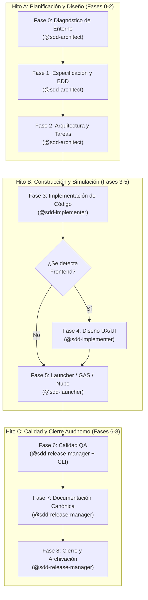

# Zugzbot SDD Harness

> [!IMPORTANT]
> **Zugzbot** es un entorno de orquestación de desarrollo guiado por especificaciones (Spec-Driven Development - SDD) multi-agente y reutilizable para [OpenCode](https://opencode.ai) y [Cursor](https://cursor.sh). Instala un ciclo de vida de desarrollo de IA de grado de producción completo en cualquier proyecto con un solo comando — totalmente acotado al proyecto, sin escribir nada en tu configuración global.

## 🚀 Conceptos Clave y Arquitectura

Este arnés implementa un ciclo de vida estricto de **Desarrollo Guiado por Especificaciones (SDD)** orquestado por **Zugzbot**, un agente primario que delega cada fase a subagentes consolidados. Ningún agente escribe código sin una especificación aprobada, un plan de arquitectura y un checklist de tareas atómicas.

El flujo de trabajo se organiza en **3 Hitos de Decisión (Fricción Cero)** y **9 Fases SDD**:



---

## 🤖 Elenco de Agentes

### Agentes del Ciclo SDD (Consolidados en V2)

| Agente | Rol | Hito / Fases |
|---|---|---|
| `zugzbot` | Orquestador primario — rutea, delega y controla los límites de cada fase y Hito. | Siempre activo |
| `sdd-architect` | Diagnostica el stack técnico, conduce entrevistas interactivas, define alcances (`proposal.md`), especificaciones BDD (`spec.md`) y el checklist atómico modular. | **Hito A**: Fases 0, 1 y 2 |
| `sdd-implementer` | Escribe código modular senior y refina detalles de UX/UI en caso de frontend. | **Hito B**: Fases 3 y 4 |
| `sdd-launcher` | Levanta entornos locales o realiza despliegues en la nube (ej: GAS/clasp) y detiene para pruebas manuales. | **Hito B**: Fase 5 |
| `sdd-release-manager` | Ejecuta tests (`sdd test`), linter (`sdd lint`), auto-cura errores, documenta de forma quirúrgica, actualiza SemVer, limpia el lockfile y firma commits semánticos de producción. | **Hito C**: Fases 6, 7 y 8 |

### Agentes Auxiliares

| Agente | Rol | Permisos |
|---|---|---|
| `aux-oracle` | Responde consultas de conocimiento general **sin relación directa con el proyecto**. | Solo lectura |
| `aux-handyman` | Ejecuta tareas pequeñas, puntuales e inmediatas (máx. 3 archivos) que no requieren un ciclo SDD completo. | Lectura + Escritura |

---

## 📋 El Ciclo de Vida SDD Completo

Cada cambio significativo progresa de forma secuencial a través de estas fases gobernadas por hitos:

### Hito A — Planificación y Diseño
0. **Fase 0 — Diagnóstico y Contexto (`@sdd-architect`)**
   - Analiza dependencias locales (Node/TS, Python, Go, Rust, Ruby, PHP) y frameworks.
   - Recomienda y ejecuta de forma muy segura `npx autoskills --detect` para equipar al arnés con habilidades a la medida.
1. **Fase 1 — Especificación (`@sdd-architect`)**
   - Conduce una entrevista técnica ágil utilizando cuestionarios interactivos en OpenCode (`default_api:ask_question`).
   - Generación de `proposal.md` (negocio) y `specs/spec.md` con escenarios BDD formales (`Dado-Cuando-Entonces`).
2. **Fase 2 — Planificación y Arquitectura (`@sdd-architect`)**
   - Creación de `orchestrator_architecture.md` (diagramas Mermaid) y `orchestrator_tasks.md` (checklist global de tareas).

### Hito B — Construcción y Simulación
3. **Fase 3 — Implementación de Código (`@sdd-implementer`)**
   - Escritura de código incremental de forma quirúrgica siguiendo estrictamente el checklist y directrices del prompt base.
4. **Fase 4 — Percepción y Diseño Visual (`@sdd-implementer`) — *Frontend***
   - Captura la UI mediante Puppeteer MCP para evaluar y perfeccionar la experiencia visual en caso de existir frontend. Se omite automáticamente si no hay interfaz.
5. **Fase 5 — Entorno y Pruebas Manuales (`@sdd-launcher`)**
   - Inicia servidores de desarrollo en localhost o sube síncronamente a la nube (ej. `clasp push` para Google Apps Script) basándose en las lecciones del Cerebro del Proyecto.
   - Presenta un enlace o tarjeta interactiva para validación del desarrollador (Human-In-The-Loop).

### Hito C — Calidad y Cierre Autónomo
6. **Fase 6 — Calidad y Pruebas QA (`@sdd-release-manager`)**
   - Ejecuta las directivas locales de calidad ejecutando `./.openspec/sdd lint` y `./.openspec/sdd test`.
   - **Bucle de Auto-Curación:** Si se detectan fallos estáticos o lógicos, reactiva al implementador con logs detallados en un bucle continuo de corrección autónoma.
7. **Fase 7 — Documentación Canónica (`@sdd-release-manager`)**
   - Escribe o actualiza quirúrgicamente el `README.md` global, `CHANGELOG.md`, `brain.md` (lecciones aprendidas) y genera el mensaje Conventional Commit semántico libre de marcas de IA.
8. **Fase 8 — Cierre y Archivación (`@sdd-release-manager`)**
   - Limpia el lockfile `.openspec/sdd-lock.json`, archiva el historial del cambio y realiza el `git commit` semántico final de forma autónoma.

---

## ✨ Experiencia de Usuario (UX) Premium

El arnés SDD está optimizado para ofrecer una experiencia fluida, interactiva y de alto rendimiento:

1. **Consolidación en 4 Agentes Core**: Menor consumo de tokens, mayor consistencia contextual y rapidez de ejecución sin perder especialización.
2. **Cuestionarios Interactivos Inteligentes**: Uso nativo de modales de opción múltiple (`default_api:ask_question`) para decisiones rápidas en OpenCode.
3. **Control Local con CLI Novedoso (`sdd`)**: Utilidad portable `./.openspec/sdd` para monitorear el estado, hacer rollback o correr pruebas/linters directamente desde la terminal.
4. **Piloto Automático (`--auto`)**: Omite pausas de aprobación en flujos maduros para velocidad pura de extremo a extremo.

---

## 📦 Instalación

> [!NOTE]
> El instalador del arnés está diseñado para ser **100% local y aislado**. No altera configuraciones globales de tu sistema ni de OpenCode; todo se instala dentro del directorio destino de tu proyecto.

### Requisitos Previos

- [OpenCode](https://opencode.ai) o [Cursor](https://cursor.sh) instalado.
- Git 2.28+ configurado localmente.

### Opción A: V1 (Estable, Multi-Agente con 9 especialistas) — Rama `main`

Para instalar la versión 1 clásica del arnés, navega a la raíz de tu proyecto destino y ejecuta:

```bash
git clone --depth 1 -b main https://github.com/Danielisla96/zugzbot.git /tmp/zugzbot-harness \
  && /tmp/zugzbot-harness/sdd-harness/bootstrap-sdd.sh \
  && rm -rf /tmp/zugzbot-harness
```

Clona de forma efímera la rama clásica, inyecta los 9 agentes clásicos y configuraciones locales de forma silenciosa.

### Opción B: V2 (Ultra-rápido, Consolidado con 4 especialistas + CLI local) — Rama `fix/v2`

Para instalar la nueva versión 2 optimizada y de bajo consumo de tokens, navega a la raíz de tu proyecto destino y ejecuta:

```bash
git clone --depth 1 -b fix/v2 https://github.com/Danielisla96/zugzbot.git /tmp/zugzbot-harness \
  && /tmp/zugzbot-harness/sdd-harness/bootstrap-sdd.sh \
  && rm -rf /tmp/zugzbot-harness
```

Clona de forma efímera la rama optimizada, inyecta los 4 agentes consolidados, el prompt base y la utilidad local `sdd`.

### Opción C — Instalación Local

Si ya tienes el repositorio clonado localmente en tu máquina:

```bash
cd /ruta/a/tu/proyecto-destino
/ruta/a/zugzbot/sdd-harness/bootstrap-sdd.sh
```

---

## 📂 Estructura del Proyecto Post-Bootstrap

```
tu-proyecto/
├── .agent/
│   ├── mcp-config.json      # Configuración del servidor Puppeteer MCP
│   ├── skills/              # Definiciones de habilidades sdd-* y openspec-*
│   └── workflows/           # Archivos de workflows declarativos opsx-*
├── .opencode/
│   ├── agents/              # Prompts de sistema de todos los subagentes consolidados
│   ├── commands/            # Mapeos de comandos slash
│   ├── mcp-config.json      # Configuración MCP para OpenCode
│   └── skills/              # Habilidades del runtime
├── .openspec/
│   ├── changes/             # Cambios activos e históricos archivados
│   ├── schemas/
│   │   └── ssd-orchestrated/# Esquemas y plantillas de documentos del ciclo
│   ├── sdd                  # Utilidad portable de CLI local para monitoreo y control
│   ├── sdd-lock.json        # Lockfile de persistencia de estado del ciclo SDD
│   ├── prompt_base.md       # Reglas globales y personalidad base
│   └── brain.md             # Cerebro de larga duración y lecciones aprendidas
├── AGENTS.md                # Reglamento de conducta obligatorio para los modelos
└── README.md                # Este archivo de documentación del arnés
```

---

## ⚡ Referencia de Comandos Slash en OpenCode

| Comando | Descripción |
|---|---|
| `/opsx-propose <descripcion>` | Inicia la Fase 1 — entrevista guiada y especificación |
| `/opsx-explore <query>` | Entra en modo de exploración técnica y diseño mental profundo |
| `/opsx-apply` | Inicia la Fase 3 — codificación incremental basada en el checklist aprobado |
| `/opsx-archive` | Archiva un cambio completamente verificado y aprobado |

---

## 🛠️ Utilidad de CLI Local (`sdd`)

Puedes correr comandos directamente en la terminal de tu proyecto usando `./.openspec/sdd`:

- `./.openspec/sdd status` (o simplemente `./.openspec/sdd`): Muestra el progreso del ciclo agrupado en hitos de decisión y fases.
- `./.openspec/sdd validate`: Audita estructuralmente las propuestas y especificaciones BDD.
- `./.openspec/sdd test`: Ejecuta de forma nativa la suite de pruebas del proyecto destino.
- `./.openspec/sdd lint`: Ejecuta el linter o verificador estático de código local.
- `./.openspec/sdd rollback`: Descarta de forma segura cambios Git locales no confirmados.
- `./.openspec/sdd clean`: Purga logs de fallos, registros temporales y resetea el ciclo a Fase 0.

---

## 📜 Reglamento de Conducta (AGENTS.md)

Todos los agentes están estrictamente limitados por `AGENTS.md`, el cual garantiza:
- **Cero Código "Al Vuelo":** No se escribe una sola línea de código sin especificación aprobada, arquitectura de componentes trazada y checklist de tareas atómicas.
- **Límites de Hito Rígidos:** Ningún subagente puede avanzar al siguiente hito sin la firma explícita del desarrollador humano en el prompt en modo estándar.
- **Calidad Absoluta**: Se requiere la verificación estática libre de advertencias y ejecución exitosa de pruebas antes de proceder al cierre.
- **Mensajes de Commit Humanos**: Mensajes descriptivos impecables y libres de firmas robóticas o menciones de IA.
- **SOLID y Clean Architecture**: Es obligatorio seguir patrones limpios de diseño y la inyección de dependencias.
- **Historial Limpio**: No se permiten commits genéricos; toda entrega debe estar descrita semánticamente sin marcas de IA.
