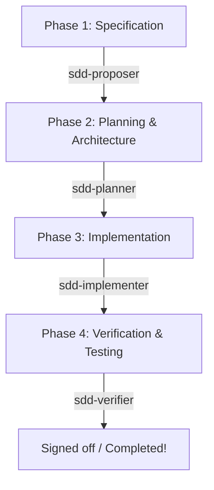

# Zugzbot SDD Harness

> [!IMPORTANT]
> **Zugzbot** is the centralized, reusable Spec-Driven Development (SDD) orchestration harness for OpenCode. It provides a standardized environment to run robust, multi-agent orchestrated software development lifecycles in any project with zero manual setup.

---

## 🚀 Key Concepts & Architecture

This harness implements a strict **Spec-Driven Development (SDD)** lifecycle using a modular multi-agent system orchestrated by **Zugzbot**.



### The 4-Phase SDD Lifecycle

Every feature, bug fix, or codebase change goes through the following four sequential phases, completely preventing "vibe coding":

1. **Phase 1: Specification (`sdd-proposer`)**
   - Conducts a technical interview with the user.
   - Generates the proposal under `openspec/changes/<change-name>/proposal.md`.
   - Generates behavior scenarios under `openspec/changes/<change-name>/specs/spec.md` using Gherkin (`Given / When / Then`) syntax.
2. **Phase 2: Planning & Architecture (`sdd-planner`)**
   - Designs modular interfaces and documents them in `orchestrator_architecture.md`.
   - Breaks implementation into independent, atomic tasks in `orchestrator_tasks.md` with checklist checkboxes `- [ ]`.
3. **Phase 3: Implementation (`sdd-implementer`)**
   - Sequentially modifies source files based on the task checklist.
   - Updates progress tracking in `orchestrator_tasks.md`.
4. **Phase 4: Verification & Testing (`sdd-verifier`)**
   - Writes automated tests or component verification checks.
   - Runs linting and test suites, resolving any failures before final sign-off.

---

## 📦 One-Click Installation & Setup

It is incredibly simple to bootstrap this SDD harness in any new or existing repository.

### Prerequisites

- You must have the [OpenCode](https://opencode.dev) agent toolchain installed on your local machine.

### Installation Methods

#### Option A: One-Line Zero-Footprint Installation (Recommended 🚀)

Since the `zugzbot` repository is public, you can bootstrap the SDD harness in **any local project** with a single command without keeping a permanent local clone of the harness repository.

Simply navigate to the root of your target project and run:
```bash
git clone --depth 1 https://github.com/Danielisla96/zugzbot.git /tmp/zugzbot-harness && /tmp/zugzbot-harness/sdd-harness/bootstrap-sdd.sh && rm -rf /tmp/zugzbot-harness
```

*This command clones the harness to a temporary folder, runs the bootstrap script to inject all necessary agents, workflows, and templates into your project, and then automatically cleans up the temporary files.*

---

#### Option B: Local File Installation

If you already have the `zugzbot` repository cloned locally:

1. **Navigate to the root of your target project**:
   ```bash
   cd /path/to/your/new-project
   ```

2. **Run the bootstrap script** from your local clone:
   ```bash
   /path/to/zugzbot/sdd-harness/bootstrap-sdd.sh
   ```

The script will automatically:
- Install the global agent prompts in your user configuration (`~/.config/opencode/agents/`).
- Initialize target directories in your project (`.agent/`, `.opencode/`, `openspec/`).
- Copy all essential OpenCode commands, skills, and Gherkin schemas.
- Set up the project-specific rules in `AGENTS.md`.

---

## 📂 Project Directory Structure After Bootstrap

Once installed, your new project will have the following standardized structure:

```
new-project/
├── .agent/
│   ├── skills/              # Agent skills for spec creation, plans, and implementations
│   └── workflows/           # Declarative multi-agent workflows
├── .opencode/
│   ├── commands/            # Slash command mappings (/opsx-propose, /opsx-apply, etc.)
│   └── skills/              # Specialized task skills
├── openspec/
│   ├── config.yaml          # OpenSpec workflow rules and configuration
│   └── schemas/             # Templates and schema configurations for SDD
│       └── ssd-orchestrated/
├── AGENTS.md                # Strict multi-agent orchestrator rules and guidelines
└── ...                      # Your actual project source code and tests
```

---

## ⚡ Command Reference

In your bootstrapped project, you can run the following commands via your agent:

| Command | Description |
|---|---|
| `/opsx-propose <description>` | Proposes a new change, initializes specs, and guides you through Phase 1. |
| `/opsx-explore <query>` | Enters exploration mode to think through complex problems and refine requirements. |
| `/opsx-apply` | Starts Phase 3 (Implementation), stepping through tasks and modifying the codebase. |
| `/opsx-archive` | Finalizes a change, archiving its specs, tasks, and proposals into history once verified. |

---

## 📜 Master Rules (AGENTS.md)

All agents operating in the target project are governed by a strict set of rules in `AGENTS.md` (e.g., SOLID principles, strict typing, TDD, conventional commits). No agent is allowed to write production code without having an approved spec, plan, and task list first.
