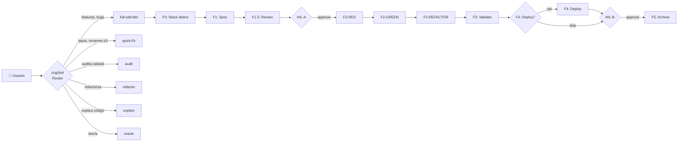

# 🤖 Zugzbot v2.0.0 — Arnés SDD Multi-Agente Agnóstico al Stack

> [!IMPORTANT]
> **Zugzbot v2.0.0** es un arnés de orquestación para [OpenCode](https://opencode.ai) que implementa **Spec-Driven Development (SDD) con TDD puro (Red → Green → Refactor)**. Tú le dices QUÉ quieres en lenguaje natural; él clasifica tu pedido, monta un equipo de subagentes especializados, ejecuta el ciclo de 11 fases, y te entrega un cambio versionado con commit semántico. **Tú solo apruebas en 2 momentos** (HIL-A y HIL-B); el resto es coreografía determinista.

---

## 🚀 Quickstart (3 pasos)

```bash
# 1) Instalar el arnés en tu proyecto
cd mi-proyecto
npm install zugzbot-sdd@latest
npx zugzbot   # bootstrapea .openspec/ y .opencode/

# 2) Abrir OpenCode y hablarle
opencode .
# En el chat: @zugzbot "agrega un endpoint POST /api/logout que invalide JWT"

# 3) Aprobar cuando te pregunte (2 momentos: HIL-A y HIL-B)
```

No hay paso 4. **`@zugzbot`** hace el resto.

---

## 🧠 Cómo funciona (la mecánica)

El arnés tiene 4 piezas que interactúan entre sí en cada turno:

```
┌─────────────────────────────────────────────────────────────┐
│  👤 TÚ escribes en lenguaje natural                          │
└────────────────────────┬────────────────────────────────────┘
                         │
                         ▼
              ┌──────────────────────┐
              │  @zugzbot (router)   │  ← ÚNICO con mode: primary
              │  Clasifica tu intent │
              └──────────┬───────────┘
                         │ delega vía "task" permission
        ┌────────────────┼────────────────┬──────────────┐
        ▼                ▼                ▼              ▼
   @sdd-explorer   @sdd-builder     @aux-auditor   @aux-oracle
   (F0: detectar)  (F2: codear)     (audit)        (teoría)
        │                │                │              │
        └────────────────┴────────────────┴──────────────┘
                         │
                         ▼
              ┌──────────────────────┐
              │  .openspec/          │  ← Única fuente de verdad
              │  sdd-lock.json v2    │     entre turnos
              └──────────────────────┘
```

### Los 4 componentes clave

| Componente | Qué hace | Dónde vive |
|---|---|---|
| **`@zugzbot`** (router) | Clasifica tu prompt en uno de 6 workflows, lee el lockfile, delega al subagente correcto, fiscaliza transiciones y HIL | `agents/zugzbot.md` (modo `primary`) |
| **Subagentes** (14 total) | Cada uno hace UN trabajo: detectar stack, escribir tests, implementar, validar, etc. SRP estricto. | `agents/sdd-*.md`, `agents/f*.md`, `agents/aux-*.md` |
| **Lockfile v2** | Estado completo del ciclo activo: fase actual, stack detectado, TDD progress, rama git, tareas pendientes. Única vía de saber "dónde quedé". | `.openspec/sdd-lock.json` |
| **Tools SRP** (33) | Atómicas: `sdd_transition` (cambiar fase), `sdd_lock_manager` (leer/escribir lock), `sdd_test_runner` (correr tests), `sdd_linter`, etc. | `tools/*.ts` + `.opencode/tools/*.js` |

### El ciclo de un turno

```
1. 📥 TÚ escribes:  "agrega un endpoint POST /api/logout que invalide JWT"
2. 🧭 @zugzbot clasifica:  sdd_router → workflow: "full-sdd-tdd"
3. 📖 @zugzbot lee lockfile:  change_name="" → crear "agregar-endpoint-logout"
4. 🗺️ @zugzbot imprime roadmap:  [ ] F0  [ ] F1  [ ] F1.5  [ ] HIL-A  [ ] F2-RED  ...
5. 🤝 @zugzbot delega vía task:  sdd-explorer (F0) / sdd-planner (F1) / f2-red-test-writer (F2-RED) / ...
6. 🔧 Subagente trabaja:  lee spec, corre tests, escribe código, genera reportes
7. 🔄 Subagente transiciona:  sdd_transition(F1 → F1.5) con validación TDD gate
8. 📤 @zugzbot retorna:  "F1 hecho. F1.5 en curso. Próxima: revisión de testeabilidad."
9. 🔁 Repite desde paso 1 hasta F5 (cierre) o HIL-A/HIL-B (pausa para tu input)
```

### Por qué el lockfile es el corazón

El lockfile es **la única cosa que persiste entre turnos**. Cuando cierras OpenCode y vuelves otro día, `@zugzbot` no tiene memoria de tu sesión — solo lee el lockfile y sabe exactamente:

- En qué fase estás (`F0` | `F1` | `F2-RED` | ... | `DONE`)
- Qué stack detectó (`node-typescript` | `python` | `go` | ...)
- Cuántos tests añadiste en RED y cuántos pasan en GREEN
- Si la rama git está limpia o tiene cambios sin commit
- Qué tareas están pendientes

**El lockfile es amnesia-cero**: nunca pierdes el contexto de un cambio a medio hacer.

---

## 🎬 Tu primera conversación (ejemplo realista)

> Pedido: *"agrega un endpoint POST /api/logout que invalide el JWT"*

| Turno | Quién habla | Qué pasa |
|---|---|---|
| 1 | **👤 Tú** | "agrega un endpoint POST /api/logout que invalide el JWT" |
| 1 | **🤖 @zugzbot** | Clasifica `full-sdd-tdd`. Lockfile vacío → crea `change_name: "agregar-endpoint-logout"`. Imprime roadmap. Delega a `@sdd-explorer`. |
| 1 | **🤖 @sdd-explorer** | Detecta stack (`node-typescript`), genera `diagnostics.md`. `sdd_transition(F0 → F1)`. |
| 2 | **🤖 @sdd-planner** | Te pregunta en **1 llamada consolidada**: *"¿El logout borra sesión en BD? ¿JWT expirado → 200 o 401? ¿Lista negra? ¿Rol requerido?"* |
| 2 | **👤 Tú** | Respondes A/B/C/D (o texto libre) |
| 2 | **🤖 @sdd-planner** | Escribe `spec.md` con 5 criterios BDD. `sdd_transition(F1 → F1.5)`. |
| 3 | **🤖 @zugzbot (F1.5)** | Corre 8 checks de testeabilidad sobre el spec. Si pasa → HIL-A. |
| 3 | **🤖 @zugzbot (HIL-A)** | Te muestra resumen y pregunta A/B/C. |
| 3 | **👤 Tú** | Apruebas (A) → `sdd_transition(F1.5 → F2-RED, status: "spec_approved")` |
| 3 | **🤖 @f2-red-test-writer** | Escribe 5 tests que FALLAN. `sdd_test_runner verify-red` → `all_failing: true`. Transiciona a F2-GREEN. |
| 4 | **🤖 @sdd-builder** | Implementa el mínimo viable en `src/auth/logout.ts`. `verify-green` → 5/5. Transiciona a F2-REFACTOR. |
| 4 | **🤖 @f2-refactor-improver** | Aplica prettier + extrae `validateToken()`. Linter 0 errors. Tests 5/5 verdes. Transiciona a F3. |
| 5 | **🤖 @sdd-tester** | Corre 15 validadores (linter, security, secrets, spec compliance). Genera `validation_report.md`. Si todo OK → F4. |
| 5 | **🤖 @sdd-deployer** | Levanta `npm run dev`, captura logs, genera `deployment_report.md`. |
| 5 | **🤖 @zugzbot (HIL-B)** | Te muestra URL de dev y pregunta A/B/C. |
| 5 | **👤 Tú** | Apruebas (A) → `sdd_transition(F4 → F5, status: "qa_validated")` |
| 6 | **🤖 @sdd-archiver** | Bump 1.0.0 → 1.1.0, actualiza CHANGELOG, commit `feat(auth): agregar endpoint POST /api/logout`, archiva `.openspec/changes/...`, resetea lockfile. |
| 6 | **🤖 @zugzbot** | Imprime banner: 🎉 **CICLO SDD FINALIZADO**. |

**Tiempo total**: 6 turnos (1 sesión o varios días). **Tú solo hablaste 3 veces** (F1 + HIL-A + HIL-B). El resto es coreografía determinista.

---

## 🔁 Reanudar una sesión (amnesia cero)

```
👤 Tú: "qué tal" (o cualquier cosa, da igual)
🤖 @zugzbot:
  📋 Estado del cambio: agregar-endpoint-logout
     Stack: node-typescript
     Última fase: F2-GREEN (3/3 tests passing)
     Estás en: F2-REFACTOR
     Tareas pendientes: 0

  [x] F0  Stack detect
  [x] F1  Spec
  [x] F1.5 Spec review
  [x] HIL-A ← aprobado
  [x] F2-RED ← completado
  [x] F2-GREEN ← completado
  [➡️] F2-REFACTOR ← en curso
  [ ] F3
  [ ] F4
  [ ] HIL-B
  [ ] F5

  ¿Continúo con el refactor, o quieres revisar algo antes?
```

Cierra OpenCode. Vuelve al día siguiente. Di lo que sea. El router detecta que hay un cambio activo y te muestra dónde quedaste. **No tienes que explicar nada.**

---

## 🧭 Los 6 workflows (router cognitivo)

`@zugzbot` clasifica tu prompt en uno de 6 workflows:

| Workflow | Frase-ejemplo | Qué hace | Toca código? |
| :--- | :--- | :--- | :--- |
| **`full-sdd-tdd`** | "agrega X", "implementa Y", "el bug es Z" | Ciclo completo F0→F5 con TDD | **Sí** (con tests) |
| **`quick-fix`** | "arregla este typo", "renombra variable", "bump versión" | Patch atómico ≤3 archivos | **Sí** (directo) |
| **`audit`** | "audita la calidad", "qué deuda técnica hay" | 15 validadores + reporte | No (read-only) |
| **`refactor`** | "limpia src/auth.ts", "simplifica el handler" | Refactor seguro con cobertura | **Sí** (cuidado) |
| **`explain`** | "explícame qué hace este archivo", "muéstrame el flujo" | Walkthrough con diagramas | No |
| **`oracle`** | "qué es un closure", "diferencia entre X e Y" | Conocimiento puro | No |

> Si tu prompt es ambiguo, `@zugzbot` te hace **1 pregunta consolidada** con 2-3 opciones. Nunca te pregunta de a poco.



---

## 🚦 Cuándo me preguntará @zugzbot (los 2 HIL)

Solo en **2 momentos** del ciclo `full-sdd-tdd` se requiere tu aprobación. El resto es automático.

### HIL-A (después de F1.5, antes de empezar a codear)

```
🚦 HIL-A: El spec está listo y pasó los 8 checks de testeabilidad.

Resumen:
  - Cambio: agregar-endpoint-logout
  - Criterios BDD: 5
  - Archivos a tocar: 2
  - Dependencias nuevas: ninguna

¿Cómo procedo?

  [A] ✅ Aprobar spec y continuar con F2-RED (TDD)
  [B] ❌ Rechazar y volver a F1 (ajustar preguntas del spec)
  [C] ⏸ Pausar aquí (lo retomo después)
```

### HIL-B (después de F4, antes de cerrar el ciclo)

```
🚦 HIL-B: El deploy/QA está listo en dev.

Resumen:
  - Cambio: agregar-endpoint-logout
  - URL de dev: http://localhost:3000
  - Validaciones: 15/15 passing
  - Reports: .openspec/changes/.../validation_report.md, deployment_report.md

¿Cómo procedo?

  [A] ✅ Aprobar QA y cerrar ciclo (ir a F5 → bump + commit)
  [B] 🐛 Reportar issues (volver a F3 para re-validar)
  [C] ⏪ Rollback (volver a F1 y replantear)
```

**Reglas**:
- El formato A/B/C es **siempre idéntico y predecible**. Nunca te preguntará algo abierto.
- Si respondes texto libre, `@zugzbot` lo clasificará (A si dice "ok/sí/aprobar", B si menciona "issue/problema/bug", C si dice "espera/pausa/cancela").
- En `auto_pilot: true`, las fases F0→F1→F1.5→F2-RED→F2-GREEN→F2-REFACTOR→F3→F4 avanzan sin pausas. **HIL-A y HIL-B siguen siendo obligatorios**.

---

## 🧬 Los 14 agentes (uno por responsabilidad)

### Core SDD (8) — el ciclo completo

| Agente | Rol | Fase | Herramientas |
|---|---|---|---|
| **`zugzbot`** | **Router cognitivo** — clasifica y delega | Permanente | `task`, `sdd_transition`, `sdd_lock_manager`, `sdd_router` |
| **`sdd-explorer`** | Detecta stack, mapea codebase | **F0** | `sdd_stack_detector`, `sdd_generate_tree`, `sdd_git_awareness` |
| **`sdd-planner`** | Entrevista, redacta `spec.md` con BDD | **F1** | `sdd_brain_sync`, `sdd_diff_impact_analyzer`, `sdd_requirement_tracker` |
| **`f2-red-test-writer`** | Escribe tests que FALLAN | **F2-RED** | `sdd_test_runner`, `edit` (solo tests) |
| **`sdd-builder`** | Implementa el mínimo código que pasa tests | **F2-GREEN** | `sdd_test_runner`, `sdd_linter`, `edit` (mínimo) |
| **`f2-refactor-improver`** | Limpia código, tests siguen verdes | **F2-REFACTOR** | `sdd_linter`, `sdd_test_runner`, `edit` (atómico) |
| **`sdd-tester`** | 15 validadores (linter, security, secrets) | **F3** | Todos los `sdd_*_test` y `sdd_*_validator` |
| **`sdd-deployer`** | Deploy a dev/staging | **F4** | `sdd_clasp` (GAS), `bash` |
| **`sdd-archiver`** | Bump versión, CHANGELOG, commit semántico | **F5** | `sdd_archive_and_commit` |

### Auxiliares (5) — atajos fuera del ciclo

| Agente | Cuándo usarlo | Permisos |
|---|---|---|
| **`aux-handyman`** | Typos, renames, bumps ≤3 archivos | `edit: allow`, sin HIL |
| **`aux-oracle`** | "¿qué es X?", "diferencia A vs B" | `edit/bash/lsp: deny` (solo conocimiento) |
| **`aux-auditor`** | "audita la calidad", "qué deuda hay" | `edit: deny` (read-only) |
| **`aux-refactor`** | "limpia X", "simplifica Y" | `edit: allow`, tests siempre verdes |
| **`aux-explainer`** | "explícame qué hace Z" | `edit/bash: deny` (solo lectura) |

### Reglas de delegación

- **Solo `@zugzbot` puede delegar** (wildcards `sdd-*`, `f*`, `aux-*` en `task` permission).
- **Ningún subagente puede delegar a otro**. SRP absoluto: cada uno hace su trabajo y retorna.
- Esto preserva la **linealidad de la máquina de estados** y evita loops infinitos.

---

## 🛠️ Las 33 herramientas SRP

Una herramienta = un trabajo. Componentes por categoría:

### Máquina de estados (la única vía de cambiar de fase)

- **`sdd_transition`** — recibe `nextPhase`, valida TDD gates, HIL, spec existente, rama git, y escribe lockfile + commit + log atómicamente. Es **la única herramienta** que puede moverte de F0 a F1, de F1 a F1.5, etc.
- **`sdd_lock_manager`** — I/O centralizada del lockfile v2 con 9 acciones: `read | write | update | validate | set_tdd | set_git | add_task | mark_task | reset`.

### Clasificación y orquestación

- **`sdd_router`** — clasificador determinista de intent (keyword scoring + heurísticas de ambigüedad).
- **`sdd_stack_detector`** — auto-detección leyendo `profiles/*.json`.

### TDD discipline (enforcement dura)

- **`sdd_test_runner`** — runner agnóstico: `verify-red` (todos rojos), `verify-green` (todos verdes), `verify-all-passing`. Detecta automáticamente `vitest`, `jest`, `pytest`, `go test`, `cargo test`, `mvn test`.
- **`sdd_linter`** — linter agnóstico: `check` (reporta errors), `fix` (auto-fix), `detect`. Detecta `eslint`, `biome`, `ruff`, `mypy`, `clippy`, `checkstyle`.
- **`sdd_spec_reviewer`** — F1.5: 8 checks objetivos de testeabilidad del spec.

### Validación (F3)

- `sdd_spec_validator`, `sdd_spec_compliance_linter` — verifican 1:1 spec↔código.
- `sdd_requirement_tracker` — cobertura de requisitos.
- `sdd_regression_detector` — bugs reintroducidos desde `brain.md`.
- `sdd_secret_scanner`, `sdd_security_vulnerability_scanner` — seguridad.
- `sdd_bdd_tester`, `sdd_visual_regression_diff`, `sdd_performance_regress_profiler`, `sdd_ui_auditor`, `sdd_sandbox_patcher` — validación dinámica.

### Memoria y contexto

- `sdd_brain_sync`, `sdd_brain_curator` — memoria técnica del proyecto (`.openspec/brain.md`).
- `sdd_compact_context`, `sdd_context_pruner` — gestión de tokens.
- `sdd_checkpoint` — snapshots de fase (`.openspec/checkpoints/`).

### Stack-específicas (carga condicional)

- **`sdd_clasp`** — Google Apps Script (solo si `stack_profile === "gas"`).
- `sdd_auto_api_mocker` — mocks de APIs externas.

### Utilidad

- `sdd_git_awareness` — estado de Git (rama, SHA, working tree).
- `sdd_generate_tree` — árbol de archivos.
- `sdd_archive_and_commit` — git semántico (bump + CHANGELOG + commit + archive).
- `sdd_install_autoskills` — auto-instala skills desde registry a `.opencode/skills/` (gated por `session_features.autoskills`).
- `sdd_graphify` — genera y consulta el Grafo de Conocimiento del proyecto (`graphify-out/`). Acción `install` opcional con `uv`/`pip` (gated por `session_features.graphify`).
- `sdd_session_features` — gestiona los feature flags opt-in persistidos en el lockfile v6.

---

## 🌍 Los 8 stacks auto-detectados

| Profile | Detectado por | Test runner | Linter | Deploy |
| :--- | :--- | :--- | :--- | :--- |
| `node-typescript` | `package.json` + `tsconfig.json` | vitest, jest, mocha | eslint, biome, tsc | dev-server, build, publish |
| `node-javascript` | `package.json` | vitest, jest, mocha | eslint, biome | dev-server, build, publish |
| `python` | `pyproject.toml`, `requirements.txt` | pytest, unittest, tox | ruff, flake8, mypy | dev-server, build, publish |
| `go` | `go.mod` | go test | go vet, staticcheck | build, publish (tag) |
| `rust` | `Cargo.toml` | cargo test | clippy, rustfmt | publish (crates.io) |
| `java` | `pom.xml`, `build.gradle` | mvn test, gradle test | checkstyle, spotbugs | build, publish |
| `gas` | `.clasp.json`, `appsscript.json` | mocks locales | eslint-gas | clasp push |
| `static-site` | `astro.config.*`, `hugo.toml` | vitest, playwright | eslint, markdownlint | build (SSG) |

**Cero hardcoding**: el core del arnés no sabe qué es React, Next, Django, Flask o Clasp. Toda la lógica de stack vive en estos 8 JSON.

---

## 🧠 La disciplina TDD (lo más importante)

> **No se puede escribir código de producción sin un test que lo exija.**

```
F2-RED      → Test escrito que FALLA       (sdd_test_runner verify-red)
F2-GREEN    → Mínimo código que PASA       (sdd_test_runner verify-green)
F2-REFACTOR → Limpiar, tests siguen VERDES (sdd_linter check + tests verdes)
```

**El lockfile rechaza transiciones inválidas físicamente**:

- ❌ `sdd_transition(F2-GREEN)` si `tdd.red.completed !== true`
- ❌ `sdd_transition(F2-REFACTOR)` si `tdd.green.completed !== true`
- ❌ `sdd_transition(F3)` si `tdd.refactor.linter_clean !== true`
- ❌ `sdd_transition(F2-RED)` si `status !== "spec_approved"` (HIL-A pendiente)

No hay atajos. El LLM puede intentarlo, pero `sdd_transition` retorna `[SDD Transition Blocked]` y aborta.

### Anti-patrones (los detecta el sistema)

- 🚫 "Implementar primero, tests después" — no es TDD, F2-GREEN se bloquea.
- 🚫 "Mega-test" (1 test que prueba 10 cosas) — `f2-red-test-writer` está entrenado a evitarlo.
- 🚫 "Test de implementación" (probar funciones internas) — el spec reviewer lo flaggea.
- 🚫 "Refactor oportunista" (limpiar código no tocado por el cambio) — `f2-refactor-improver` lo evita.
- 🚫 "Skip RED" (asumir que el test es trivial) — el lockfile lo bloquea.

---

## 📂 Lo que se crea al hacer `npx zugzbot`

```
tu-proyecto/
├── AGENTS.md                      # 🟢 Reglamento global del swarm
├── ZUGZ.md                        # 🟢 Cheat sheet de una pantalla
├── opencode.json                  # 🟢 Config de 14 agentes (generada, regenerable)
├── zugz-models.json               # 🟢 Override de modelos por agente (editable)
├── tui.json                       # 🔴 Cargador visual del plugin TUI
├── .opencode/                     # 🔴 Motor del arnés (instalado por el bootstrap)
│   ├── tools/                     #    33 herramientas SRP (compiladas a .js)
│   ├── plugins/                   #    TUI + SDD core
│   ├── profiles/                  #    8 profiles de stack
│   └── skills/                    #    11 skills premium
├── prompts/                       # 🟢 Prompts modulares (referencia, no se tocan)
│   ├── system/                    #    orchestrator-base, subagent-base, tdd-discipline, router-rules
│   ├── contracts/                 #    QUÉ hace cada fase (9)
│   └── boundaries/                #    QUÉ NO hace cada fase (9)
└── .openspec/                     # 🟢 Estado del ciclo SDD
    ├── sdd-lock.json              #    Schema v2 (bloques: tdd, git, workflow, stack_profile, tasks[])
    ├── brain.md                   #    Memoria técnica del proyecto
    ├── changes/                   #    Historial de specs
    └── audits/                    #    Reportes de aux-auditor
```

🟢 = editable / parte del proyecto. 🔴 = generado por el installer, no tocar a mano.

---

## 📦 Instalación

```bash
# Limpia
cd tu-proyecto
npm install zugzbot-sdd@latest
npx zugzbot

# Si ya tienes v1.x (legacy)
rm -rf .openspec/changes/<cambio-activo>
rm .openspec/sdd-lock.json
npx zugzbot
```

### ¿Qué hace el instalador? (paso a paso)

1. **Detecta** si hay una instalación legacy v1.x → falla con instrucciones si la hay.
2. **Crea** estructura de directorios: `.openspec/changes/`, `.opencode/{plugins,skills,tools,profiles}/`, etc.
3. **Genera** `opencode.json` con 14 agentes, permisos por herramienta, y modelos leídos de `zugz-models.json` (si existe) o del template del paquete.
4. **Crea** lockfile v2 con template inicial (`change_name: ""`, `active_phase: "F0"`, `status: "idle"`).
5. **Copia** `zugz-models.json` con modelos por defecto (editable).
6. **Copia** profiles, skills, tools, plugins desde el paquete.
7. **Crea/actualiza** `.gitignore` con exclusiones v2.
8. **Re-entradas seguras**: en cada `npx zugzbot` posterior, preserva tu `zugz-models.json`, `opencode.json` (mergea modelos), `sdd-lock.json`, `tui.json`, `brain.md`.

### Personalizar modelos por agente

Edita `zugz-models.json` y re-ejecuta `npx zugzbot`:

```json
{
  "default": "google/gemini-2.5-pro",
  "agents": {
    "zugzbot": "anthropic/claude-sonnet-4.5",
    "sdd-explorer": "openai/gpt-5",
    "aux-auditor": "google/gemini-2.5-pro"
  }
}
```

Los modelos se aplican al `opencode.json` automáticamente. Si añades agentes custom a `opencode.json`, también se preservan.

---

## 📊 Convenciones internas

1. **Fase 0 solo una vez**: el diagnóstico se ejecuta cuando `.openspec/diagnostics.md` no existe.
2. **Carga perezosa**: los agentes leen archivos solo bajo demanda (no se carga todo el contexto en cada turno).
3. **TDD enforcement**: el lockfile rechaza transiciones inválidas físicamente.
4. **HIL obligatorios**: F1.5 y F4. Aunque `auto_pilot: true`, estos dos siguen requiriendo tu input.
5. **Auto-detección de stack**: no hardcoded, profiles JSON.
6. **Tests de regresión**: se ejecutan en F3 y F5.

---

## 🧪 Validación del arnés (desarrollo)

```bash
npx tsc         # 0 errores
npx eslint .    # 0 errores
npx vitest run  # 97/97 tests
```

- **30 unit** — estructura de harness, schema v2, prompts completos.
- **67 integration** — stack detection (16), TDD cycle (9), router (24), installer (6), e2e demo (6), harness structure (4), dom structure (1), tag balance (1).

---

## ⚙️ Modelo Oficial

`minimax-coding-plan/MiniMax-M2.7` (default). Configurable vía `zugz-models.json` — ver sección "Personalizar modelos por agente".

---

## 📄 Licencia

MIT © Danielisla96
