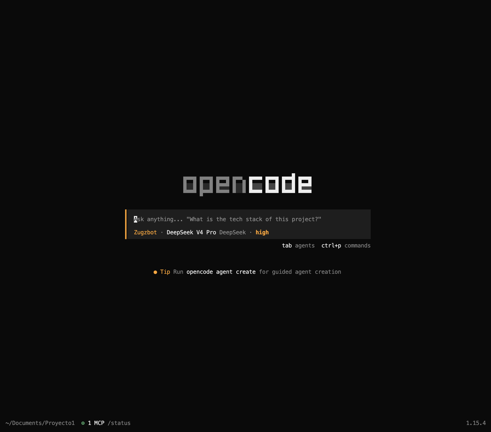
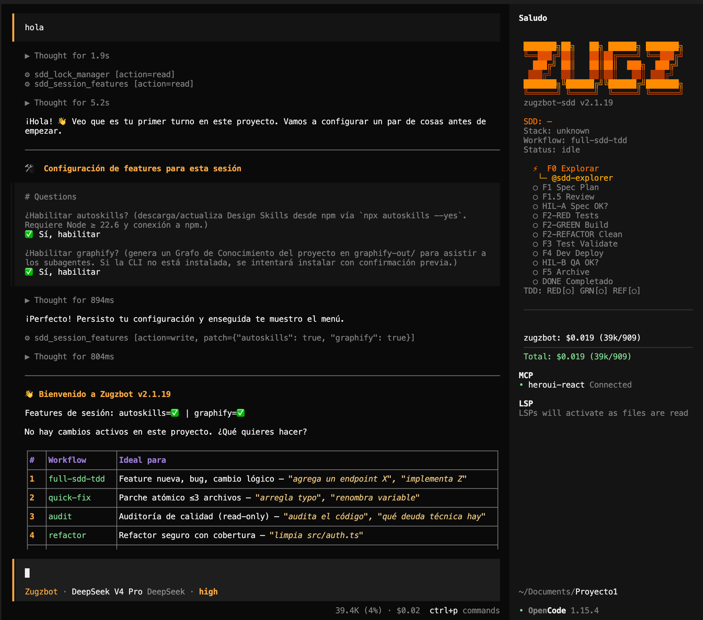

# 🤖 Zugzbot v2.0.0 — Arnés SDD Multi-Agente Agnóstico al Stack

> [!IMPORTANT]
> **Zugzbot v2.0.0** es un potente arnés de orquestación para [OpenCode](https://opencode.ai) que implementa **Spec-Driven Development (SDD) con TDD puro (Red → Green → Refactor)**. Tú le dices QUÉ quieres en lenguaje natural; el sistema clasifica tu pedido, monta un equipo de subagentes especializados, ejecuta el ciclo de 11 fases, y te entrega un cambio versionado con commit semántico. **Tú solo apruebas en 2 momentos** (HIL-A y HIL-B); el resto es coreografía determinista.

---

## 📸 Interfaz Visual y TUI

El plugin incluye una interfaz gráfica de Terminal (TUI) integrada directamente en OpenCode para que visualices el estado actual del ciclo SDD en tiempo real:

| Pantalla de Inicio | Panel de Conversación y TUI Activo |
| :---: | :---: |
|  |  |

> [!TIP]
> *Nota para el desarrollador:* Guarda las capturas de pantalla de tu interfaz en la carpeta `docs/images/` con los nombres `opencode_main.png` y `opencode_chat.png` para visualizarlas correctamente en GitHub o en tu visor de Markdown.

---

## 🚀 Quickstart (3 pasos)

```bash
# 1) Instalar el arnés en tu proyecto
cd mi-proyecto
npm install zugzbot-sdd@latest
npx zugzbot-sdd@latest   # Ejecuta el validador y bootstrapea .openspec/ y .opencode/

# 2) Abrir OpenCode y hablarle
opencode .
# En el chat: @zugzbot "agrega un endpoint POST /api/logout que invalide JWT"

# 3) Aprobar cuando te pregunte (2 momentos: HIL-A y HIL-B)
```

No hay paso 4. **`@zugzbot`** hace el resto.

---

## 🧠 Cómo funciona (la mecánica)

El arnés tiene 4 piezas que interactúan entre sí en cada turno:

```
┌─────────────────────────────────────────────────────────────┐
│  👤 TÚ escribes en lenguaje natural                          │
└────────────────────────┬────────────────────────────────────┘
                         │
                         ▼
               ┌──────────────────────┐
               │  @zugzbot (router)   │  ← ÚNICO con mode: primary
               │  Clasifica tu intent │
               └──────────┬───────────┘
                         │ delega vía "task" permission
         ┌────────────────┼────────────────┬──────────────┐
         ▼                ▼                ▼              ▼
    @sdd-explorer   @sdd-builder     @aux-auditor   @aux-oracle
    (F0: detectar)  (F2: codear)     (audit)        (teoría)
         │                │                │              │
         └────────────────┴────────────────┴──────────────┘
                         │
                         ▼
               ┌──────────────────────┐
               │  .openspec/          │  ← Única fuente de verdad
               │  sdd-lock.json       │     entre turnos (v7)
               └──────────────────────┘
```

### Los 4 componentes clave

| Componente | Qué hace | Dónde vive |
|---|---|---|
| **`@zugzbot`** (router) | Clasifica tu prompt en uno de 6 workflows, lee el lockfile, delega al subagente correcto, fiscaliza transiciones y HIL. | `agents/zugzbot.md` (modo `primary`) |
| **Subagentes** (14 total) | Cada uno hace UN trabajo: detectar el stack, escribir tests, implementar código mínimo, validar lints/seguridad, etc. SRP estricto. | `agents/sdd-*.md`, `agents/f*.md`, `agents/aux-*.md` |
| **Lockfile (v7)** | Estado completo del ciclo activo: fase actual, stack detectado, TDD progress, rama git, tareas y design system seleccionado. Única vía de saber "dónde quedé". | `.openspec/sdd-lock.json` |
| **Tools SRP** (34) | Herramientas atómicas compiladas: `sdd_transition`, `sdd_lock_manager` (con persistencia v7), `sdd_test_runner` (correr tests), `sdd_linter`, etc. | `tools/*.ts` + `.opencode/tools/*.js` |

---

## 📥 Diagnóstico Automático del Sistema (Pre-instalación)

Al ejecutar `npx zugzbot-sdd@latest`, el instalador realiza una validación exhaustiva de tu entorno de desarrollo para asegurarse de que todo funcione de manera óptima:

* **Node.js:** Valida que sea versión `>= v18.0.0` (Requerido).
* **Git:** Requerido para la gestión de snapshots y control de versiones TDD.
* **OpenCode CLI:** Requerido para la orquestación e invocación de subagentes.
* **Docker:** Opcional recomendado para el levantamiento de bases de datos y contenedores en dev.
* **Python / Go / Rust:** Detecta toolchains de compilación instalados para adaptar los agentes.

---

## 🎨 Catalog de Design Systems (11 Opciones con HeroUI)

El skill `sdd-design-system` permite maquetar vistas de frontend alineadas estrictamente a un catálogo de diseño listo para usar:

| # | Slug | Nombre | Path (relativo al proyecto) | Primary | Vibe / Estilo |
|---|---|---|---|---|---|
| 1 | airbnb | Airbnb | `.opencode/design/DESIGN-airbnb.md` | `#ff385c` | Marketplace cálido, pill-shaped, fotos primero |
| 2 | apple | Apple | `.opencode/design/DESIGN-apple.md` | `#0066cc` | Minimal premium, monochrome, edge-to-edge |
| 3 | **heroui** | **HeroUI** | `.opencode/design/DESIGN-heroui.md` | `#006fee` | Limpio moderno, Tailwind CSS, componentes vivos y vibrantes |
| 4 | meta | Meta | `.opencode/design/DESIGN-meta.md` | `#0064e0` | Utility-first, blue brand, hairline borders, dual-CTA |
| 5 | nike | Nike | `.opencode/design/DESIGN-nike.md` | `#111111` | Bold sports, black/white, Futura uppercase, editorial |
| 6 | notion | Notion | `.opencode/design/DESIGN-notion.md` | `#0075de` | Editorial productivity, off-white canvas, Inter, stickers |
| 7 | renault | Renault | `.opencode/design/DESIGN-renault.md` | Sunlight Yellow | Automotive, dark, NouvelR display, diamond mark |
| 8 | theverge | The Verge | `.opencode/design/DESIGN-theverge.md` | `#3cffd0` | Editorial tech media, dark, oversized headlines, timeline |
| 9 | uber | Uber | `.opencode/design/DESIGN-uber.md` | `#000000` | Clean utilitarian, black/white, geometric sans, full-pill |
| 10 | voltagent | Voltagent | `.opencode/design/DESIGN-voltagent.md` | `#00d992` | Devtool, near-black canvas, mono accents, code-mock |
| 11 | x.ai | xAI | `.opencode/design/DESIGN-x.ai.md` | `#ffffff` | AI brand, near-black canvas, geometric sans, cosmic |

### Cómo seleccionar el Design System:
- **Mención explícita:** `/front crear dashboard estilo HeroUI` (carga automáticamente).
- **Interactive Picker:** Si no se menciona ninguno, se te presentará un menú numerado (HeroUI es la opción `3`).
- **En el Lockfile:** Establece `"active_design_system": "heroui"` en tu `.openspec/sdd-lock.json`.

---

## 💳 Telemetría y Tiempos de Ejecución (`token_usage.md`)

Al finalizar con éxito un ciclo F5 (Archive), el agente genera un reporte completo de coste de tokens en `.openspec/changes/archive/<cambio>/token_usage.md`:
* **Duración de Ejecución:** Muestra exactamente cuántos segundos tardó cada agente y subagente en ejecutar sus tareas (obtenido en tiempo real desde la base de datos de OpenCode).
* **Coste total de tokens:** Desglosado por tokens de entrada, salida y costo financiero en USD.
* **Modelos involucrados:** Registra qué modelos respondieron durante el ciclo.

---

## ⚙️ Personalización de Modelos de IA (`zugz-models.json`)

Cada desarrollador puede configurar sus propios modelos preferidos para los subagentes del enjambre sin alterar el repositorio central. 
1. Edita el archivo `zugz-models.json` en la raíz de tu proyecto.
2. Ejecuta `npx zugzbot-sdd@latest` para aplicar y sincronizar automáticamente las preferencias con `opencode.json`.

```json
{
  "default": "deepseek/deepseek-v4-flash",
  "agents": {
    "zugzbot": "deepseek/deepseek-v4-pro",
    "sdd-builder": "openai/gpt-4o",
    "sdd-tester": "anthropic/claude-3-5-sonnet"
  }
}
```

---

## 🚦 Cuándo me preguntará @zugzbot (los 2 HIL)

Solo en **2 momentos** del ciclo `full-sdd-tdd` se requiere tu aprobación. El resto es automático.

### HIL-A (después de F1.5, antes de empezar a codear)
El spec BDD está listo y pasó las validaciones de testeabilidad. Eliges aprobar para comenzar el TDD (F2-RED).

### HIL-B (después de F4, antes de cerrar el ciclo)
El deploy y las pruebas de regresión pasaron en dev. Revisas los resultados y apruebas el archivo del cambio a producción (F5).

---

## 🧪 Validación del arnés (Desarrollo)

```bash
npm run build   # Compila TypeScript a .opencode/tools/
npm test        # Corre los 291 tests de integración y unitarios
```

---

## 📄 Licencia

MIT © Danielisla96
