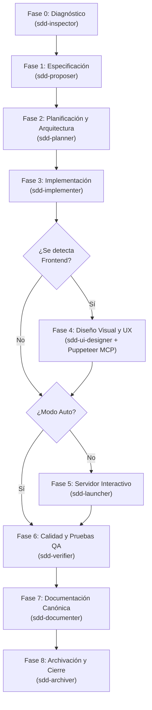

# Zugzbot SDD Harness

> [!IMPORTANT]
> **Zugzbot** es un entorno de orquestación de desarrollo guiado por especificaciones (Spec-Driven Development - SDD) multi-agente y reutilizable para [OpenCode](https://opencode.ai) y [Cursor](https://cursor.sh). Instala un ciclo de vida de desarrollo de IA de grado de producción completo en cualquier proyecto con un solo comando — totalmente acotado al proyecto, sin escribir nada en tu configuración global.

---

## 🚀 Conceptos Clave y Arquitectura

Este arnés implementa un ciclo de vida estricto de **Desarrollo Guiado por Especificaciones (SDD)** orquestado por **Zugzbot**, un agente primario que delega cada fase a un subagente especializado. Ningún agente escribe código sin una especificación aprobada, un plan de arquitectura y un checklist de tareas atómicas.



---

## 🤖 Elenco de Agentes

### Agentes del Ciclo SDD

| Agente | Rol | Fase |
|---|---|---|
| `zugzbot` | Orquestador primario — rutea, delega y controla los límites de cada fase. | Siempre activo |
| `sdd-inspector` | Diagnostica el stack tecnológico, dependencias y ejecuta/recomienda `npx autoskills`. | Fase 0 |
| `sdd-proposer` | Conduce la entrevista técnica interactiva y define el alcance (`proposal.md`) y especificación (`spec.md`). | Fase 1 |
| `sdd-planner` | Diseña la arquitectura modular (`orchestrator_architecture.md`) y el checklist (`orchestrator_tasks.md`). | Fase 2 |
| `sdd-implementer` | Escribe código de producción senior robusto e incremental siguiendo el checklist. | Fase 3 |
| `sdd-ui-designer` | Captura la UI mediante Puppeteer MCP para evaluar y perfeccionar la experiencia de usuario. | Fase 4 *(frontend)* |
| `sdd-launcher` | Levanta el servidor de desarrollo local interactivo y verifica disponibilidad en tiempo real. | Fase 5 |
| `sdd-verifier` | Ejecuta linters, pruebas unitarias y de integración en bucle de auto-curación. | Fase 6 |
| `sdd-documenter` | Genera y actualiza de forma quirúrgica el README, TECHNICAL.md, USER_GUIDE.md y CHANGELOG.md. | Fase 7 |
| `sdd-archiver` | Valida el estado del repositorio Git, archiva el cambio y firma el commit Git semántico. | Fase 8 |

### Agentes Auxiliares

| Agente | Rol | Permisos |
|---|---|---|
| `aux-oracle` | Responde consultas de conocimiento general **sin relación directa con el proyecto**. | Solo lectura |
| `aux-handyman` | Ejecuta tareas pequeñas e inmediatas que no ameritan iniciar un ciclo de vida SDD completo. | Lectura + Escritura |

---

## 📋 El Ciclo de Vida SDD Completo

Cada cambio significativo progresa de forma secuencial a través de estas fases gobernadas:

0. **Fase 0 — Diagnóstico y Contexto (`sdd-inspector`)**
   - Analiza en profundidad el estado tecnológico del proyecto, dependencias y frameworks.
   - Sugiere y ejecuta de forma muy segura `npx autoskills --detect` para equipar al arnés con las habilidades ideales.

1. **Fase 1 — Especificación (`sdd-proposer`)**
   - Conduce una entrevista técnica ágil utilizando cuestionarios interactivos de opción múltiple.
   - Generación de `openspec/changes/<nombre>/proposal.md` (alcance y negocio).
   - Generación de `openspec/changes/<nombre>/specs/spec.md` con escenarios BDD (`Dado / Cuando / Entonces`).

2. **Fase 2 — Planificación y Arquitectura (`sdd-planner`)**
   - Diseño modular siguiendo principios SOLID y Arquitectura Limpia.
   - Creación de `orchestrator_architecture.md` (diagramas Mermaid) y `orchestrator_tasks.md` (checklist global de tareas).

3. **Fase 3 — Implementación (`sdd-implementer`)**
   - Escritura de código incremental quirúrgico siguiendo estrictamente el checklist.
   - Valida la ausencia de errores de compilación o LSP antes de cerrar.

4. **Fase 4 — Diseño Visual y UX (`sdd-ui-designer`) — *Frontend***
   - **Integración Puppeteer MCP:** Levanta un navegador Chrome headless local.
   - Interactúa, evalúa accesibilidad (WCAG AA), jerarquía, y genera el reporte `ui_review_report.md`.
   - **Omisión Inteligente**: Si no se detecta frontend en el diagnóstico (Fase 0), se salta silenciosamente a la Fase 5.

5. **Fase 5 — Servidor Local Interactivo (`sdd-launcher`)**
   - Identifica el comando idóneo de inicio (ej: `npm run dev`, `python manage.py runserver`), arranca el servidor local en segundo plano y verifica su accesibilidad en tiempo real.
   - Presenta un enlace interactivo (ej: `http://localhost:3000`) para que el desarrollador interactúe y compruebe manualmente.
   - **Omisión Inteligente**: Se ignora y pasa directo a Fase 6 en piloto automático (`--auto`).

6. **Fase 6 — Calidad y Pruebas QA (`sdd-verifier`)**
   - Ejecuta linters, suite de pruebas unitarias y verifica integraciones backend mediante peticiones `curl`.
   - **Bucle de Auto-curación:** Reactiva automáticamente al implementador si se detectan fallos lógicos.

7. **Fase 7 — Documentación Canónica (`sdd-documenter`)**
   - Escribe desde cero o actualiza de forma quirúrgica (respetando texto no relacionado) los documentos `README.md`, `docs/TECHNICAL.md`, y `docs/USER_GUIDE.md`.
   - Inyecta la entrada de cambios en `CHANGELOG.md` global bajo `## [Unreleased]`.
   - Genera el mensaje Conventional Commit semántico en `commit_message.txt`.

8. **Fase 8 — Archivación y Cierre (`sdd-archiver`)**
   - Consolida el historial, archiva las especificaciones en `openspec/changes/archive/` y realiza automáticamente un `git commit` semántico libre de marcas de IA.

---

## ✨ Experiencia de Usuario (UX) Premium

El arnés SDD está optimizado para ofrecer una experiencia fluida, interactiva y de alto rendimiento:

1. **Fase 0 — Diagnóstico Inteligente de Entrada**: El instalador analiza el stack local (TypeScript/JS, Python, Go, Rust, Ruby, PHP) y detecta dependencias, frameworks (Next.js, React, Django, etc.), bases de datos y frameworks de testeo, adaptando dinámicamente la activación del diseñador visual (`sdd-ui-designer`). **Además, sugiere el uso de `npx autoskills` para la autogeneración extremadamente segura de habilidades adaptadas a las tecnologías del proyecto.**
2. **Cuestionarios de Selección Estructurados**: Zugzbot y `@sdd-proposer` aprovechan la herramienta interactiva de selección `AskUserQuestion` en OpenCode. En lugar de responder largas preguntas de texto abierto, el desarrollador responde completando formularios de opción múltiple ágilmente.
3. **Piloto Automático (`--auto`)**: Los usuarios avanzados pueden pasar la bandera o parámetro `--auto` en sus comandos. Esto desactiva todas las pausas de confirmación entre fases, delegando y ejecutando de forma 100% autónoma el ciclo completo de SDD hasta finalizar el cambio.
4. **Commits Git Automatizados y Convencionales**: Al finalizar el ciclo en la etapa de archivado, el sistema comprueba los cambios de código locales y realiza automáticamente un `git commit` semántico utilizando el mensaje impecable del archivo `commit_message.txt` sin dejar firmas de IA.

---

## 📦 Instalación

> [!NOTE]
> El instalador del arnés está diseñado para ser **100% local y aislado**. No altera configuraciones globales de tu sistema ni de OpenCode; todo se instala dentro del directorio destino de tu proyecto.

### Requisitos Previos

- [OpenCode](https://opencode.ai) o [Cursor](https://cursor.sh) instalado.
- Git 2.28+ configurado localmente.

### Opción A — Instalación en un Solo Comando (Recomendado)

Navega a la raíz de tu proyecto destino y ejecuta:

```bash
git clone --depth 1 https://github.com/Danielisla96/zugzbot.git /tmp/zugzbot-harness \
  && /tmp/zugzbot-harness/sdd-harness/bootstrap-sdd.sh \
  && rm -rf /tmp/zugzbot-harness
```

Clona de forma efímera el arnés, inyecta los agentes y configuraciones locales de forma silenciosa, y limpia los residuos temporales sin dejar huella global.

### Opción B — Instalación Local

Si ya tienes el repositorio clonado localmente:

```bash
cd /ruta/a/tu/proyecto-destino
/ruta/a/zugzbot/sdd-harness/bootstrap-sdd.sh
```

---

### Lo que hace el Instalador

El script de instalación ejecuta 9 pasos de forma silenciosa y elegante:

```
[0/8] Diagnóstico de Proyecto...             — Analiza dependencias y frameworks locales.
[1/8] Verificando repositorio Git...         — Inicializa git e inyecta el .gitignore base.
[2/8] Creando estructura de carpetas...       — Crea directorios .agent/, .opencode/ y openspec/.
[3/8] Instalando perfiles de subagentes...     — Inyecta los prompts de sistema en español técnico.
[4/8] Generando registro de agentes...        — Escribe el opencode.jsonc de proyecto.
[5/8] Copiando habilidades y configs MCP...   — Configura habilidades de fase y Puppeteer MCP.
[6/8] Escribiendo marcador de versión...       — Setea la versión del arnés en .agent/.
[7/8] Creando checkpoint de Git...            — Realiza un commit con la instalación limpia.
[8/8] Sincronizando reglamento (AGENTS.md)... — Instala la constitución base de comportamiento.
```

---

## 📂 Estructura del Proyecto Post-Bootstrap

```
tu-proyecto/
├── .agent/
│   ├── mcp-config.json      # Configuración del servidor Puppeteer MCP
│   ├── skills/              # Definiciones de habilidades sdd-* y openspec-*
│   └── workflows/           # Archivos de workflows declarativos opsx-*
├── .opencode/
│   ├── agents/              # Prompts de sistema de todos los subagentes
│   ├── commands/            # Mapeos de comandos slash
│   ├── mcp-config.json      # Configuración MCP para OpenCode
│   └── skills/              # Habilidades del runtime
├── openspec/
│   ├── changes/             # Cambios activos y archivados
│   └── schemas/
│       └── ssd-orchestrated/ # Esquemas y plantillas de documentos del ciclo
├── docs/                    # Generado en Fase 5 por sdd-documenter
│   ├── TECHNICAL.md
│   └── USER_GUIDE.md
├── opencode.jsonc           # Registro local de agentes del proyecto
├── AGENTS.md                # Reglamento de conducta obligatorio para los modelos
└── README.md                # Actualizado automáticamente al final de cada ciclo
```

---

## ⚡ Referencia de Comandos Slash

| Comando | Descripción |
|---|---|
| `/opsx-propose <descripcion>` | Inicia la Fase 1 — entrevista guiada y especificación |
| `/opsx-explore <query>` | Entra en modo de exploración técnica y diseño mental profundo |
| `/opsx-apply` | Inicia la Fase 3 — codificación incremental basada en el checklist aprobado |
| `/opsx-archive` | Archiva un cambio completamente verificado y aprobado |

---

## 📜 Reglamento de Conducta (AGENTS.md)

Todos los agentes están severamente limitados por `AGENTS.md`, el cual garantiza:
- **Cero Código "Al Vuelo":** No se escribe una sola línea de código sin especificación aprobada, arquitectura de componentes trazada y checklist de tareas atómicas.
- **Límites de Fase Rígidos:** Ningún subagente puede avanzar a la siguiente fase sin la firma explícita del desarrollador humano en el prompt.
- **SOLID y Clean Architecture:** Es obligatorio seguir patrones limpios de diseño y la inyección de dependencias.
- **Historial Limpio:** No se permiten commits genéricos; toda entrega debe estar descrita semánticamente sin marcas de IA.
