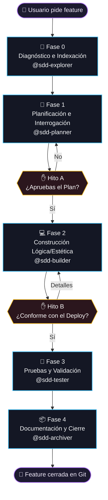

# 🤖 Zugzbot — Arnés SDD Multi-Agente para OpenCode

> [!IMPORTANT]
> **Zugzbot** es un arnés de orquestación industrial basado en **Spec-Driven Development (SDD) Simplificado** para [OpenCode](https://opencode.ai). Estructura el ciclo de vida del desarrollo de software en **5 fases secuenciales**, garantizando que ningún modelo de IA escriba código de producción sin planificación previa, revisión humana interactiva, validación estática de calidad y cierre documentado en Git.

---

## 🧠 Filosofía: SDD Simplificado de 5 Fases

**Ningún agente toca código sin un plan aprobado.** El ciclo SDD de Zugzbot se compone de 5 hitos estructurados donde 5 agentes especializados se pasan el control entre sí de forma atómica:



> [!NOTE]
> La **Fase 0** se ejecuta **solo una vez por proyecto** (si `.openspec/diagnostics.md` no existe) para mapear el stack del repositorio. En ciclos posteriores de desarrollo, `@zugzbot` salta directamente a la Fase 1.

---

## 🤖 Elenco de Agentes y Roles Técnicos

### Agentes del Ciclo Core SDD

| Agente | Rol | Fase | Entregable principal |
|:---|:---|:---:|:---|
| **`zugzbot`** | **Orquestador Maestro** — coordina la metodología, delega a subagentes, fiscaliza sus límites y gestiona las pausas de visto bueno humano (HIL). | Permanente | Roadmap de 4 fases y delegaciones rápidas. |
| **`sdd-explorer`** | **Diagnosticador e Indexador** — escanea la base de código, ejecuta análisis automáticos de habilidades y genera el mapa técnico del stack. | **F0** | `.openspec/diagnostics.md` + `skills_manifest.md` |
| **`sdd-planner`** | **Planificador e Interrogador** — realiza una encuesta consolidada de 3-5 preguntas concretas y redacta la especificación técnica en formato BDD. | **F1** | `.openspec/changes/<change-name>/specs/spec.md` |
| **`sdd-builder`** | **Constructor Lógico y Estético** — implementa el código en base a las especificaciones y asegura interfaces estéticamente modernas y balanceadas. | **F2** | Código funcional modificado de manera quirúrgica. |
| **`sdd-tester`** | **Control de Calidad y Pruebas** — ejecuta las suites de tests automatizados de forma nativa y valida el balanceo de etiquetas de marcado (HTML/JSX). | **F3** | `.openspec/changes/<change-name>/verification_report.md` |
| **`sdd-archiver`** | **Especialista de Cierre** — realiza el bump de versión del proyecto, consolida el CHANGELOG, prepara el commit semántico y archiva la carpeta del cambio. | **F4** | `commit_message.txt` y carpeta de cambio archivada. |

### Agentes Auxiliares fuera del Ciclo Core

| Agente | Rol | Limitación |
|:---|:---|:---|
| **`aux-oracle`** | Consultas conceptuales, arquitectura de sistemas y dudas sobre el código sin alterar archivos. | Edición y bash denegados. |
| **`aux-handyman`** | Parches atómicos rápidos o correcciones menores que involucren un máximo de 3 archivos sin necesidad de abrir un ciclo SDD completo. | Limitado a ediciones pequeñas. |

---

## 📂 Anatomía de Archivos (Compartidos vs Locales)

Para garantizar un espacio de trabajo limpio, los archivos están estructurados de forma estricta:

```
tu-proyecto/
├── .gitignore             # (Configurado automáticamente para excluir archivos locales)
├── AGENTS.md              # 🟢 Compartido: Reglamento y convenciones globales de IA para el equipo
├── opencode.json          # 🟢 Compartido: Declaración de agentes y permisos generales de OpenCode
├── ZUGZ.md                # 🟢 Compartido: Manual de inducción rápida e instrucciones del arnés
├── tui.json               # 🔴 Local: Cargador visual que conecta el plugin TUI del sidebar (Ignorado)
├── .opencode/             # 🔴 Local: Todo el motor del arnés, herramientas, habilidades y dependencias (Ignorado)
└── .openspec/
    ├── brain.md           # 🟢 Compartido: Base de conocimiento técnico a largo plazo del proyecto
    ├── prompt_base.md     # 🟢 Compartido: Directrices de comportamiento común del swarm
    ├── sdd-lock.json      # 🔴 Local: Estado y fase activa del ciclo en desarrollo (Ignorado)
    └── changes/           # 🟢 Compartido: Historial de especificaciones y reportes técnicos por cambio
        └── <change-name>/
            ├── specs/spec.md
            └── verification_report.md
```

---

## 🛠️ Utilidad CLI Local (`sdd`)

El arnés incorpora una potente utilidad CLI de control local ubicada en `./.opencode/tools/` (enlazada opcionalmente en tu raíz como `./sdd` para acceso rápido). Ofrece comandos para monitorear y gestionar todo el ciclo:

```bash
# Ver el estado del ciclo activo, la fase en curso y la lista de criterios de aceptación
./sdd status

# Abrir el Dashboard Web Premium de control local en tu navegador por defecto
./sdd dashboard

# Auditar estructuralmente que las especificaciones BDD y propuestas de cambio estén correctas
./sdd validate

# Ejecutar de forma automática las suites de tests del proyecto según el stack detectado (Vitest/Jest/PyTest/Go/Cargo)
./sdd test

# Auditar la sintaxis del linter nativo del proyecto y ejecutar auditorías de etiquetas HTML balanceadas
./sdd lint

# Limpiar logs de fallos y reiniciar de forma segura la máquina de estados local a la Fase 0
./sdd clean

# Descartar de forma segura modificaciones locales no guardadas y regresar al checkpoint limpio del ciclo
./sdd rollback

# Mostrar los modelos activos de cada uno de los agentes del swarm
./sdd models status

# Aplicar los modelos por defecto o personalizados a los agentes locales
./sdd models apply

# Cambiar el perfil de modelos usando presets optimizados (free / balanced / turbo)
./sdd models preset turbo
```

---

## 🔌 Monitor SDD en Tiempo Real (TUI Plugin)

El plugin `plugin_tui.tsx` inyecta un panel reactivo en el sidebar lateral de OpenCode (activable con la tecla **`b`**), permitiendo visualizar:
* Un logo interactivo de ZUGZ con efectos estéticos degradados en naranja.
* La barra de porcentaje y el estado de progreso de las **5 fases** del ciclo activo.
* El registro en tiempo real de las últimas transiciones y las tareas pendientes con su respectivo check.

---

## 📦 Instalación en tu Proyecto (One-Step Setup)

Para equipar cualquier repositorio de Git con este arnés multi-agente, simplemente abre la raíz de tu proyecto en la terminal y ejecuta el siguiente comando:

```bash
rm -rf /tmp/zugzbot \
  && git clone --depth=1 --branch main https://github.com/Danielisla96/zugzbot.git /tmp/zugzbot \
  && /tmp/zugzbot/install-plugin.sh "$(pwd)" \
  && rm -rf /tmp/zugzbot
```

### ¿Qué hace el instalador por debajo?
1. Realiza una validación de entorno asegurando que tengas **Node.js**, **Git** y un manejador de paquetes (**Bun** o **NPM**).
2. Clona el arnés de forma efímera y copia de forma aislada el motor de agentes en `.opencode/`.
3. Crea y actualiza de manera no intrusiva los archivos compartidos de equipo (`AGENTS.md`, `ZUGZ.md` y `opencode.json`).
4. **Modifica tu `.gitignore`** inyectando de forma automática las reglas de exclusión para ocultar todos los archivos locales basura de tu repositorio.
5. Instala las dependencias internas de forma completamente aislada dentro de `.opencode/`.

---

## 🤝 Contribuir al Arnés (Modo Desarrollo)

Si deseas modificar o colaborar en el desarrollo del propio motor de agentes de Zugzbot:

1. Realiza un fork de este repositorio.
2. Clona tu fork localmente.
3. Ejecuta el instalador en modo desarrollo dentro del mismo directorio:
   ```bash
   ./install-plugin.sh
   ```
   *Esto creará enlaces simbólicos en lugar de copiar archivos, permitiendo que tus cambios en `zugz-plugin/` se reflejen en OpenCode en tiempo real.*
4. Asegúrate de que las dependencias estáticas de TypeScript y ESLint para LSPs queden instaladas ejecutando `bun install` o `npm install` en la raíz.
5. Envía un Pull Request adjuntando la especificación del cambio correspondiente.
