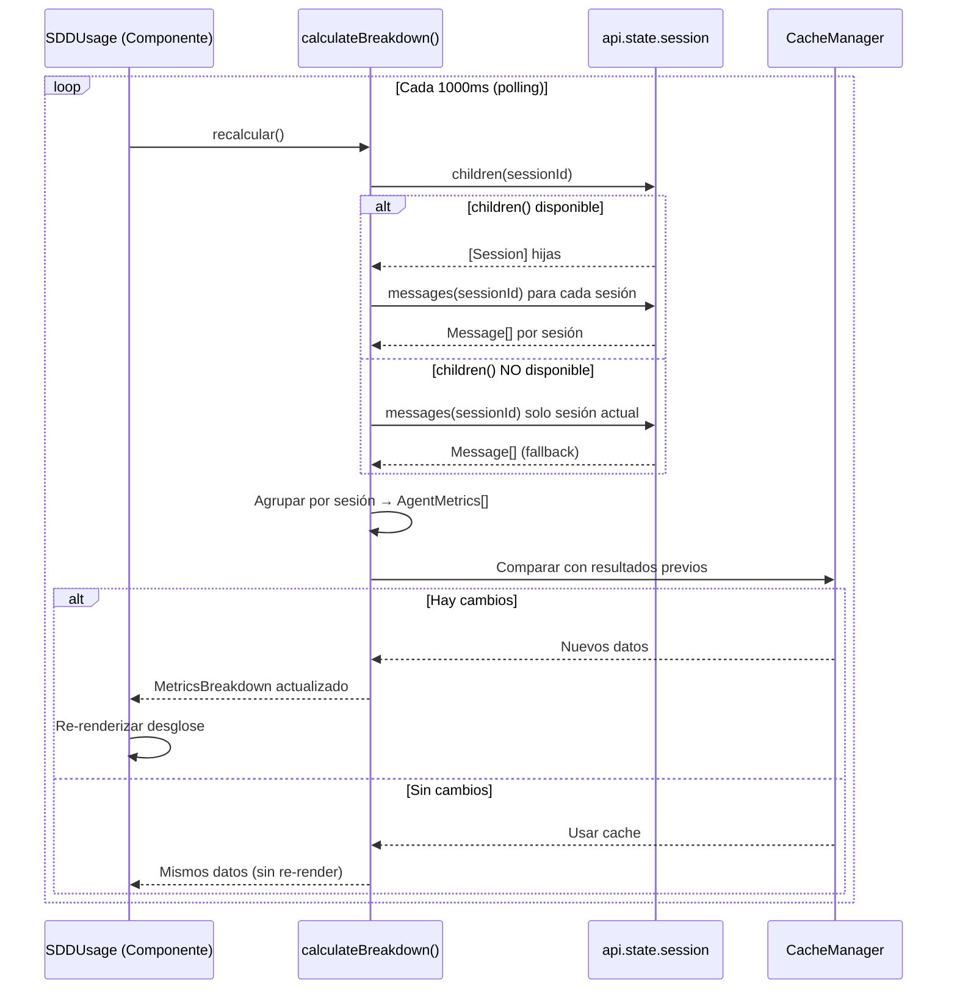

# Arquitectura Técnica: `session-metrics-breakdown`

> **Fase:** 2 — Arquitectura y Planificación
> **Arquitecto:** sdd-architect 📐
> **Estilo:** Orientado a componentes funcionales con estado reactivo (SolidJS signals)

---

## 1. Diagrama de Arquitectura de Componentes

```mermaid
graph TD
    subgraph "Plugin TUI (plugin_tui.tsx)"
        A[PluginTuiSidebar] --> B[sidebar_content]
        B --> C[SDDMonitor]
        B --> D[SDDUsage]
        B --> E[props.children - Chat Original]
    end

    subgraph "API de Estado (api.state)"
        F[api.state.session]
        F --> G[messages(sessionId)]
        F --> H[children(sessionId)?]
        F --> I[get(sessionId)?]
    end

    subgraph "Nuevos Módulos"
        J[calculateBreakdown]
        K[AgentMetricsRow]
        L[NombreAgente: formateo/truncado]
        M[CacheManager - resultados previos]
    end

    D --> J
    J --> F
    J --> M
    D --> K
    K --> L
    M --> D
```

## 2. Flujo de Datos del Desglose



## 3. Estructura de Datos Interna

```typescript
// ─── Constantes ───────────────────────────────────────
const MAX_AGENT_NAME_LENGTH = 20
const POLLING_INTERVAL_MS = 1000
const COST_DECIMALS = 5
const CACHE_DEEP_COMPARE = true

// ─── Tipos de datos ───────────────────────────────────
interface AgentMetrics {
  agentName: string
  sessionId: string
  cost: number
  tokensInput: number
  tokensOutput: number
  tokenTotal: number  // derivado
}

interface MetricsBreakdown {
  agents: AgentMetrics[]
  totalCost: number
  totalTokens: number
  agentCount: number
}

// ─── Estado interno ───────────────────────────────────
// Signal primaria (reemplaza a usageState actual)
const [breakdownState, setBreakdownState] = createSignal<MetricsBreakdown>({
  agents: [],
  totalCost: 0,
  totalTokens: 0,
  agentCount: 0
})

// Cache de resultados previos (deep compare)
let previousBreakdown: MetricsBreakdown | null = null
```

## 4. Función Principal: `calculateBreakdown()`

```typescript
function calculateBreakdown(sessionId: string): MetricsBreakdown {
  const sessionIds = collectSessionIds(sessionId)  // [padre, ...hijos]
  
  const agents: AgentMetrics[] = sessionIds.map(sid => {
    const messages = api.state.session.messages(sid) || []
    const sessionInfo = api.state.session.get?.(sid)
    const agentName = extractAgentName(messages, sessionInfo, sid)
    
    return {
      agentName: truncateAgentName(agentName, MAX_AGENT_NAME_LENGTH),
      sessionId: sid,
      ...sumMetrics(messages)
    }
  })
  
  return {
    agents,
    totalCost: agents.reduce((sum, a) => sum + a.cost, 0),
    totalTokens: agents.reduce((sum, a) => sum + a.tokenTotal, 0),
    agentCount: agents.length
  }
}

// Funciones auxiliares
function collectSessionIds(sessionId: string): string[] {
  try {
    const children = api.state.session.children?.(sessionId) ?? []
    return [sessionId, ...children.map(c => c.id ?? c)]
  } catch {
    return [sessionId]  // Fallback seguro
  }
}

function extractAgentName(
  messages: Message[], 
  sessionInfo: Session | null, 
  sessionId: string
): string {
  // 1. Intentar con UserMessage.agent del primer mensaje
  const userMsg = messages.find(m => m.role === 'user')
  if (userMsg && 'agent' in userMsg && userMsg.agent) {
    return userMsg.agent
  }
  // 2. Fallback: session.title
  if (sessionInfo?.title) {
    return sessionInfo.title
  }
  // 3. Último recurso
  return `Sesión ${sessionId.slice(0, 8)}`
}

function sumMetrics(messages: Message[]) {
  let cost = 0, input = 0, output = 0
  for (const msg of messages) {
    if (msg.role === 'assistant' && 'cost' in msg) {
      cost += msg.cost ?? 0
      input += msg.tokens?.input ?? 0
      output += msg.tokens?.output ?? 0
    }
  }
  return { cost, tokensInput: input, tokensOutput: output, tokenTotal: input + output }
}

function truncateAgentName(name: string, maxLen: number): string {
  if (name.length <= maxLen) return name
  return name.slice(0, maxLen - 1) + '…'
}
```

## 5. Componente UI Extendido: `SDDUsage` v2

```mermaid
graph LR
    subgraph "SDDUsage v2"
        T[Totales Generales]
        B[Separador]
        H[Header: 📊 Desglose por Agente]
        R1[Fila: Build | $0.0050 | 450/200]
        R2[Fila: sdd-architect | $0.0045 | 400/180]
        R3[Fila: sdd-implementer | $0.0028 | 384/187]
    end
    
    T --> B --> H --> R1 --> R2 --> R3
```

### 5.1 Diseño de cada fila

```
<agentName>          <cost>     <tokensIn/tokensOut>
─────────────────────────────────────────────────────
Build                $0.00500   450 / 200
sdd-architect        $0.00450   400 / 180
sdd-implementer      $0.00280   384 / 187
```

Cada fila usa padding con espacios para alineación monospace:

```typescript
function AgentMetricsRow(props: { agent: AgentMetrics; index: number }) {
  const { agent } = props
  const paddedName = agent.agentName.padEnd(20)
  const paddedCost = `$${agent.cost.toFixed(COST_DECIMALS)}`.padStart(12)
  const paddedTokens = `${agent.tokensInput.toLocaleString()} / ${agent.tokensOutput.toLocaleString()}`.padStart(16)
  
  return (
    <text fg={props.index === 0 ? api.theme.current.accent : api.theme.current.text}>
      {paddedName} {paddedCost} {paddedTokens}
    </text>
  )
}
```

## 6. Estrategia de Cache y Rendimiento

### 6.1 Cache Manager (optimización de polling)

```typescript
function hasMetricsChanged(prev: MetricsBreakdown | null, next: MetricsBreakdown): boolean {
  if (!prev) return true
  if (prev.agentCount !== next.agentCount) return true
  // Deep compare de cada agente
  return prev.agents.some((a, i) => {
    const b = next.agents[i]
    return a.cost !== b.cost || a.tokensInput !== b.tokensInput || a.tokensOutput !== b.tokensOutput
  })
}
```

### 6.2 Optimización del ciclo de polling

```typescript
const interval = setInterval(() => {
  setLockState(loadLockfile())
  
  // Solo recalcular desglose si el lockfile cambió (nueva fase) 
  // O si pasaron suficientes ciclos para capturar nuevos mensajes
  const newBreakdown = calculateBreakdown(props.session_id)
  if (hasMetricsChanged(previousBreakdown, newBreakdown)) {
    setBreakdownState(newBreakdown)
    previousBreakdown = newBreakdown
  }
}, POLLING_INTERVAL_MS)
```

## 7. Manejo de Errores y Casos Borde

| Caso | Comportamiento |
|------|---------------|
| `session.children()` lanza error | Catch silencioso, fallback a sesión única |
| Sesión no encontrada | Retorna métricas en 0, no interrumpe UI |
| Costo `undefined` o `NaN` | `?? 0` / `Number.isFinite()` guard |
| Nombre de agente `null` | Fallback a nombre genérico |
| Más de 10 sesiones hijas | Se muestran todas (scroll natural del sidebar) |

## 8. Árbol de Archivos Modificados

```
plugin/zugzbot-sdd/
└── plugins/
    └── plugin_tui.tsx          ← MODIFICADO (SDDUsage extendido)
```

**Solo 1 archivo modificado.** No se requieren nuevos archivos de código.
