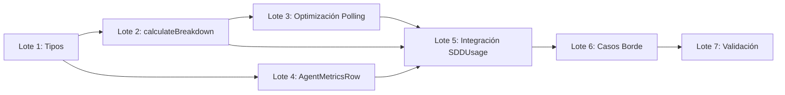

# Checklist Técnico: `session-metrics-breakdown`

> **Fase:** 2 — Planificación
> **Arquitecto:** sdd-architect 📐
> **Estimación:** ~120-180 min de implementación

---

## Lote 1: Infraestructura de Datos (30 min)

- [x] **1.1** Crear tipo `AgentMetrics` con campos: `agentName`, `sessionId`, `cost`, `tokensInput`, `tokensOutput`, `tokenTotal`
- [x] **1.2** Crear tipo `MetricsBreakdown` con campos: `agents: AgentMetrics[]`, `totalCost`, `totalTokens`, `agentCount`
- [x] **1.3** Definir constantes: `MAX_AGENT_NAME_LENGTH = 20`, `POLLING_INTERVAL_MS = 1000`, `COST_DECIMALS = 5`

## Lote 2: Función `calculateBreakdown()` (40 min)

- [x] **2.1** Implementar `collectSessionIds(sessionId)` que obtiene `[padre, ...hijos]` usando `api.state.session.children()` con try-catch y fallback a solo sesión actual
- [x] **2.2** Implementar `extractAgentName(messages, sessionInfo, sessionId)` con cascada: `UserMessage.agent` → `session.title` → `"Sesión {id}"`
- [x] **2.3** Implementar `sumMetrics(messages)` que suma `cost`, `tokens.input`, `tokens.output` solo de `AssistantMessage`
- [x] **2.4** Implementar `truncateAgentName(name, maxLen)` con truncado a 20 chars + `…`
- [x] **2.5** Implementar `calculateBreakdown(sessionId)` que orquesta 2.1-2.4 y retorna `MetricsBreakdown`

## Lote 3: Optimización de Polling (20 min)

- [x] **3.1** Implementar `hasMetricsChanged(prev, next)` con deep compare de cost/tokens
- [x] **3.2** Modificar `setInterval` para que solo actualice `breakdownState` si `hasMetricsChanged()` retorna `true`
- [x] **3.3** Agregar `previousBreakdown` como variable de closure fuera del intervalo

## Lote 4: Componente UI `AgentMetricsRow` (25 min)

- [x] **4.1** Crear subcomponente `AgentMetricsRow(props: { agent: AgentMetrics; index: number })` que renderiza una fila formateada
- [x] **4.2** Implementar padding/alineación con `padEnd`/`padStart` para visual monospace
- [x] **4.3** Usar `api.theme.current.accent` para la primera fila (agente principal), `text` para las demás
- [x] **4.4** Formatear costo con `toFixed(COST_DECIMALS)` y tokens con `toLocaleString()`

## Lote 5: Integración en `SDDUsage` (25 min)

- [x] **5.1** Reemplazar `usageState` signal con `breakdownState: Signal<MetricsBreakdown>`
- [x] **5.2** En `SDDUsage`, mostrar totales generales desde `breakdownState().totalCost` y `breakdownState().totalTokens`
- [x] **5.3** Agregar separador visual (`borderTop`) después de totales generales
- [x] **5.4** Agregar header "📊 Desglose por Agente" (solo si `agentCount > 1`)
- [x] **5.5** Iterar `breakdownState().agents` renderizando `AgentMetricsRow` para cada uno

## Lote 6: Manejo de Casos Borde (15 min)

- [x] **6.1** Verificar que sesión `null`/`undefined` no crashea (retorna breakdown vacío)
- [x] **6.2** Verificar que `msg.cost` NaN/undefined usa `Number.isFinite()` con guard condicional
- [x] **6.3** Verificar que `msg.tokens` undefined no crashea con `msg.tokens?.input ?? 0`
- [x] **6.4** Verificar que `session.children()` catch no propaga error al componente padre

## Lote 7: Validación Conceptual (20 min)

- [x] **7.1** Verificar Escenario 1 (BDD): desglose con 3 agentes — `calculateBreakdown` retorna 3 entradas con suma correcta
- [x] **7.2** Verificar Escenario 2 (BDD): sin hijos — `collectSessionIds` retorna solo sesión padre, `agentCount = 1`
- [x] **7.3** Verificar Escenario 3 (BDD): sesión vacía — `calculateBreakdown` retorna breakdown vacío sin error
- [x] **7.4** Verificar Escenario 5 (BDD): consistencia — suma de agentes = totales generales
- [x] **7.5** Verificar Escenario 9 (BDD): fallback `children()` — try-catch en `collectSessionIds` asegura sesión única
- [x] **7.6** Verificar visualmente: `truncateAgentName` a 20 chars + `…` y `padEnd`/`padStart` para alineación monospace

---

## Resumen de Dependencias entre Lotes

**Total: 21 tareas atómicas | ~175 min estimados**
