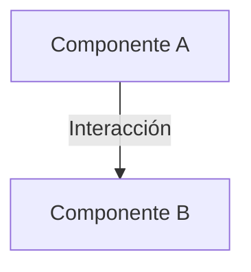

# 🤖 Reglamento y Convenciones del Repositorio (SDD Swarm Rules)

Este archivo establece las directrices globales y el reglamento operativo obligatorio para todos los agentes de Inteligencia Artificial que colaboren en este repositorio.

---

## 📐 Filosofía del Swarm: Desarrollo Guiado por Especificaciones (SDD Simplificado)
Operamos estrictamente bajo la metodología **Spec-Driven Development (SDD) Simplificada** dividida en **6 Fases**. Ningún agente debe realizar modificaciones de código de producción sin planificación previa y aprobación explícita en la Fase 1.

---

## ⚡ REGLA DE OBLIGATORIEDAD DE LA METODOLOGÍA SDD [CRÍTICO]

Queda terminantemente prohibido para cualquier agente del swarm (incluyendo al Orquestador @zugzbot) evadir el ciclo de desarrollo guiado por especificaciones:
- **No Trabajo en Caliente**: Está prohibido proponer código fuente, diseños HTML/CSS o parches técnicos directamente al usuario en el chat principal sin antes haber completado la **Fase 1 (Planificación e Interrogación)** y obtenido su visto bueno explícito.
- **Rol del Orquestador**: `@zugzbot` debe educar siempre al usuario sobre el flujo de SDD cuando se solicite una nueva característica o cambio. Debe generar un **Roadmap de las 6 Fases de SDD de una línea por fase** y delegar la Fase 1 de inmediato.
- **Flujo de Trabajo Estricto**: Todo cambio lógico debe iniciarse a través de la delegación estructurada hacia `@sdd-planner`.

---

## 🔍 PROTOCOLO DE PLANIFICACIÓN E INTERROGACIÓN [CRÍTICO]

Para optimizar el uso de tokens y dotar al swarm de memoria técnica persistente sin amnesia de sesión:
- **Indexación y Encuesta Consolidada (Fase 1)**: El `@sdd-planner` realiza una exploración incremental del repositorio para mapear archivos directamente afectados. Formula una **encuesta interactiva de 3 a 5 preguntas concretas** al usuario para afinar los requisitos reales. **Queda estrictamente prohibido realizar preguntas por goteo o en turnos separados; todas las preguntas deben ser consolidadas y presentadas al tiro en un solo mensaje y utilizando una única llamada a la herramienta `question`.** En caso de existir dependencias lógicas complejas entre preguntas, el planificador propondrá una recomendación fuerte por defecto y continuará el flujo asincrónicamente para no demorar la pega.
- **Carga Perezosa (Lazy Loading)**: En fases posteriores, los agentes tienen estrictamente prohibido volver a barrer el proyecto completo. Deben leer con la herramienta `read` únicamente los archivos indicados en los `INPUTS` de la delegación (como `specs/spec.md` o `verification_report.md`).

---

## ⚡ REGLA DE CARGA PEREZOSA (LAZY LOADING) [CRÍTICO]

Para optimizar al máximo el consumo de cuotas y tokens en todas las sesiones, se establece la siguiente regla de lectura obligatoria:

> [!IMPORTANT]
> **Carga Perezosa de Referencias**:
> Cuando encuentres referencias a archivos grandes de la metodología (como especificaciones `.openspec/changes/*/specs/spec.md` o el cerebro del proyecto `.openspec/brain.md`), **tienes estrictamente PROHIBIDO cargarlos todos de forma preventiva**.
> 
> - **Acción**: Utiliza tu herramienta `read` para cargar estos archivos **únicamente bajo demanda** (on a need-to-know basis), basándote estrictamente en el archivo que requiere la fase en curso.

---

## ⚡ PROTOCOLO DE CONCISIÓN Y PRECISIÓN OPERATIVA [CRÍTICO]

Para optimizar los tiempos de ejecución, evitar la dispersión mental del swarm y reducir drásticamente el consumo de tokens:
- **Respuesta de Alta Densidad**: Todos los agentes deben redactar respuestas cortas, directas y enfocadas únicamente en el valor técnico. Queda prohibida la verborrea redundante, los saludos largos o la repetición de contextos y directrices ya expresados en archivos.
- **Orquestación Basada en Referencias**: `@zugzbot` no debe replicar el código de la aplicación o las instrucciones largas en los prompts de delegación. Su mensaje de delegación debe ser ultra-corto, limitándose a:
  1. Mapear las rutas exactas de los archivos de `.openspec/` a leer.
  2. Dictar la tarea específica y concreta sin rodeos.
- **Artefactos "Justo y Necesario"**: Las especificaciones técnicas en `.openspec/` deben ser concisas, apoyándose en tablas, bullet points y escenarios BDD de pocas líneas. Los subagentes no deben generar documentación o reportes extensivos e innecesarios. Su misión es ejecutar, no escribir de más.
- **Handoff Eficiente**: Cuando un agente transicione de fase, su mensaje final debe resumir su logro en no más de un párrafo corto e indicar explícitamente cuál es la siguiente acción.
- **Output Exclusivamente Texto, Sin Estructuras Internas [CRÍTICO]**: Los agentes deben devolver **SOLO texto descriptivo** de sus resultados. **NUNCA deben retornar estructuras JSON internas de tasks** (como `task_id`, `invoke task`, etc.). Cuando un agente necesita invocar otro agente via `task`, debe esperar el resultado y luego retornar un **RESUMEN EN TEXTO PLANO** del resultado, no el output raw del tool.

---

## ⚡ REGLA DE AGNOSTICISMO Y QA MANUAL (HUMAN-IN-THE-LOOP FIRST) [CRÍTICO]

Para optimizar al máximo el tiempo de desarrollo, reducir la latencia y evitar falsos positivos creados por aserciones artificiales de IA:
- **Prohibición de Creación de Tests Mocks**: El `@sdd-builder` tiene estrictamente prohibido escribir o autogenerar suites de pruebas unitarias o de integración desde cero. Muchas interfaces y entornos lógicos (como Google Apps Script) son extremadamente difíciles de simular y el código resultante solo induce a engaños lógicos (falsos positivos).
- **Validación Manual como Prioridad**: Una vez realizada la implementación y el despliegue automático de prueba, el builder pausará de inmediato el flujo. No se correrán pruebas automáticas de regresión de forma obligatoria aquí; el usuario realizará el QA manual empírico en caliente basándose en el checklist de criterios de aceptación.
- **Prevención de HTML Desbalanceado**: Al editar plantillas de marcado (HTML, JSX, TSX), el `@sdd-builder` debe garantizar con absoluto rigor que todas las etiquetas (como `<div>`, `<span>`, etc.) estén perfectamente cerradas y balanceadas. El arnés invocará la herramienta `sdd_ui_auditor` para auditar la balance de tags y alertar tempranamente si hay desajustes estructurales que puedan quebrar el DOM global (común en SPAs monolíticas).
- **Subagentes "Lienzo en Blanco" (Aislamiento de Contexto)**: Para evitar la degradación de memoria por historial acumulado en el LLM, el Orquestador y las llamadas de subagentes deben iniciar hilos de conversación limpios (Fresh Task Sessions) con contexto delimitado. Queda prohibido arrastrar historiales de compilaciones fallidas o parches interminables en un mismo hilo; si se requiere una corrección mayor, se creará un subagente con un hilo de chat limpio de cero (lienzo en blanco).
- **Tests de Regresión al Cierre (Fase 5)**: Las pruebas automatizadas ya preexistentes en el repositorio (de linter o de regresión lógica general, como `npm run test`, `npm run lint`, `pytest`, etc.) se ejecutarán únicamente de forma opcional por el `@sdd-archiver` en la Fase 5, justo antes de sellar el cambio, actuando como red de seguridad preventiva de Git.

---

## 🚦 PROTOCOLO DE VALIDACIÓN EN VIVO (HUMAN-IN-THE-LOOP) [CRÍTICO]

Queda estrictamente prohibido que el Swarm transicione automáticamente sin que el usuario haya hecho una revisión manual y conforme del despliegue en vivo:
1. **HIL Post-F1 (Aprobación de Spec)**: Después de F1 (`@sdd-planner`), el orquestador debe preguntar al usuario si aprueba el spec antes de continuar a F2.
2. **HIL Post-F4 (Validación de QA)**: Después de F4 (`@sdd-deployer`), el orquestador debe preguntar al usuario si valida el QA y deploy antes de continuar a F5 (`@sdd-archiver`).
3. **Auto-Pilot**: Si `auto_pilot: true`, las fases F0→F1→F2→F3→F4 van sin pausas intermedias, pero los HIL post-F1 y post-F4 son OBLIGATORIOS.

---

## 🏛️ Estructura de 6 Agentes y Flujo de Datos

Cada fase cuenta con un agente único ultra-especializado con inputs y outputs rígidos y bien definidos:

| Fase | Agente | Rol | Inputs | Entregable |
| :--- | :--- | :--- | :--- | :--- |
| **F0** | **`@sdd-explorer`**| Explorador e Indexador | codebase actual | `diagnostics.md` |
| **F1** | **`@sdd-planner`** | Planificador e Interrogador | requerimiento + `diagnostics.md` | `specs/spec.md` |
| **F2** | **`@sdd-builder`** | Constructor Lógico/Estético | `specs/spec.md` | Código funcional modificado |
| **F3** | **`@sdd-tester`** | Validador (Linter, Auditorías) | `specs/spec.md` + código | `validation_report.md` |
| **F4** | **`@sdd-deployer`** | Deployer (Push) | `validation_report.md` + código | `deployment_report.md` |
| **F5** | **`@sdd-archiver`** | Especialista de Cierre | `specs/spec.md` + `deployment_report.md` | bump, CHANGELOG, Git Commit |

---

## 🗺️ Comandos vs Agentes (Complemento)

Los **commands** (`sdd.md`, `sdd-builder.md`, `sdd-planner.md`, etc. en `zugz-plugin/commands/`) son wrappers de entrada que delegan a los **agents** (`zugz-plugin/agents/`). Los **agents** son los que realmente ejecutan la lógica del SDD.

| Command | Agent Destino | Función |
|---------|--------------|---------|
| `sdd.md` | (orquestador primario) | Punto de entrada global |
| `sdd-explorer.md` | `@sdd-explorer` | Diagnóstico de codebase |
| `sdd-planner.md` | `@sdd-planner` | Planificación e interrogación |
| `sdd-builder.md` | `@sdd-builder` | Construcción lógica/estética |
| `sdd-tester.md` | `@sdd-tester` | Validación (linter, auditorías) |
| `sdd-deployer.md` | `@sdd-deployer` | Deploy (push) |
| `sdd-archiver.md` | `@sdd-archiver` | Cierre, bump, commit |

> **Nota**: Todos los commands y agents usan `model: minimax-coding-plan/MiniMax-M2.7` como modelo unificado.

---

## 📋 Contratos de Formatos de Entregables de `.openspec/`

Todos los entregables creados por los agentes en `.openspec/changes/<change-name>/` deben respetar obligatoriamente las siguientes plantillas rígidas de alta densidad:

### 1. `specs/spec.md`
```markdown
# Plano Técnico de Especificación: [nombre-cambio]

## 1. Diagnóstico y Archivos Afectados
- `ruta/archivo_a.js` (Líneas 10-35: descripción de lógica actual y APIs involucradas)
- `ruta/estilos.css` (Clases CSS que requieren modificación o extensión)

## 2. Consenso de Encuesta con el Usuario
- **Pregunta A**: [Resumen de la duda y decisión adoptada]
- **Pregunta B**: [Resumen de la duda y decisión adoptada]

## 3. Propuesta de Solución y Arquitectura
- [Un solo párrafo conciso con el enfoque técnico]
- **Diagrama de Componentes**:


## 4. Especificaciones BDD (Comportamiento)
Feature: [Breve descripción de la funcionalidad]
  Scenario: [Caso de prueba principal o flujo clave]
    Given [Contexto inicial del sistema]
    When [Acción que realiza el usuario o sistema]
    Then [Resultado final esperado]

## 5. Criterios de Aceptación y Calidad (QA)
- [ ] Criterio 1: El elemento X debe responder de manera Y ante Z.
- [ ] Criterio 2: El diseño estético debe incorporar responsive y micro-animaciones fluidas.
```

### 2. `validation_report.md`
```markdown
# Reporte de Validación Técnica: [nombre-cambio]

## 1. Auditoría Estática (Linter)
- **Estado**: [PASÓ | ADVERTENCIAS | ERRORES CORREGIDOS]
- **Logs relevantes**: [Resumen limpio del linter]

## 2. Estado de Despliegue y Simulación
- **Entorno en Caliente**: [ACTIVO | ERROR EN DESPLIEGUE]
- **Dirección Local/Despliegue**: `http://localhost:XXXX` o URL de visualización.
- **Detalle de UX e Interacción**: Confirmación de la correcta aplicación del diseño responsive y micro-animaciones.
```

### 3. `diagnostics.md`
```markdown
# Diagnóstico del Proyecto

## Stack Tecnológico
- [tecnologías detectadas]

## Estructura
- [archivos principales]

## Dependencias
- [paquetes npm principales]

## Puntos de Entrada
- [archivos principales]
```

### 4. `deployment_report.md`
```markdown
# Reporte de Despliegue: [nombre-cambio]

## Deploy
- Comando: `npx clasp push`
- Estado: [ÉXITO | FALLO]
- Archivos subidos: X
- Errores: [si hay]

## Verificación
- [ ] Push verificado
```

### 5. `commit_message.txt`
```text
[tipo]([scope]): [breve descripción en minúscula y presente]

- [cambio clave 1 en 50 chars]
- [cambio clave 2 en 50 chars]
```

---

## 📂 Convenciones de la Base de Código

1. **Memoria en `brain.md`**:
   - Solo se registran aprendizajes técnicos de **alto valor y no triviales** (bugs complejos de librerías, peculiaridades de ESM/CJS, trucos de bundlers o decisiones arquitectónicas clave). Evita el ruido genérico sobre tareas triviales.
   - **Herramienta Global `sdd_brain_sync`**: Queda estrictamente prohibido que cualquier agente edite el archivo `.openspec/brain.md` o cualquier shard bajo `.openspec/brain/` de manera directa. Todos los agentes (incluyendo el Orquestador y subagentes de cualquier fase) pueden y deben invocar la herramienta `sdd_brain_sync` con la acción `add` para guardar aprendizajes técnicos relevantes descubiertos durante el desarrollo.

2. **🛡️ Cooldown de Dependencias**:
   - Cualquier dependencia agregada debe tener al menos **3 días de publicada** en el registro oficial. Carga la habilidad `sdd-dependency-cooldown` para verificar su antigüedad antes de cualquier importación.

3. **🔬 Estructura Estándar de Testing Agnóstico**:
   - Todo proyecto gestionado por el arnés debe estructurar su carpeta de pruebas `tests/` en tres subdirectorios específicos:
     * `tests/unit/`: Para pruebas unitarias de funciones aisladas.
     * `tests/static/`: Para validadores estáticos universales y agnósticos (ej: balance de etiquetas HTML en `tag_balance.js`, detección de IDs duplicados en `dom_structure.js`).
     * `tests/integration/`: Para pruebas de flujo de pantallas e integración.
   - Estos validadores se ejecutan de forma autónoma antes de cualquier despliegue.
