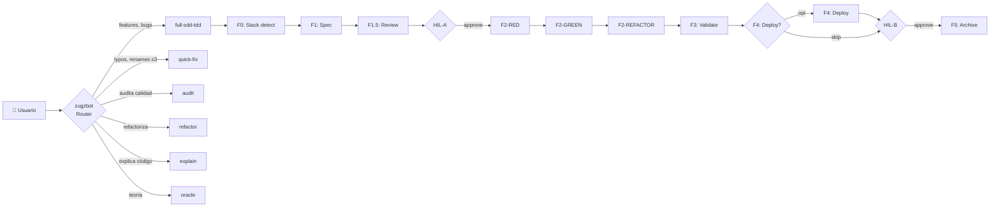

# 🤖 Zugzbot v2.0.0 — Arnés SDD Multi-Agente Agnóstico al Stack

> [!IMPORTANT]
> **Zugzbot v2.0.0** es un arnés de orquestación industrial basado en **Spec-Driven Development (SDD) con TDD puro** para [OpenCode](https://opencode.ai). Estructura el ciclo de vida del desarrollo de software en **6 fases con TDD atómico (Red → Green → Refactor)**, garantizando que ningún modelo de IA escriba código de producción sin planning, validación humana y tests aprobados.

---

## 🚀 Quickstart (3 pasos)

```bash
# 1) Instalar el arnés en tu proyecto
cd mi-proyecto
npm install zugzbot-sdd@latest
npx zugzbot   # bootstrapea .openspec/ y .opencode/

# 2) Abrir OpenCode y hablarle
opencode .
# En el chat: @zugzbot "agrega un endpoint POST /api/logout que invalide JWT"

# 3) Aprobar cuando te pregunte (2 momentos: HIL-A y HIL-B)
```

No hay paso 4. **`@zugzbot`** clasifica tu pedido, monta el equipo de subagentes, ejecuta el ciclo, y te entrega un cambio versionado con commit semántico.

---

## 🎬 Tu primera conversación (ejemplo realista)

> Pedido: "agrega un endpoint POST /api/logout que invalide el JWT"

| Turno | Quién habla | Qué pasa |
|---|---|---|
| 1 | **👤 Tú** | "agrega un endpoint POST /api/logout que invalide el JWT" |
| 1 | **🤖 @zugzbot** | Clasifica `full-sdd-tdd`. Lee lockfile (vacío). Crea `change_name: "agregar-endpoint-logout"`. Imprime roadmap. Delega a `@sdd-explorer`. |
| 1 | **🤖 @sdd-explorer** | Detecta stack (`node-typescript`), genera `diagnostics.md`, transiciona a F1. |
| 2 | **🤖 @sdd-planner** | Te pregunta en 1 llamada consolidada: "¿El logout borra sesión en BD? ¿JWT expirado → 200 o 401? ¿Lista negra? ¿Rol requerido?" |
| 2 | **👤 Tú** | Respondes A/B/C/D (o texto libre) |
| 2 | **🤖 @sdd-planner** | Escribe `spec.md` con 5 criterios BDD. Transiciona a F1.5. |
| 3 | **🤖 @zugzbot (F1.5)** | Corre 8 checks de testeabilidad. Si pasa → **HIL-A**. |
| 3 | **🤖 @zugzbot (HIL-A)** | Te muestra el resumen del spec y te pregunta: `[A] Aprobar` / `[B] Rechazar` / `[C] Pausar` |
| 3 | **👤 Tú** | Apruebas (A) |
| 3 | **🤖 @f2-red-test-writer** | Escribe 5 tests que FALLAN. `verify-red` → `all_failing: true`. Transiciona a F2-GREEN. |
| 4 | **🤖 @sdd-builder** | Implementa el mínimo viable en `src/auth/logout.ts`. `verify-green` → 5/5. Transiciona a F2-REFACTOR. |
| 4 | **🤖 @f2-refactor-improver** | Aplica prettier + extrae `validateToken()`. Linter 0 errors. Tests 5/5 verdes. Transiciona a F3. |
| 5 | **🤖 @sdd-tester** | Corre 15 validadores (linter, security, secrets, spec compliance). Genera `validation_report.md`. Si todo OK → F4. |
| 5 | **🤖 @sdd-deployer** | Levanta `npm run dev`, captura logs, genera `deployment_report.md`. |
| 5 | **🤖 @zugzbot (HIL-B)** | Te muestra URL de dev y te pregunta: `[A] Aprobar` / `[B] Reportar issues` / `[C] Rollback` |
| 5 | **👤 Tú** | Apruebas (A) |
| 6 | **🤖 @sdd-archiver** | Bump 1.0.0 → 1.1.0, actualiza CHANGELOG, commit `feat(auth): agregar endpoint POST /api/logout`, archiva `.openspec/changes/...`, resetea lockfile. |
| 6 | **🤖 @zugzbot** | Imprime banner: 🎉 **CICLO SDD FINALIZADO** con versión, archivos, commit, lecciones. |

**Tiempo total**: 6 turnos (puede ser 1 sesión o varios días). **Tú solo hablaste 3 veces** (F1 + HIL-A + HIL-B). El resto es coreografía determinista.

---

## 🔁 Reanudar una sesión (amnesia cero)

El lockfile (`.openspec/sdd-lock.json`) es la única fuente de verdad. Si cierras OpenCode y vuelves otro día, **`@zugzbot` retoma exactamente donde quedaste** sin que tengas que explicarle nada:

```
👤 Tú: "qué tal" (o cualquier cosa)
🤖 @zugzbot:
  📋 Estado del cambio: agregar-endpoint-logout
     Stack: node-typescript
     Última fase: F2-GREEN (3/3 tests passing)
     Estás en: F2-REFACTOR
     Tareas pendientes: 0

  [x] F0  Stack detect
  [x] F1  Spec
  [x] F1.5 Spec review
  [x] HIL-A ← aprobado
  [x] F2-RED ← completado
  [x] F2-GREEN ← completado
  [➡️] F2-REFACTOR ← en curso
  [ ] F3
  [ ] F4
  [ ] HIL-B
  [ ] F5

  ¿Continúo con el refactor, o quieres revisar algo antes?
```

---

## 🧭 Workflows Soportados (Router Cognitivo)

`@zugzbot` clasifica tu prompt en uno de 6 workflows. El primero es el más común; los otros 5 son atajos para tareas rápidas.

| Workflow | Frase-ejemplo | Qué hace | Toca código? |
| :--- | :--- | :--- | :--- |
| **`full-sdd-tdd`** | "agrega X", "implementa Y", "el bug es Z" | Ciclo completo F0→F5 con TDD | **Sí** (con tests) |
| **`quick-fix`** | "arregla este typo", "renombra variable", "bump versión" | Patch atómico ≤3 archivos | **Sí** (directo) |
| **`audit`** | "audita la calidad", "qué deuda técnica hay" | 15 validadores + reporte | No (read-only) |
| **`refactor`** | "limpia src/auth.ts", "simplifica el handler" | Refactor seguro con cobertura | **Sí** (cuidado) |
| **`explain`** | "explícame qué hace este archivo", "muéstrame el flujo" | Walkthrough con diagramas | No |
| **`oracle`** | "qué es un closure", "diferencia entre X e Y" | Conocimiento puro | No |

> Si tu prompt es ambiguo, `@zugzbot` te hace **1 pregunta consolidada** con 2-3 opciones para que elijas. Nunca te pregunta de a poco.



---

## 🚦 Cuándo me preguntará @zugzbot (HIL)

Solo en **2 momentos** del ciclo `full-sdd-tdd` se requiere tu aprobación. El resto es automático.

### HIL-A (después de F1.5, antes de empezar a codear)

```
🚦 HIL-A: El spec está listo y pasó los 8 checks de testeabilidad.

Resumen:
  - Cambio: agregar-endpoint-logout
  - Criterios BDD: 5
  - Archivos a tocar: 2
  - Dependencias nuevas: ninguna

¿Cómo procedo?

  [A] ✅ Aprobar spec y continuar con F2-RED (TDD)
  [B] ❌ Rechazar y volver a F1 (ajustar preguntas del spec)
  [C] ⏸ Pausar aquí (lo retomo después)
```

### HIL-B (después de F4, antes de cerrar el ciclo)

```
🚦 HIL-B: El deploy/QA está listo en dev.

Resumen:
  - Cambio: agregar-endpoint-logout
  - URL de dev: http://localhost:3000
  - Validaciones: 15/15 passing
  - Reports: .openspec/changes/.../validation_report.md, deployment_report.md

¿Cómo procedo?

  [A] ✅ Aprobar QA y cerrar ciclo (ir a F5 → bump + commit)
  [B] 🐛 Reportar issues (volver a F3 para re-validar)
  [C] ⏪ Rollback (volver a F1 y replantear)
```

**Reglas**:
- El formato A/B/C es **siempre idéntico y predecible**. Nunca te preguntará algo abierto.
- Si respondes texto libre, `@zugzbot` lo clasificará (A si dice "ok/sí/aprobar", B si menciona "issue/problema/bug", C si dice "espera/pausa/cancela").
- En `auto_pilot: true`, las fases F0→F1→F1.5→F2-RED→F2-GREEN→F2-REFACTOR→F3→F4 avanzan sin pausas. **HIL-A y HIL-B siguen siendo obligatorios**.

---

## 🤖 Agentes (14 total)

### Core SDD (8)

| Agente | Rol | Fase | Permisos clave |
| :--- | :--- | :--- | :--- |
| **`zugzbot`** | **Router cognitivo** — clasifica intent y delega | Permanente | `task`, `sdd_transition`, `sdd_lock_manager`, `sdd_router` |
| **`sdd-explorer`** | Detecta stack, mapea codebase, persiste `stack_profile` | **F0** | `sdd_stack_detector`, `sdd_generate_tree`, `sdd_git_awareness` |
| **`sdd-planner`** | Entrevista al usuario, redacta `spec.md` con BDD | **F1** | `sdd_brain_sync`, `sdd_diff_impact_analyzer`, `sdd_requirement_tracker` |
| **`f2-red-test-writer`** | Escribe tests reales que fallan | **F2-RED** | `sdd_test_runner`, `edit` (solo tests) |
| **`sdd-builder`** | Implementa el mínimo código que pasa tests | **F2-GREEN** | `sdd_test_runner`, `sdd_linter`, `edit` (mínimo) |
| **`f2-refactor-improver`** | Limpia código, mantiene tests verdes | **F2-REFACTOR** | `sdd_linter`, `sdd_test_runner`, `edit` (refactor atómico) |
| **`sdd-tester`** | Valida linter, security, secret-scan, spec compliance | **F3** | 15 tools de validación |
| **`sdd-deployer`** | Deploy a dev/staging según `stack_profile.deploy.kind` | **F4** | `sdd_clasp` (solo si GAS), `bash` |
| **`sdd-archiver`** | Bump versión, CHANGELOG, commit semántico | **F5** | `sdd_archive_and_commit` |

### Auxiliares fuera del Ciclo Core (5)

| Agente | Rol | Limitaciones |
| :--- | :--- | :--- |
| **`aux-handyman`** | Parches atómicos (typos, renames, bumps ≤3 archivos) | `edit: allow`, ≤3 archivos |
| **`aux-oracle`** | Consultas conceptuales/teóricas | `edit/bash/lsp: deny` |
| **`aux-auditor`** | Auditoría de calidad estática (linter, security, secrets) | `edit: deny` (read-only) |
| **`aux-refactor`** | Refactor seguro con cobertura de tests | `edit: allow`, tests siempre verdes |
| **`aux-explainer`** | Walkthrough didáctico del código | `edit/bash: deny` (solo lectura) |

---

## 🛠️ Herramientas SRP (33)

### Lockfile y Estado

- `sdd_lock_manager` — I/O centralizada del lockfile v2 con 9 acciones
- `sdd_transition` — máquina de estados SDD con TDD gates
- `sdd_git_awareness` — rama, SHA, working tree, stash
- `sdd_checkpoint` — snapshots de fase

### Stack y Profile

- `sdd_stack_detector` — auto-detección de stack
- `sdd_stack_detector_lib` — helpers compartidos

### Router

- `sdd_router` — clasificador de intent (full-sdd-tdd / quick-fix / audit / refactor / explain / oracle)

### TDD Discipline

- `sdd_test_runner` — runner agnóstico (vitest/jest/pytest/go test/cargo test/mvn test)
- `sdd_linter` — linter agnóstico (eslint/biome/ruff/mypy/clippy/etc.)
- `sdd_spec_reviewer` — F1.5 validador de testeabilidad

### Spec y Requisitos

- `sdd_spec_validator` — verifica que el código cumple el spec
- `sdd_spec_compliance_linter` — 1:1 entre criterios y código
- `sdd_requirement_tracker` — cobertura de requisitos
- `sdd_diff_impact_analyzer` — radio de impacto

### Calidad

- `sdd_secret_scanner` — busca secretos en código
- `sdd_security_vulnerability_scanner` — CVEs + code vulns
- `sdd_visual_regression_diff` — diff visual (frontend)
- `sdd_performance_regress_profiler` — latencias
- `sdd_sandbox_patcher` — autocorrección de errores simples
- `sdd_ui_auditor` — balance de tags HTML

### Validación Dinámica

- `sdd_bdd_tester` — corre escenarios BDD
- `sdd_regression_detector` — detecta bugs reintroducidos
- `sdd_test_scaffold_generator` — genera scaffolds de tests

### Memoria (Brain)

- `sdd_brain_sync` — añade/lee/limpia lecciones
- `sdd_brain_curator` — detecta duplicados y entradas de bajo valor

### Contexto

- `sdd_compact_context` — comprime contexto largo
- `sdd_context_pruner` — poda semántica
- `sdd_install_autoskills` — instala/migra skills (con resolución por profile)

### Stack-Específico (carga condicional)

- `sdd_clasp` — Google Apps Script (solo si `stack_profile === "gas"`)
- `sdd_auto_api_mocker` — mocks de APIs externas

### Utilidad

- `sdd_generate_tree` — árbol de archivos
- `sdd_archive_and_commit` — git semántico

---

## 🌍 Stacks Soportados (8 profiles)

| Profile | Detectado por | Test runner | Linter | Deploy |
| :--- | :--- | :--- | :--- | :--- |
| `node-typescript` | `package.json` + `tsconfig.json` | vitest, jest, mocha, node-test | eslint, biome, tsc | dev-server, build, publish |
| `node-javascript` | `package.json` | vitest, jest, mocha | eslint, biome | dev-server, build, publish |
| `python` | `pyproject.toml`, `requirements.txt`, `setup.py` | pytest, unittest, tox | ruff, flake8, mypy, pylint | dev-server, build, publish |
| `go` | `go.mod` | go test | go vet, staticcheck, golangci-lint | build, publish (tag) |
| `rust` | `Cargo.toml` | cargo test | clippy, rustfmt | publish (crates.io) |
| `java` | `pom.xml`, `build.gradle` | mvn test, gradle test | checkstyle, spotbugs, pmd | build, publish |
| `gas` | `.clasp.json`, `appsscript.json` | mocks locales | eslint-gas | clasp push |
| `static-site` | `astro.config.*`, `hugo.toml`, `_config.yml` | vitest, playwright | eslint, markdownlint | build (SSG) |

---

## 📂 Anatomía de Archivos

```
tu-proyecto/
├── AGENTS.md                      # 🟢 Reglamento global del swarm
├── ZUGZ.md                        # 🟢 Manual de inducción rápida
├── opencode.json                  # 🟢 Configuración de 14 agentes
├── zugz-models.json               # 🟢 (opcional) override de modelos por agente
├── tui.json                       # 🔴 Cargador visual del plugin TUI
├── .opencode/                     # 🔴 Motor del arnés
│   ├── tools/                     # 33 herramientas SRP
│   ├── plugins/                   # TUI + SDD core
│   ├── profiles/                  # 8 profiles de stack
│   └── skills/                    # 11 skills premium
├── prompts/                       # 🟢 Prompts modulares (system/, contracts/, boundaries/)
│   ├── system/
│   │   ├── orchestrator-base.md
│   │   ├── subagent-base.md
│   │   ├── tdd-discipline.md
│   │   └── router-rules.md
│   ├── contracts/                 # QUÉ hace cada fase (9)
│   └── boundaries/                # QUÉ NO hace cada fase (9)
└── .openspec/                     # 🟢 Estado del ciclo SDD
    ├── sdd-lock.json              # Schema v2 con bloque tdd y git
    ├── brain.md                   # Memoria técnica del proyecto
    ├── changes/                   # Historial de specs
    └── audits/                    # Reportes de aux-auditor
```

---

## 🧠 Filosofía: Spec + TDD Discipline

> [!NOTE]
> Zugzbot v2.0.0 cree que:
> 1. **Ningún código de producción sin spec aprobado** (F1.5 enforcement).
> 2. **Ningún código sin test que lo exija** (Red antes que Green).
> 3. **Ningún test roto en refactor** (tests verdes durante limpieza).
> 4. **Ningún cambio fuera de su lane** (SRP estricto + boundaries absolutas).
> 5. **Cero acoplamiento al stack** (agnosticismo via profiles JSON).

---

## 📦 Instalación

```bash
# Instalación limpia en tu proyecto
cd tu-proyecto
npm install zugzbot-sdd@latest
npx zugzbot
```

### ¿Qué hace el instalador?

1. Detecta si hay una instalación legacy v1.x (falla con instrucciones claras si la hay).
2. Crea estructura de directorios (`.openspec/`, `.opencode/`, `prompts/`).
3. Genera `opencode.json` con 14 agentes y permisos por herramienta.
4. Crea lockfile v2 con bloques `tdd` y `git`.
5. Copia `zugz-models.json` con modelos por defecto (editable).
6. Instala 8 profiles de stack, 11 skills, 33 tools.
7. Actualiza `.gitignore` con exclusiones v2.

### Personalizar modelos por agente

Edita `zugz-models.json` y re-ejecuta `npx zugzbot` para aplicar los cambios a `opencode.json`:

```json
{
  "default": "google/gemini-2.5-pro",
  "agents": {
    "zugzbot": "anthropic/claude-sonnet-4.5",
    "sdd-explorer": "openai/gpt-5",
    "aux-auditor": "google/gemini-2.5-pro"
  }
}
```

### ⚠️ Breaking Change v1 → v2

No hay migrador automático. Si tienes v1.5.x instalado:

```bash
# 1. Cierra el ciclo activo
rm -rf .openspec/changes/<cambio-activo>

# 2. Borra el lockfile antiguo
rm .openspec/sdd-lock.json

# 3. Continúa con la instalación de v2
npx zugzbot
```

---

## 📊 Convenciones de Desarrollo

1. **Fase 0 solo una vez**: el diagnóstico se ejecuta cuando `.openspec/diagnostics.md` no existe (o bajo demanda).
2. **Carga perezosa (Lazy Loading)**: los agentes leen archivos solo bajo demanda.
3. **TDD enforcement**: el lockfile rechaza transiciones inválidas.
4. **HIL en puntos críticos**: F1.5 y F4 son obligatorios.
5. **Tests de regresión**: se ejecutan en F3 y F5.
6. **Auto-detección de stack**: no hardcoded, profiles JSON.

---

## 🧪 Validación

```bash
npx tsc         # 0 errores
npx eslint .    # 0 errores
npx vitest run  # 97/97 tests
```

---

## ⚙️ Modelo Oficial

`minimax-coding-plan/MiniMax-M2.7` (default). Configurable vía `zugz-models.json`.

---

## 📄 Licencia

MIT © Danielisla96
