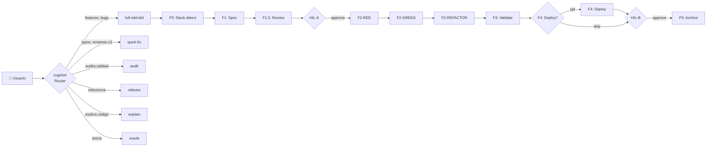

# 🤖 Zugzbot v2.0.0 — Arnés SDD Multi-Agente Agnóstico al Stack

> [!IMPORTANT]
> **Zugzbot v2.0.0** es un arnés de orquestación industrial basado en **Spec-Driven Development (SDD) con TDD puro** para [OpenCode](https://opencode.ai). Estructura el ciclo de vida del desarrollo de software en **6 fases con TDD atómico (Red → Green → Refactor)**, garantizando que ningún modelo de IA escriba código de producción sin planning, validación humana y tests aprobados.

---

## 🎯 Características v2.0.0

| Característica | v1.5 | v2.0 |
| :--- | :--- | :--- |
| **Stacks soportados** | GAS + frontend | Node/TS, Python, Go, Rust, Java, GAS, static-site |
| **TDD** | Simbólico (scaffolds sin enforce) | **Puro: Red → Green → Refactor enforced** |
| **Workflows** | SDD lineal único | **6 workflows** vía router cognitivo |
| **Subagentes** | 9 con SRP parcial | **14 con SRP estricto** |
| **Herramientas** | 30 (algunas mixtas) | **33 SRP** (una = un trabajo) |
| **Linter/Test runner** | Hardcoded | **Agnóstico al stack** via profiles |
| **Perfil del proyecto** | Hardcoded GAS | **Auto-detección + 8 profiles** |
| **Spec review** | No existía | **F1.5 dedicado** con 8 checks objetivos |
| **Hitos HIL** | 2 (post-F1, post-F4) | **Mismos + validación de testeabilidad** |
| **Curador de memoria** | Manual | **`sdd_brain_curator`** automático |
| **Lockfile** | v1 numérico | **v2 con fases string, TDD gates, git block** |

---

## 🧭 Workflows Soportados (Router Cognitivo)



**`full-sdd-tdd`** es el ciclo completo. Los otros 5 son **modos rápidos** que NO usan la máquina de estados SDD.

---

## 🔄 Flujo Canónico (full-sdd-tdd)

```
Usuario pide feature
   ↓
Router clasifica: "full-sdd-tdd"
   ↓
F0: @sdd-explorer → diagnostics.md (stack_profile auto-detectado)
   ↓
F1: @sdd-planner → spec.md (BDD con criterios testeables)
   ↓
F1.5: @f1.5-spec-reviewer → valida testeabilidad (8 checks)
   ↓
[HIL-A: aprobar spec]
   ↓
F2-RED: @f2-red-test-writer → tests fallidos
   ↓
F2-GREEN: @sdd-builder → mínimo código que pasa tests
   ↓
F2-REFACTOR: @f2-refactor-improver → limpia (tests siguen verdes)
   ↓
F3: @sdd-tester → validation_report.md (linter, security, spec compliance)
   ↓
F4: @sdd-deployer (opcional según stack) → deployment_report.md
   ↓
[HIL-B: validar QA]
   ↓
F5: @sdd-archiver → bump, CHANGELOG, commit semántico
   ↓
Ciclo cerrado
```

> **TDD discipline enforced**: `sdd_transition` rechaza transiciones inválidas. No se puede ir a F2-GREEN sin F2-RED completo, ni a F2-REFACTOR sin F2-GREEN, ni a F3 sin refactor con linter limpio.

---

## 🤖 Agentes (14 total)

### Core SDD (8)

| Agente | Rol | Fase | Permisos clave |
| :--- | :--- | :--- | :--- |
| **`zugzbot`** | **Router cognitivo** — clasifica intent y delega | Permanente | `task`, `sdd_transition`, `sdd_lock_manager`, `sdd_router` |
| **`sdd-explorer`** | Detecta stack, mapea codebase, persiste `stack_profile` | **F0** | `sdd_stack_detector`, `sdd_generate_tree`, `sdd_git_awareness` |
| **`sdd-planner`** | Entrevista al usuario, redacta `spec.md` con BDD | **F1** | `sdd_brain_sync`, `sdd_diff_impact_analyzer`, `sdd_requirement_tracker` |
| **`f2-red-test-writer`** | Escribe tests reales que fallan | **F2-RED** | `sdd_test_runner`, `edit` (solo tests) |
| **`sdd-builder`** | Implementa el mínimo código que pasa tests | **F2-GREEN** | `sdd_test_runner`, `sdd_linter`, `edit` (mínimo) |
| **`f2-refactor-improver`** | Limpia código, mantiene tests verdes | **F2-REFACTOR** | `sdd_linter`, `sdd_test_runner`, `edit` (refactor atómico) |
| **`sdd-tester`** | Valida linter, security, secret-scan, spec compliance | **F3** | 15 tools de validación |
| **`sdd-deployer`** | Deploy a dev/staging según `stack_profile.deploy.kind` | **F4** | `sdd_clasp` (solo si GAS), `bash` |
| **`sdd-archiver`** | Bump versión, CHANGELOG, commit semántico | **F5** | `sdd_archive_and_commit` |

### Auxiliares fuera del Ciclo Core (5)

| Agente | Rol | Limitaciones |
| :--- | :--- | :--- |
| **`aux-handyman`** | Parches atómicos (typos, renames, bumps ≤3 archivos) | `edit: allow`, ≤3 archivos |
| **`aux-oracle`** | Consultas conceptuales/teóricas | `edit/bash/lsp: deny` |
| **`aux-auditor`** | Auditoría de calidad estática (linter, security, secrets) | `edit: deny` (read-only) |
| **`aux-refactor`** | Refactor seguro con cobertura de tests | `edit: allow`, tests siempre verdes |
| **`aux-explainer`** | Walkthrough didáctico del código | `edit/bash: deny` (solo lectura) |

---

## 🛠️ Herramientas SRP (33)

### Lockfile y Estado

- `sdd_lock_manager` — I/O centralizada del lockfile v2 con 9 acciones
- `sdd_transition` — máquina de estados SDD con TDD gates
- `sdd_git_awareness` — rama, SHA, working tree, stash
- `sdd_checkpoint` — snapshots de fase

### Stack y Profile

- `sdd_stack_detector` — auto-detección de stack
- `sdd_stack_detector_lib` — helpers compartidos

### Router

- `sdd_router` — clasificador de intent (full-sdd-tdd / quick-fix / audit / refactor / explain / oracle)

### TDD Discipline

- `sdd_test_runner` — runner agnóstico (vitest/jest/pytest/go test/cargo test/mvn test)
- `sdd_linter` — linter agnóstico (eslint/biome/ruff/mypy/clippy/etc.)
- `sdd_spec_reviewer` — F1.5 validador de testeabilidad

### Spec y Requisitos

- `sdd_spec_validator` — verifica que el código cumple el spec
- `sdd_spec_compliance_linter` — 1:1 entre criterios y código
- `sdd_requirement_tracker` — cobertura de requisitos
- `sdd_diff_impact_analyzer` — radio de impacto

### Calidad

- `sdd_secret_scanner` — busca secretos en código
- `sdd_security_vulnerability_scanner` — CVEs + code vulns
- `sdd_visual_regression_diff` — diff visual (frontend)
- `sdd_performance_regress_profiler` — latencias
- `sdd_sandbox_patcher` — autocorrección de errores simples
- `sdd_ui_auditor` — balance de tags HTML

### Validación Dinámica

- `sdd_bdd_tester` — corre escenarios BDD
- `sdd_regression_detector` — detecta bugs reintroducidos
- `sdd_test_scaffold_generator` — genera scaffolds de tests

### Memoria (Brain)

- `sdd_brain_sync` — añade/lee/limpia lecciones
- `sdd_brain_curator` — detecta duplicados y entradas de bajo valor

### Contexto

- `sdd_compact_context` — comprime contexto largo
- `sdd_context_pruner` — poda semántica
- `sdd_install_autoskills` — instala/migra skills (con resolución por profile)

### Stack-Específico (carga condicional)

- `sdd_clasp` — Google Apps Script (solo si `stack_profile === "gas"`)
- `sdd_auto_api_mocker` — mocks de APIs externas

### Utilidad

- `sdd_generate_tree` — árbol de archivos
- `sdd_archive_and_commit` — git semántico

---

## 🌍 Stacks Soportados (8 profiles)

| Profile | Detectado por | Test runner | Linter | Deploy |
| :--- | :--- | :--- | :--- | :--- |
| `node-typescript` | `package.json` + `tsconfig.json` | vitest, jest, mocha, node-test | eslint, biome, tsc | dev-server, build, publish |
| `node-javascript` | `package.json` | vitest, jest, mocha | eslint, biome | dev-server, build, publish |
| `python` | `pyproject.toml`, `requirements.txt`, `setup.py` | pytest, unittest, tox | ruff, flake8, mypy, pylint | dev-server, build, publish |
| `go` | `go.mod` | go test | go vet, staticcheck, golangci-lint | build, publish (tag) |
| `rust` | `Cargo.toml` | cargo test | clippy, rustfmt | publish (crates.io) |
| `java` | `pom.xml`, `build.gradle` | mvn test, gradle test | checkstyle, spotbugs, pmd | build, publish |
| `gas` | `.clasp.json`, `appsscript.json` | mocks locales | eslint-gas | clasp push |
| `static-site` | `astro.config.*`, `hugo.toml`, `_config.yml` | vitest, playwright | eslint, markdownlint | build (SSG) |

---

## 📂 Anatomía de Archivos

```
tu-proyecto/
├── AGENTS.md                      # 🟢 Reglamento global del swarm
├── ZUGZ.md                        # 🟢 Manual de inducción rápida
├── opencode.json                  # 🟢 Configuración de 14 agentes
├── tui.json                       # 🔴 Cargador visual del plugin TUI
├── .opencode/                     # 🔴 Motor del arnés
│   ├── tools/                     # 33 herramientas SRP
│   ├── plugins/                   # TUI + SDD core
│   ├── profiles/                  # 8 profiles de stack
│   └── skills/                    # 11 skills premium
├── prompts/                       # 🟢 Prompts modulares (system/, contracts/, boundaries/)
│   ├── system/
│   │   ├── orchestrator-base.md
│   │   ├── subagent-base.md
│   │   ├── tdd-discipline.md
│   │   └── router-rules.md
│   ├── contracts/                 # QUÉ hace cada fase (8)
│   └── boundaries/                # QUÉ NO hace cada fase (8)
└── .openspec/                     # 🟢 Estado del ciclo SDD
    ├── sdd-lock.json              # Schema v2 con bloque tdd y git
    ├── brain.md                   # Memoria técnica del proyecto
    ├── changes/                   # Historial de specs
    └── audits/                    # Reportes de aux-auditor
```

---

## 🧠 Filosofía: Spec + TDD Discipline

> [!NOTE]
> Zugzbot v2.0.0 cree que:
> 1. **Ningún código de producción sin spec aprobado** (F1.5 enforcement).
> 2. **Ningún código sin test que lo exija** (Red antes que Green).
> 3. **Ningún test roto en refactor** (tests verdes durante limpieza).
> 4. **Ningún cambio fuera de su lane** (SRP estricto + boundaries absolutas).
> 5. **Cero acoplamiento al stack** (agnosticismo via profiles JSON).

---

## 📦 Instalación

```bash
# Instalación limpia en tu proyecto
rm -rf /tmp/zugzbot \
  && git clone --depth=1 --branch main https://github.com/Danielisla96/zugzbot.git /tmp/zugzbot \
  && /tmp/zugzbot/zugz-plugin/install-plugin.sh "$(pwd)" \
  && rm -rf /tmp/zugzbot
```

### ¿Qué hace el instalador?

1. Detecta **stack-agnóstico** (Node/TS, Python, Go, Rust, Java, GAS, static-site).
2. Crea estructura de directorios (`.openspec/`, `.opencode/`, `prompts/`).
3. Genera `opencode.json` con 14 agentes y permisos por herramienta.
4. Crea lockfile v2 con bloques `tdd` y `git`.
5. Instala 8 profiles de stack, 11 skills, 33 tools.
6. Actualiza `.gitignore` con exclusiones v2.

### ⚠️ Breaking Change v1 → v2

No hay migrador automático. Si tienes v1.5.x instalado:

```bash
# 1. Cierra el ciclo activo
rm -rf .openspec/changes/<cambio-activo>

# 2. Borra el lockfile antiguo
rm .openspec/sdd-lock.json

# 3. Continúa con la instalación de v2.0.0
```

---

## 🚦 Hitos Obligatorios (HIL)

| Hito | Momento | Qué pasa |
| :--- | :--- | :--- |
| **HIL-A** | Post-F1.5 | El Orquestador pregunta: "¿Apruebas el spec?" Si sí → F2-RED. |
| **HIL-B** | Post-F4 | El Orquestador pregunta: "¿Apruebas el QA?" Si sí → F5. |

> Si `auto_pilot: true`, F0→F1→F1.5→F2-RED→F2-GREEN→F2-REFACTOR→F3→F4 corren sin pausas intermedias. **HIL-A y HIL-B siguen siendo obligatorios**.

---

## 📊 Convenciones de Desarrollo

1. **Fase 0 solo una vez**: el diagnóstico se ejecuta cuando `.openspec/diagnostics.md` no existe (o bajo demanda).
2. **Carga perezosa (Lazy Loading)**: los agentes leen archivos solo bajo demanda.
3. **TDD enforcement**: el lockfile rechaza transiciones inválidas.
4. **HIL en puntos críticos**: F1.5 y F4 son obligatorios.
5. **Tests de regresión**: se ejecutan en F3 y F5.
6. **Auto-detección de stack**: no hardcoded, profiles JSON.

---

## 🧪 Validación

```bash
npx tsc         # 0 errores
npx eslint .    # 0 errores
npx vitest run  # 81/81 tests
```

---

## ⚙️ Modelo Oficial

`minimax-coding-plan/MiniMax-M2.7` (default). Configurable vía `zugz-models.json`.

---

## 📄 Licencia

MIT © Danielisla96
